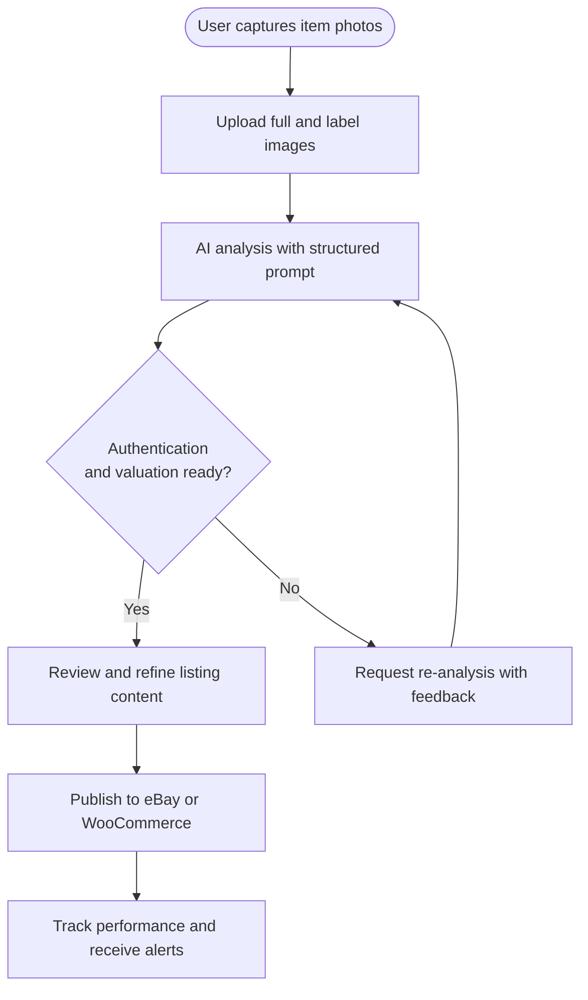
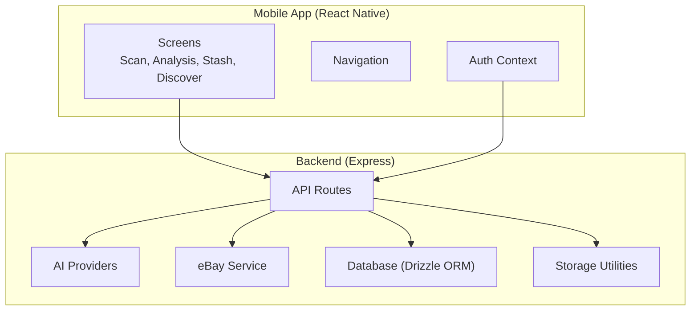
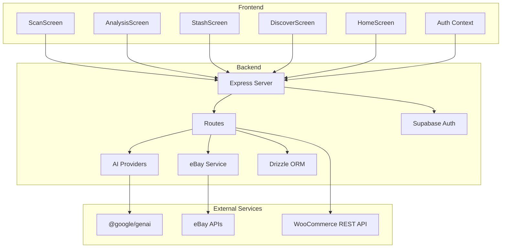
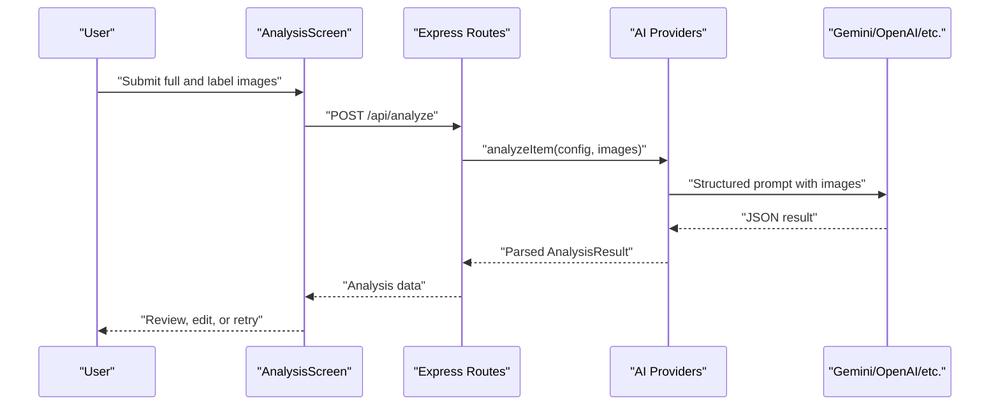
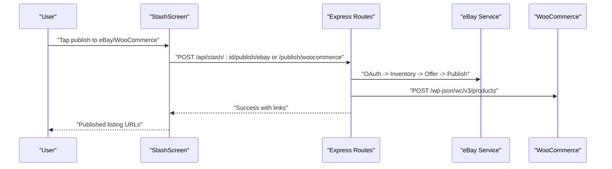
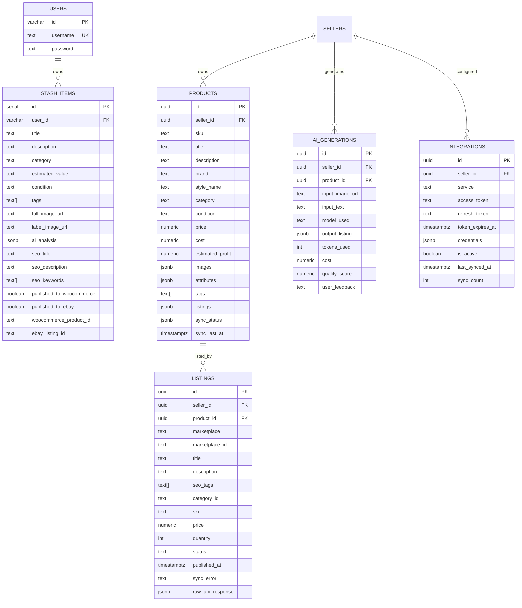
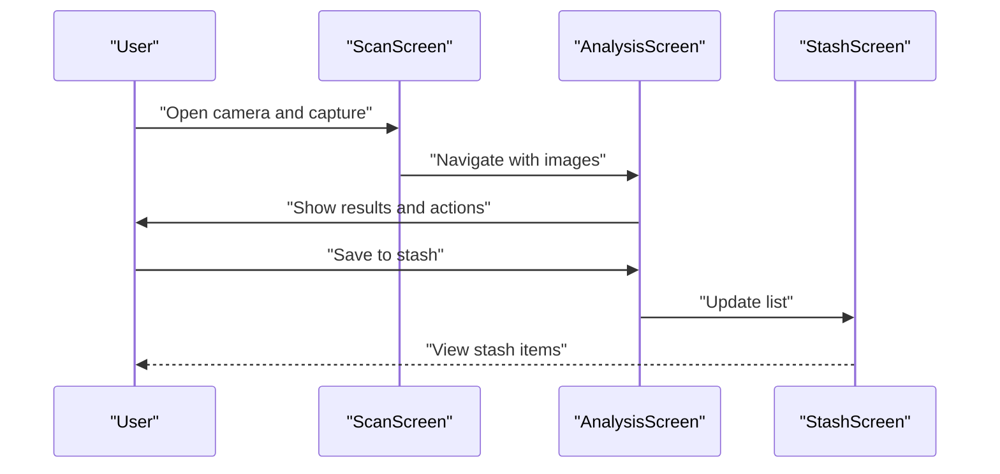
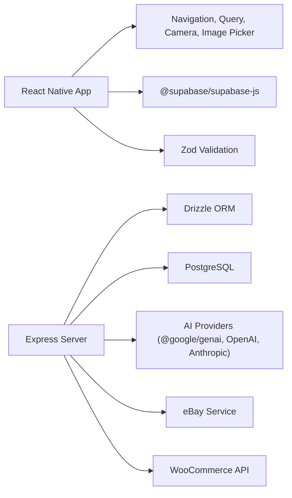

# Introduction

<cite>
**Referenced Files in This Document**
- [package.json](file://package.json)
- [App.tsx](file://client/App.tsx)
- [HomeScreen.tsx](file://client/screens/HomeScreen.tsx)
- [ScanScreen.tsx](file://client/screens/ScanScreen.tsx)
- [StashScreen.tsx](file://client/screens/StashScreen.tsx)
- [DiscoverScreen.tsx](file://client/screens/DiscoverScreen.tsx)
- [AnalysisScreen.tsx](file://client/screens/AnalysisScreen.tsx)
- [index.ts](file://server/index.ts)
- [routes.ts](file://server/routes.ts)
- [ai-providers.ts](file://server/ai-providers.ts)
- [ebay-service.ts](file://server/ebay-service.ts)
- [types.ts](file://shared/types.ts)
- [schema.ts](file://shared/schema.ts)
- [ENVIRONMENT.md](file://ENVIRONMENT.md)
</cite>

## Table of Contents
1. [Introduction](#introduction)
2. [Project Structure](#project-structure)
3. [Core Components](#core-components)
4. [Architecture Overview](#architecture-overview)
5. [Detailed Component Analysis](#detailed-component-analysis)
6. [Dependency Analysis](#dependency-analysis)
7. [Performance Considerations](#performance-considerations)
8. [Troubleshooting Guide](#troubleshooting-guide)
9. [Conclusion](#conclusion)

## Introduction
Hidden-Gem is a mobile application designed to empower collectors and resellers with AI-powered authentication and seamless marketplace integration for vintage and collectible items. Its mission is to make authentication reliable, valuations transparent, and monetization effortless—connecting passionate enthusiasts with global buyers through trusted listings on platforms like eBay and WooCommerce.

### Purpose and Value Proposition
Hidden-Gem solves the core problems collectors and resellers face:
- Authentication uncertainty: Many vintage and collectible items are difficult to verify without expert knowledge.
- Time-intensive research: Determining fair market value and crafting compelling listings is laborious.
- Fragmented workflows: Switching between scanning, research, listing creation, and publishing is inefficient.

Hidden-Gem’s value lies in:
- Instant item authentication and condition assessment powered by AI.
- Real-time market valuation with suggested list prices and SEO-optimized listing content.
- Automated marketplace publishing to eBay and WooCommerce with marketplace-specific configurations.
- A unified “stash” for cataloging verified finds and tracking their market performance.

### Target Audience Personas
- Collector: Someone who discovers vintage or collectible items and wants quick, confident authentication and valuation before deciding whether to keep or sell.
- Reseller: Someone who regularly buys, appraises, and lists items for profit, needing fast, accurate assessments and streamlined publishing.
- Enthusiast: Someone who enjoys learning about collectibles, staying informed on market trends, and discovering authentication tips.

### Key Benefits
- Item verification: AI-driven authentication with confidence scores and expert tips.
- Market valuation: Realistic value ranges and suggested list prices grounded in comparable sales.
- Monetization opportunities: Effortless publication to major marketplaces with marketplace-specific optimizations.
- Community insights: Curated articles and must-read guides to deepen knowledge and awareness.

### Mission Statement
Hidden-Gem’s mission is to bring trust, transparency, and opportunity to the world of vintage and collectibles by combining cutting-edge AI with intuitive marketplace tools.

### Vision for the Collectible Community
We envision a future where every collector and reseller confidently verifies, values, and sells their finds—creating a thriving, informed community that celebrates craftsmanship, history, and investment potential.

### Competitive Advantages Over Traditional Authentication Methods
- Speed and accessibility: Instant AI-assisted authentication without requiring expert visits or labs.
- Depth of insight: Beyond authenticity, users receive condition ratings, market analysis, SEO content, and marketplace-ready specifics.
- End-to-end automation: From scan to publish, Hidden-Gem reduces friction and human error.
- Continuous learning: Articles and notifications keep users informed about market trends and authentication best practices.

### Beginner-Friendly Workflow Overview
Hidden-Gem’s complete workflow from discovery to sale:
1. Discovery: Browse curated articles and must-reads to learn about authentication and market trends.
2. Capture: Use the in-app scanner to snap full-item and label/close-up photos.
3. AI Analysis: Hidden-Gem evaluates authenticity, condition, and market value, generating listing-ready content.
4. Review and Refine: Adjust titles, descriptions, pricing, and specifics; request a re-analysis if needed.
5. Publish: Post listings directly to eBay or WooCommerce with marketplace-specific optimizations.
6. Track and Engage: Monitor performance, receive alerts on price changes, and manage listings.

### Developer Highlights: AI-First Authentication Approach
Hidden-Gem’s authentication pipeline is built around a robust, extensible AI framework:
- Multi-provider support: Built-in integrations with Google Gemini, OpenAI, Anthropic, and custom endpoints.
- Structured outputs: AI responses are parsed into a canonical schema, ensuring consistent data for listings and marketplace publishing.
- Retry and refinement: Users can provide feedback to improve assessments iteratively.
- Marketplace alignment: Generated listings include eBay category IDs, SEO titles, and structured item specifics tailored to each platform.

[No sources needed since this diagram shows conceptual workflow, not actual code structure]

## Project Structure
Hidden-Gem is organized as a modern React Native mobile application with an Express backend, shared TypeScript models, and a PostgreSQL-backed schema managed by Drizzle ORM. The frontend integrates authentication, camera capture, AI analysis, and marketplace publishing, while the backend orchestrates AI providers, marketplace APIs, and data persistence.

**Diagram sources**
- [App.tsx](file://client/App.tsx#L1-L67)
- [index.ts](file://server/index.ts#L1-L262)
- [routes.ts](file://server/routes.ts#L1-L929)

**Section sources**
- [package.json](file://package.json#L1-L95)
- [ENVIRONMENT.md](file://ENVIRONMENT.md#L115-L147)

## Core Components
Hidden-Gem’s core components span the mobile UI, backend services, and shared data models:

- Mobile Screens
  - ScanScreen: Captures full-item and label photos, guides users through a two-step capture process, and navigates to AnalysisScreen.
  - AnalysisScreen: Orchestrates AI analysis, displays authentication and valuation results, supports edits and retries, and saves items to the stash.
  - StashScreen: Displays saved items, their published status, and estimated values.
  - DiscoverScreen: Shows curated articles and must-reads to inform users about collecting and reselling.
  - HomeScreen: Placeholder for the main home feed.

- Backend Services
  - AI Providers: Unified interface supporting Gemini, OpenAI, Anthropic, and custom endpoints; includes retry logic and connection testing.
  - eBay Service: Manages OAuth, inventory, offers, and listing updates for eBay.
  - Routes: Exposes endpoints for analysis, publishing to marketplaces, notifications, price tracking, and content management.

- Shared Models and Schema
  - Types: Canonical shapes for products, listings, AI generations, sellers, and integrations.
  - Schema: Database tables for users, settings, stash items, articles, conversations, messages, sellers, products, listings, AI generations, sync queue, integrations, push tokens, price tracking, and notifications.

**Section sources**
- [ScanScreen.tsx](file://client/screens/ScanScreen.tsx#L1-L394)
- [AnalysisScreen.tsx](file://client/screens/AnalysisScreen.tsx#L1-L743)
- [StashScreen.tsx](file://client/screens/StashScreen.tsx#L1-L290)
- [DiscoverScreen.tsx](file://client/screens/DiscoverScreen.tsx#L1-L340)
- [HomeScreen.tsx](file://client/screens/HomeScreen.tsx#L1-L29)
- [ai-providers.ts](file://server/ai-providers.ts#L1-L696)
- [ebay-service.ts](file://server/ebay-service.ts#L1-L474)
- [routes.ts](file://server/routes.ts#L1-L929)
- [types.ts](file://shared/types.ts#L1-L116)
- [schema.ts](file://shared/schema.ts#L1-L344)

## Architecture Overview
Hidden-Gem follows a clean separation of concerns:
- Frontend: React Native with React Navigation, TanStack Query for caching, and Expo camera/image picker.
- Backend: Express server with modular route handlers, AI provider abstraction, and marketplace integrations.
- Data: PostgreSQL via Drizzle ORM with a shared schema and types for strong typing across the stack.
- Authentication: Supabase for secure user sessions and encrypted credential storage.

**Diagram sources**
- [App.tsx](file://client/App.tsx#L1-L67)
- [index.ts](file://server/index.ts#L1-L262)
- [routes.ts](file://server/routes.ts#L1-L929)
- [ai-providers.ts](file://server/ai-providers.ts#L1-L696)
- [ebay-service.ts](file://server/ebay-service.ts#L1-L474)

## Detailed Component Analysis

### AI-Powered Authentication and Valuation
Hidden-Gem’s AI engine performs structured, multi-faceted analysis:
- Authentication assessment: Determines authenticity with confidence and provides actionable tips.
- Market valuation: Generates low/high estimates and suggested list prices.
- Listing readiness: Produces SEO-optimized titles, descriptions, and item specifics aligned with marketplace requirements.
- Extensibility: Supports multiple providers and custom endpoints with retry logic and connection tests.

**Diagram sources**
- [AnalysisScreen.tsx](file://client/screens/AnalysisScreen.tsx#L107-L143)
- [routes.ts](file://server/routes.ts#L299-L385)
- [ai-providers.ts](file://server/ai-providers.ts#L380-L396)

**Section sources**
- [ai-providers.ts](file://server/ai-providers.ts#L48-L99)
- [ai-providers.ts](file://server/ai-providers.ts#L131-L180)
- [ai-providers.ts](file://server/ai-providers.ts#L604-L695)
- [routes.ts](file://server/routes.ts#L299-L385)

### Marketplace Publishing Pipeline
Hidden-Gem automates publishing to eBay and WooCommerce:
- eBay: Creates inventory items, generates offers, publishes listings, and manages updates with OAuth refresh and policy compliance checks.
- WooCommerce: Sends product data with pricing, categories, and images to the REST API.

**Diagram sources**
- [routes.ts](file://server/routes.ts#L387-L455)
- [routes.ts](file://server/routes.ts#L457-L647)
- [ebay-service.ts](file://server/ebay-service.ts#L319-L364)

**Section sources**
- [routes.ts](file://server/routes.ts#L387-L455)
- [routes.ts](file://server/routes.ts#L457-L647)
- [ebay-service.ts](file://server/ebay-service.ts#L319-L364)

### Data Models and Schema Alignment
Hidden-Gem maintains a single source of truth for data models and database schema:
- Canonical types define product, listing, AI generation, seller, and integration shapes.
- Database schema mirrors these types and includes marketplace-specific fields, sync queues, and notifications.

**Diagram sources**
- [types.ts](file://shared/types.ts#L7-L115)
- [schema.ts](file://shared/schema.ts#L6-L344)

**Section sources**
- [types.ts](file://shared/types.ts#L1-L116)
- [schema.ts](file://shared/schema.ts#L1-L344)

### Mobile UI Workflows
Hidden-Gem’s screens guide users through the end-to-end journey:
- ScanScreen: Two-step capture flow for full-item and label images, with camera permissions and flash toggles.
- AnalysisScreen: Displays AI results, allows edits, and supports re-analysis with feedback.
- StashScreen: Lists saved items, their published status, and estimated values.
- DiscoverScreen: Curates must-reads and latest articles for education and inspiration.

**Diagram sources**
- [ScanScreen.tsx](file://client/screens/ScanScreen.tsx#L17-L62)
- [AnalysisScreen.tsx](file://client/screens/AnalysisScreen.tsx#L107-L143)
- [StashScreen.tsx](file://client/screens/StashScreen.tsx#L93-L162)

**Section sources**
- [ScanScreen.tsx](file://client/screens/ScanScreen.tsx#L1-L394)
- [AnalysisScreen.tsx](file://client/screens/AnalysisScreen.tsx#L1-L743)
- [StashScreen.tsx](file://client/screens/StashScreen.tsx#L1-L290)
- [DiscoverScreen.tsx](file://client/screens/DiscoverScreen.tsx#L1-L340)
- [HomeScreen.tsx](file://client/screens/HomeScreen.tsx#L1-L29)

## Dependency Analysis
Hidden-Gem’s dependencies reflect a modern, scalable stack:
- Frontend: React Native, React Navigation, Expo ecosystem, TanStack Query, Supabase JS, and Zod for validation.
- Backend: Express, Drizzle ORM, PostgreSQL, Multer for uploads, and external AI and marketplace APIs.
- Shared: TypeScript types and schema for type safety and schema evolution.

**Diagram sources**
- [package.json](file://package.json#L24-L76)
- [index.ts](file://server/index.ts#L1-L262)
- [routes.ts](file://server/routes.ts#L1-L929)

**Section sources**
- [package.json](file://package.json#L1-L95)
- [ENVIRONMENT.md](file://ENVIRONMENT.md#L196-L210)

## Performance Considerations
- AI Prompt Efficiency: Structured prompts and JSON outputs reduce ambiguity and improve turnaround times.
- Image Upload Limits: Controlled file sizes and base64 encoding minimize payload overhead.
- Database Indexing: Unique indexes and JSONB fields optimize queries for products and listings.
- Background Tasks: Scheduled price checks and marketplace sync queues prevent blocking user interactions.
- Caching: TanStack Query caches API responses to reduce redundant network calls.

[No sources needed since this section provides general guidance]

## Troubleshooting Guide
Common issues and resolutions:
- AI Features Not Working: Verify AI provider credentials and quotas; test connections via the provider test endpoint.
- eBay Publishing Errors: Ensure OAuth refresh tokens and business policies are configured; check for required policy setup.
- Database Connectivity: Confirm DATABASE_URL and PostgreSQL availability; run migrations with db:push.
- Supabase Auth Failures: Validate Supabase URL and keys; confirm secrets are set in the environment.
- Ports Already in Use: Kill processes on ports 5000 (backend) and 8081 (frontend) as needed.

**Section sources**
- [ENVIRONMENT.md](file://ENVIRONMENT.md#L172-L195)
- [routes.ts](file://server/routes.ts#L649-L670)
- [ebay-service.ts](file://server/ebay-service.ts#L319-L364)

## Conclusion
Hidden-Gem transforms the collectible lifecycle by merging AI-powered authentication, precise market valuation, and seamless marketplace publishing. It empowers collectors and resellers to confidently discover, verify, price, and monetize their finds—while fostering a community of informed enthusiasts. With a robust, extensible architecture and a focus on developer and user experience, Hidden-Gem sets a new standard for mobile collectible management.