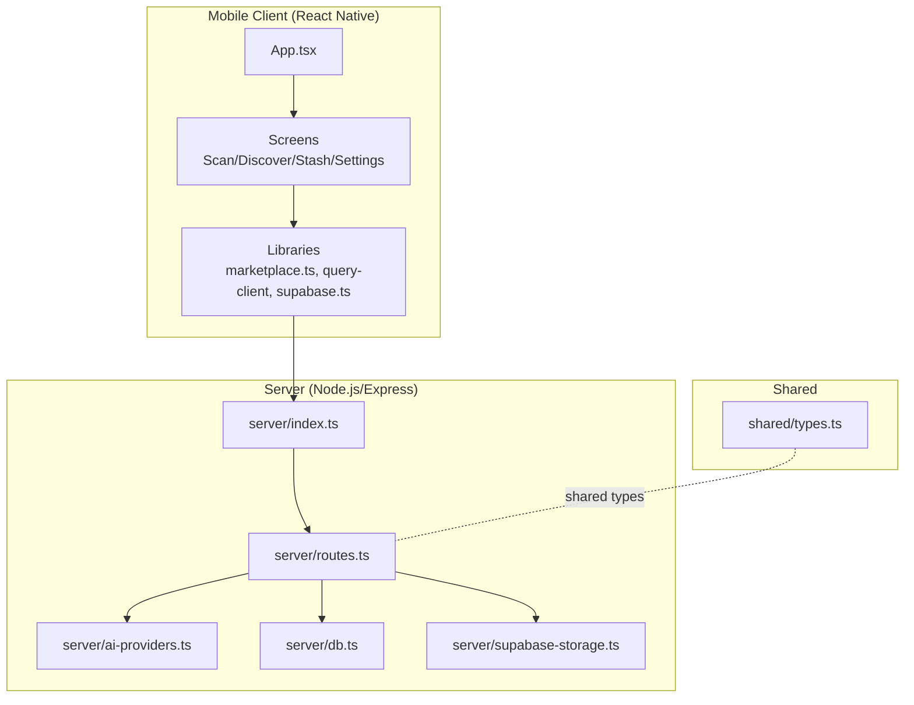
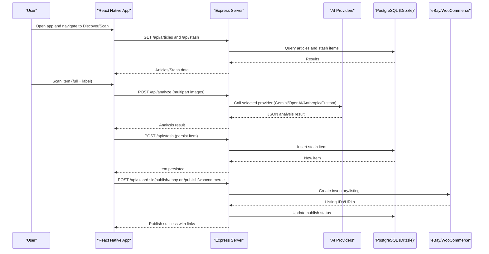
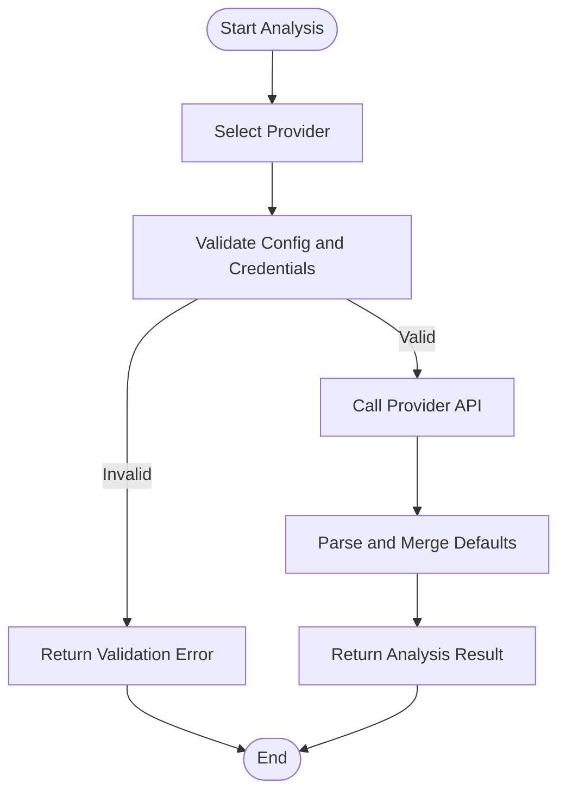
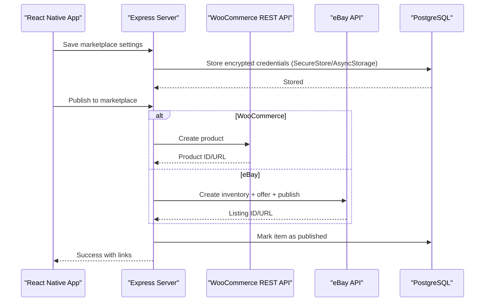
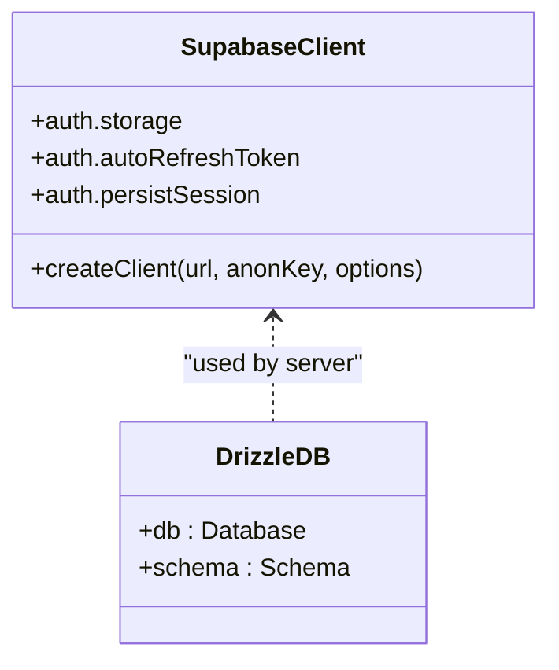
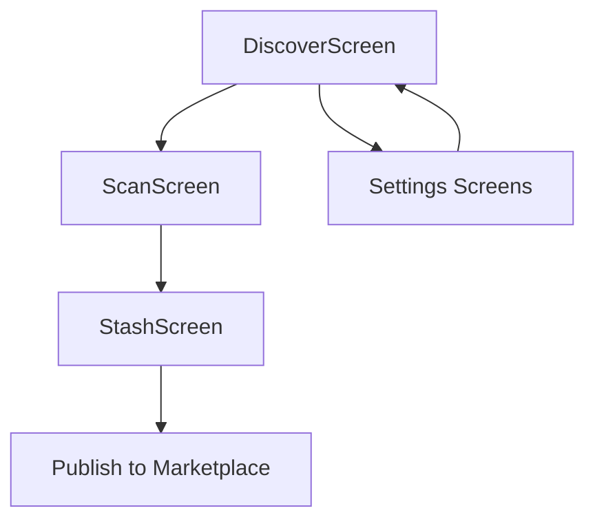
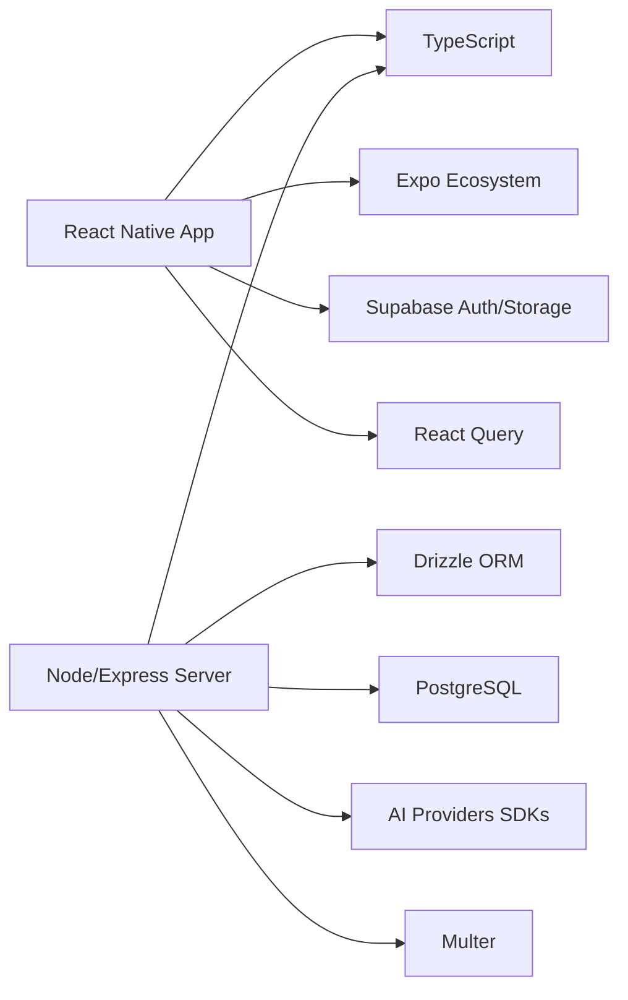

# Project Overview

<cite>
**Referenced Files in This Document**
- [package.json](file://package.json)
- [App.tsx](file://client/App.tsx)
- [index.ts](file://server/index.ts)
- [supabase.ts](file://client/lib/supabase.ts)
- [db.ts](file://server/db.ts)
- [ai-providers.ts](file://server/ai-providers.ts)
- [routes.ts](file://server/routes.ts)
- [marketplace.ts](file://client/lib/marketplace.ts)
- [AIProvidersScreen.tsx](file://client/screens/AIProvidersScreen.tsx)
- [DiscoverScreen.tsx](file://client/screens/DiscoverScreen.tsx)
- [ScanScreen.tsx](file://client/screens/ScanScreen.tsx)
- [StashScreen.tsx](file://client/screens/StashScreen.tsx)
- [EbaySettingsScreen.tsx](file://client/screens/EbaySettingsScreen.tsx)
- [WooCommerceSettingsScreen.tsx](file://client/screens/WooCommerceSettingsScreen.tsx)
- [types.ts](file://shared/types.ts)
</cite>

## Table of Contents
1. [Introduction](#introduction)
2. [Project Structure](#project-structure)
3. [Core Components](#core-components)
4. [Architecture Overview](#architecture-overview)
5. [Detailed Component Analysis](#detailed-component-analysis)
6. [Dependency Analysis](#dependency-analysis)
7. [Performance Considerations](#performance-considerations)
8. [Troubleshooting Guide](#troubleshooting-guide)
9. [Conclusion](#conclusion)

## Introduction
Hidden-Gem is a mobile application designed for collectors and resellers to authenticate, appraise, and monetize vintage and collectible items. It combines AI-powered analysis with marketplace integrations to streamline the entire workflow from discovery to sale. The app targets users who want accurate valuations, authentication insights, and seamless publishing to platforms like eBay and WooCommerce.

Core value proposition:
- Intelligent item analysis powered by configurable AI providers (Google Gemini, OpenAI, Anthropic, or custom/local endpoints)
- Curated educational content to guide collectors and resellers
- Integrated marketplace publishing to eBay and WooCommerce with secure credential management
- Stash management for organizing items awaiting listing or monitoring

Key differentiators:
- Unified AI analysis pipeline with retry and feedback support
- First-class marketplace integrations with robust credential handling
- Progressive disclosure of marketplace publishing steps (scan → analyze → publish)
- Real-time price tracking and notifications

## Project Structure
The project follows a dual-layer architecture:
- Mobile client built with React Native and TypeScript
- Node.js/Express server with TypeScript, PostgreSQL via Drizzle ORM, and Supabase for auth/storage

**Diagram sources**
- [App.tsx](file://client/App.tsx#L1-L67)
- [index.ts](file://server/index.ts#L1-L262)
- [routes.ts](file://server/routes.ts#L1-L929)
- [ai-providers.ts](file://server/ai-providers.ts#L1-L696)
- [db.ts](file://server/db.ts#L1-L19)
- [marketplace.ts](file://client/lib/marketplace.ts#L1-L129)
- [types.ts](file://shared/types.ts#L1-L116)

**Section sources**
- [package.json](file://package.json#L1-L95)
- [App.tsx](file://client/App.tsx#L1-L67)
- [index.ts](file://server/index.ts#L1-L262)

## Core Components
- Authentication and session management via Supabase client abstraction
- AI analysis orchestration supporting multiple providers with fallback parsing
- Marketplace publishing adapters for eBay and WooCommerce
- Content discovery and stash management screens
- Shared data contracts for products, listings, and AI generations

**Section sources**
- [supabase.ts](file://client/lib/supabase.ts#L1-L39)
- [ai-providers.ts](file://server/ai-providers.ts#L1-L696)
- [routes.ts](file://server/routes.ts#L387-L647)
- [marketplace.ts](file://client/lib/marketplace.ts#L1-L129)
- [types.ts](file://shared/types.ts#L7-L116)

## Architecture Overview
The app’s workflow spans three stages:
1) Discovery and scanning: Users discover content and scan items
2) AI analysis: Images are sent to selected AI provider(s) for authentication and valuation
3) Publishing: Approved items are published to chosen marketplaces with secure credentials

**Diagram sources**
- [DiscoverScreen.tsx](file://client/screens/DiscoverScreen.tsx#L88-L175)
- [ScanScreen.tsx](file://client/screens/ScanScreen.tsx#L17-L394)
- [routes.ts](file://server/routes.ts#L299-L385)
- [ai-providers.ts](file://server/ai-providers.ts#L380-L396)
- [routes.ts](file://server/routes.ts#L387-L647)
- [db.ts](file://server/db.ts#L1-L19)

## Detailed Component Analysis

### AI Providers and Analysis Pipeline
The server encapsulates AI provider logic with a unified interface and robust error handling. It supports:
- Provider selection: Gemini, OpenAI, Anthropic, or custom/local endpoints
- Retry analysis with user feedback
- Strict validation for custom endpoints and API keys
- Fallback parsing for resilient result handling

**Diagram sources**
- [ai-providers.ts](file://server/ai-providers.ts#L380-L396)
- [ai-providers.ts](file://server/ai-providers.ts#L131-L180)
- [ai-providers.ts](file://server/ai-providers.ts#L604-L695)

**Section sources**
- [ai-providers.ts](file://server/ai-providers.ts#L1-L696)
- [AIProvidersScreen.tsx](file://client/screens/AIProvidersScreen.tsx#L104-L270)

### Marketplace Integrations
The app integrates with eBay and WooCommerce to publish listings directly from the stash. Credential management is handled securely:
- eBay: Requires client credentials and optional user OAuth refresh token; supports sandbox/production environments
- WooCommerce: Requires store URL and consumer key/secret; validates connectivity

**Diagram sources**
- [marketplace.ts](file://client/lib/marketplace.ts#L1-L129)
- [routes.ts](file://server/routes.ts#L387-L647)
- [EbaySettingsScreen.tsx](file://client/screens/EbaySettingsScreen.tsx#L27-L187)
- [WooCommerceSettingsScreen.tsx](file://client/screens/WooCommerceSettingsScreen.tsx#L26-L180)

**Section sources**
- [marketplace.ts](file://client/lib/marketplace.ts#L1-L129)
- [routes.ts](file://server/routes.ts#L387-L647)
- [EbaySettingsScreen.tsx](file://client/screens/EbaySettingsScreen.tsx#L1-L568)
- [WooCommerceSettingsScreen.tsx](file://client/screens/WooCommerceSettingsScreen.tsx#L1-L512)

### Authentication and Data Layer
- Supabase client abstraction handles auth persistence and redirect URLs across platforms
- PostgreSQL schema is managed via Drizzle ORM with shared types for server/client consistency

**Diagram sources**
- [supabase.ts](file://client/lib/supabase.ts#L1-L39)
- [db.ts](file://server/db.ts#L1-L19)

**Section sources**
- [supabase.ts](file://client/lib/supabase.ts#L1-L39)
- [db.ts](file://server/db.ts#L1-L19)

### Screens and Navigation Flow
- DiscoverScreen: Browse curated articles and tips
- ScanScreen: Capture full-item and label images with camera/gallery
- StashScreen: Manage scanned items and quick actions
- Settings screens: Configure AI providers, eBay, and WooCommerce

**Diagram sources**
- [DiscoverScreen.tsx](file://client/screens/DiscoverScreen.tsx#L88-L175)
- [ScanScreen.tsx](file://client/screens/ScanScreen.tsx#L17-L394)
- [StashScreen.tsx](file://client/screens/StashScreen.tsx#L93-L163)
- [AIProvidersScreen.tsx](file://client/screens/AIProvidersScreen.tsx#L104-L270)
- [EbaySettingsScreen.tsx](file://client/screens/EbaySettingsScreen.tsx#L27-L187)
- [WooCommerceSettingsScreen.tsx](file://client/screens/WooCommerceSettingsScreen.tsx#L26-L180)

**Section sources**
- [DiscoverScreen.tsx](file://client/screens/DiscoverScreen.tsx#L1-L340)
- [ScanScreen.tsx](file://client/screens/ScanScreen.tsx#L1-L394)
- [StashScreen.tsx](file://client/screens/StashScreen.tsx#L1-L290)
- [AIProvidersScreen.tsx](file://client/screens/AIProvidersScreen.tsx#L1-L807)
- [EbaySettingsScreen.tsx](file://client/screens/EbaySettingsScreen.tsx#L1-L568)
- [WooCommerceSettingsScreen.tsx](file://client/screens/WooCommerceSettingsScreen.tsx#L1-L512)

## Dependency Analysis
Technology stack summary:
- Mobile: React Native, TypeScript, Expo ecosystem
- Backend: Node.js, Express, TypeScript
- AI: Google GenAI, OpenAI, Anthropic, custom/local endpoints
- Data: PostgreSQL via Drizzle ORM, Supabase for auth/storage
- Networking: Multer for uploads, React Query for caching, Expo Secure Store for credentials

**Diagram sources**
- [package.json](file://package.json#L24-L76)
- [index.ts](file://server/index.ts#L1-L262)
- [db.ts](file://server/db.ts#L1-L19)
- [ai-providers.ts](file://server/ai-providers.ts#L1-L696)

**Section sources**
- [package.json](file://package.json#L1-L95)
- [index.ts](file://server/index.ts#L1-L262)

## Performance Considerations
- Image upload limits and memory handling via Multer
- Client-side caching with React Query to reduce redundant requests
- Scheduled price checks to avoid frequent polling
- Environment-specific CORS and platform routing for optimal delivery

[No sources needed since this section provides general guidance]

## Troubleshooting Guide
Common issues and resolutions:
- AI provider connectivity failures: Verify API keys, model names, and endpoint URLs; use the built-in connection tests
- Marketplace publishing errors: Confirm credentials and environment settings; ensure required policies are configured for eBay
- Camera permissions: Prompt users to grant camera access; handle permission denials gracefully
- Supabase configuration: Ensure environment variables are set for URL and anonymous key

**Section sources**
- [AIProvidersScreen.tsx](file://client/screens/AIProvidersScreen.tsx#L211-L263)
- [EbaySettingsScreen.tsx](file://client/screens/EbaySettingsScreen.tsx#L112-L150)
- [WooCommerceSettingsScreen.tsx](file://client/screens/WooCommerceSettingsScreen.tsx#L108-L146)
- [ScanScreen.tsx](file://client/screens/ScanScreen.tsx#L99-L132)
- [supabase.ts](file://client/lib/supabase.ts#L6-L38)

## Conclusion
Hidden-Gem delivers a cohesive mobile experience for collectors and resellers by combining AI-driven item analysis with streamlined marketplace publishing. Its modular architecture, secure credential handling, and robust error management enable reliable workflows from discovery to monetization. The shared types and layered design support maintain consistency across the stack while allowing flexibility for future enhancements.