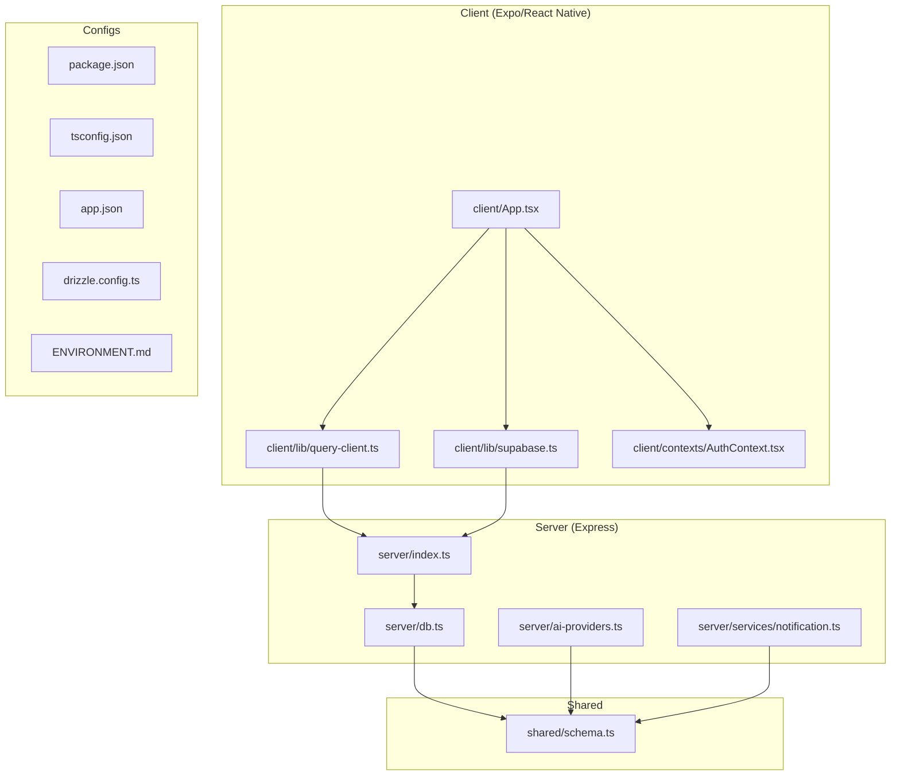
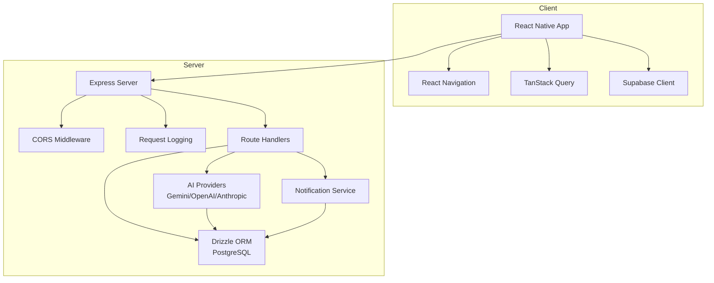
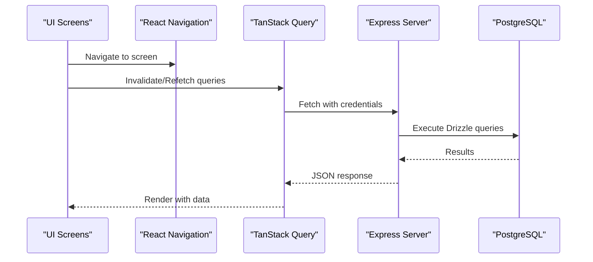
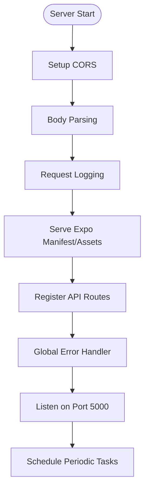
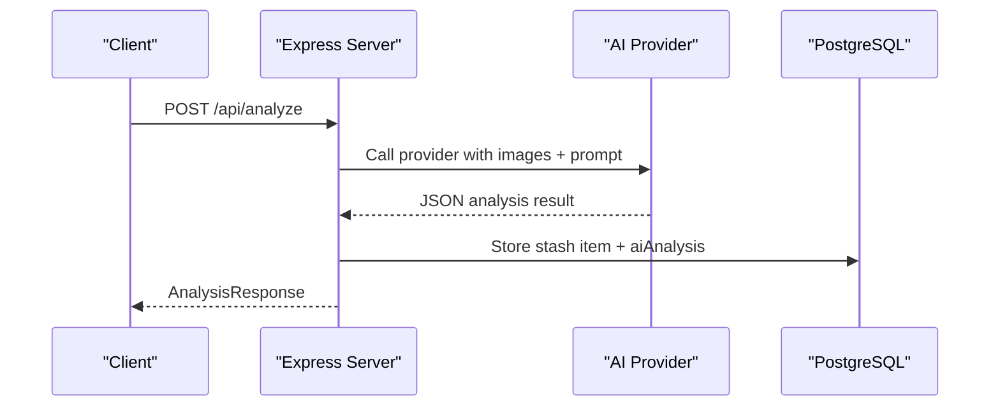
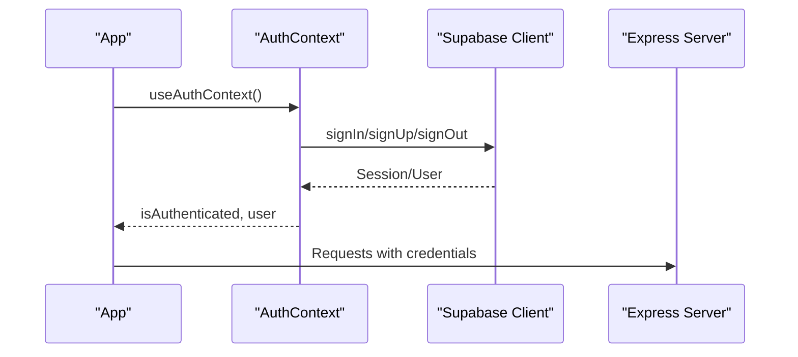
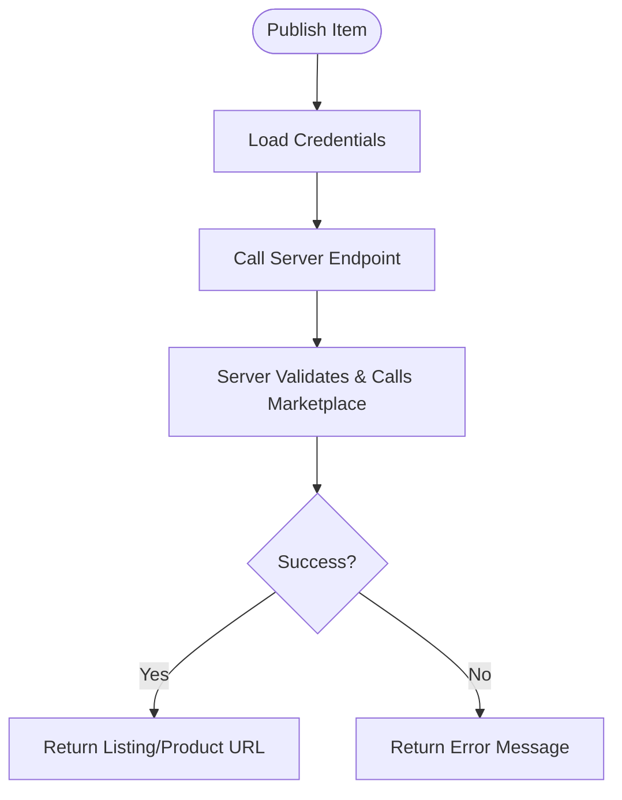
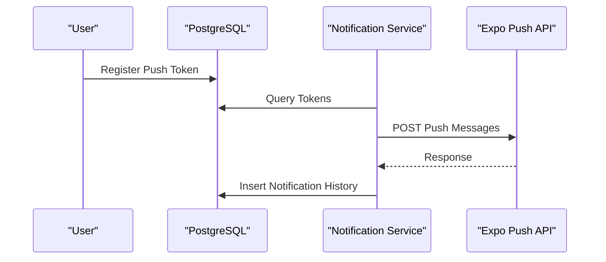
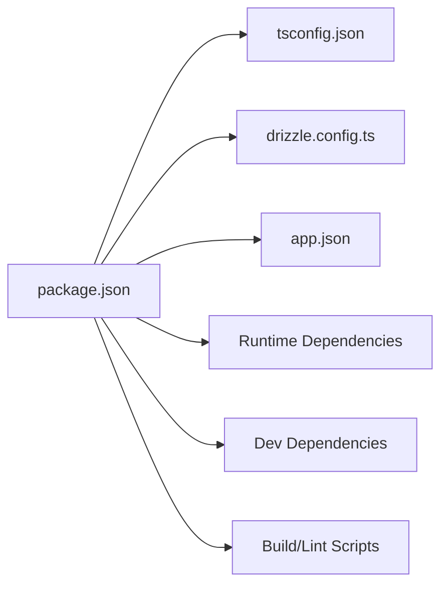

# Technology Stack

<cite>
**Referenced Files in This Document**
- [package.json](file://package.json)
- [drizzle.config.ts](file://drizzle.config.ts)
- [tsconfig.json](file://tsconfig.json)
- [app.json](file://app.json)
- [ENVIRONMENT.md](file://ENVIRONMENT.md)
- [client/App.tsx](file://client/App.tsx)
- [client/lib/supabase.ts](file://client/lib/supabase.ts)
- [client/lib/query-client.ts](file://client/lib/query-client.ts)
- [client/contexts/AuthContext.tsx](file://client/contexts/AuthContext.tsx)
- [server/index.ts](file://server/index.ts)
- [server/db.ts](file://server/db.ts)
- [shared/schema.ts](file://shared/schema.ts)
- [server/ai-providers.ts](file://server/ai-providers.ts)
- [client/lib/marketplace.ts](file://client/lib/marketplace.ts)
- [server/services/notification.ts](file://server/services/notification.ts)
</cite>

## Table of Contents
1. [Introduction](#introduction)
2. [Project Structure](#project-structure)
3. [Core Components](#core-components)
4. [Architecture Overview](#architecture-overview)
5. [Detailed Component Analysis](#detailed-component-analysis)
6. [Dependency Analysis](#dependency-analysis)
7. [Performance Considerations](#performance-considerations)
8. [Troubleshooting Guide](#troubleshooting-guide)
9. [Conclusion](#conclusion)
10. [Appendices](#appendices)

## Introduction
This document presents the complete technology stack and development tools powering the Hidden-Gem application. It covers the frontend (React Native with Expo, TypeScript, navigation, and state management), the backend (Express.js, Drizzle ORM, PostgreSQL, and Node.js), AI integration (Google Gemini and OpenAI APIs), authentication (Supabase), marketplace integrations (eBay and WooCommerce), and notification services. It also outlines version compatibility requirements, development dependencies, build tools, rationale for technology choices, performance considerations, and the development environment setup.

## Project Structure
The project follows a monorepo-like structure with a clear separation between the client (Expo/React Native), server (Express), shared database schema, and supporting scripts and configurations.

**Diagram sources**
- [client/App.tsx](file://client/App.tsx#L1-L67)
- [client/lib/supabase.ts](file://client/lib/supabase.ts#L1-L39)
- [client/lib/query-client.ts](file://client/lib/query-client.ts#L1-L80)
- [client/contexts/AuthContext.tsx](file://client/contexts/AuthContext.tsx#L1-L31)
- [server/index.ts](file://server/index.ts#L1-L262)
- [server/db.ts](file://server/db.ts#L1-L19)
- [shared/schema.ts](file://shared/schema.ts#L1-L344)
- [server/ai-providers.ts](file://server/ai-providers.ts#L1-L696)
- [server/services/notification.ts](file://server/services/notification.ts#L1-L414)
- [package.json](file://package.json#L1-L95)
- [tsconfig.json](file://tsconfig.json#L1-L15)
- [app.json](file://app.json#L1-L52)
- [drizzle.config.ts](file://drizzle.config.ts#L1-L19)
- [ENVIRONMENT.md](file://ENVIRONMENT.md#L1-L219)

**Section sources**
- [package.json](file://package.json#L1-L95)
- [ENVIRONMENT.md](file://ENVIRONMENT.md#L115-L144)

## Core Components
- Frontend framework: React Native with Expo for cross-platform mobile and web deployment.
- State and caching: TanStack Query for data fetching, caching, and invalidation.
- Navigation: React Navigation for native navigation stacks and tabs.
- Authentication: Supabase client-side SDK with secure local storage.
- Backend: Express.js server with TypeScript, CORS, logging, and static asset serving for Expo.
- Database: PostgreSQL via Drizzle ORM with schema-driven migrations.
- AI: Pluggable AI providers (Google Gemini, OpenAI, Anthropic, custom) with robust parsing and fallbacks.
- Marketplace integrations: eBay and WooCommerce publishing flows with secure credential storage.
- Notifications: Push notifications via Expo push service with database-backed token storage and history.

**Section sources**
- [client/App.tsx](file://client/App.tsx#L1-L67)
- [client/lib/query-client.ts](file://client/lib/query-client.ts#L1-L80)
- [client/lib/supabase.ts](file://client/lib/supabase.ts#L1-L39)
- [server/index.ts](file://server/index.ts#L1-L262)
- [server/db.ts](file://server/db.ts#L1-L19)
- [shared/schema.ts](file://shared/schema.ts#L1-L344)
- [server/ai-providers.ts](file://server/ai-providers.ts#L1-L696)
- [client/lib/marketplace.ts](file://client/lib/marketplace.ts#L1-L129)
- [server/services/notification.ts](file://server/services/notification.ts#L1-L414)

## Architecture Overview
The system is a hybrid mobile-first application with a backend-as-a-service approach. The React Native client communicates with the Express server over HTTPS, leveraging Supabase for authentication and TanStack Query for efficient data management. The backend integrates AI providers for item analysis and publishes listings to eBay and WooCommerce. PostgreSQL stores all application data, with Drizzle ORM providing type-safe database operations.

**Diagram sources**
- [client/App.tsx](file://client/App.tsx#L1-L67)
- [client/lib/query-client.ts](file://client/lib/query-client.ts#L1-L80)
- [client/lib/supabase.ts](file://client/lib/supabase.ts#L1-L39)
- [server/index.ts](file://server/index.ts#L1-L262)
- [server/db.ts](file://server/db.ts#L1-L19)
- [server/ai-providers.ts](file://server/ai-providers.ts#L1-L696)
- [server/services/notification.ts](file://server/services/notification.ts#L1-L414)

## Detailed Component Analysis

### Frontend Stack
- React Native + Expo: Cross-platform runtime with native modules and web support. App metadata and plugins are configured in app.json.
- TypeScript: Strict type checking with path aliases and node types included.
- Navigation: React Navigation for native stacks and tabs; theme applied via a dark theme variant.
- State and caching: TanStack Query wraps API calls with centralized query client configuration and custom fetch helpers.
- Authentication: Supabase client initialized with environment variables and platform-aware storage; redirect URL handling for web and native.
- Context: AuthProvider exposes session and user state to the app tree.

**Diagram sources**
- [client/App.tsx](file://client/App.tsx#L1-L67)
- [client/lib/query-client.ts](file://client/lib/query-client.ts#L1-L80)
- [server/index.ts](file://server/index.ts#L1-L262)
- [server/db.ts](file://server/db.ts#L1-L19)

**Section sources**
- [app.json](file://app.json#L1-L52)
- [tsconfig.json](file://tsconfig.json#L1-L15)
- [client/App.tsx](file://client/App.tsx#L1-L67)
- [client/lib/query-client.ts](file://client/lib/query-client.ts#L1-L80)
- [client/lib/supabase.ts](file://client/lib/supabase.ts#L1-L39)
- [client/contexts/AuthContext.tsx](file://client/contexts/AuthContext.tsx#L1-L31)

### Backend Stack
- Express.js: Minimal server with CORS, body parsing, request logging, Expo manifest routing, and error handling.
- Drizzle ORM + PostgreSQL: Type-safe schema definitions and migrations; SSL configuration for secure connections.
- Database schema: Shared schema defines user, stash items, articles, conversations, messages, marketplace-related tables, push tokens, price tracking, and notifications.

**Diagram sources**
- [server/index.ts](file://server/index.ts#L1-L262)
- [server/db.ts](file://server/db.ts#L1-L19)
- [shared/schema.ts](file://shared/schema.ts#L1-L344)

**Section sources**
- [server/index.ts](file://server/index.ts#L1-L262)
- [server/db.ts](file://server/db.ts#L1-L19)
- [shared/schema.ts](file://shared/schema.ts#L1-L344)

### AI Integration Technologies
- Provider abstraction: Unified analyzeItem and analyzeItemWithRetry functions supporting Gemini, OpenAI, Anthropic, and custom endpoints.
- Security: Custom endpoint validation prevents private/internal network targets; API keys handled per provider.
- Parsing: Robust JSON extraction and fallback result for resilient AI responses.
- Testing: testProviderConnection validates provider connectivity.

**Diagram sources**
- [server/ai-providers.ts](file://server/ai-providers.ts#L1-L696)
- [shared/schema.ts](file://shared/schema.ts#L29-L50)

**Section sources**
- [server/ai-providers.ts](file://server/ai-providers.ts#L1-L696)
- [shared/schema.ts](file://shared/schema.ts#L29-L50)

### Authentication Systems (Supabase)
- Client initialization: Environment variables for public URLs and keys; platform-aware storage and redirect handling.
- Auth context: Provider exposes session, user, and sign-in/sign-out actions; guards usage with context.

**Diagram sources**
- [client/lib/supabase.ts](file://client/lib/supabase.ts#L1-L39)
- [client/contexts/AuthContext.tsx](file://client/contexts/AuthContext.tsx#L1-L31)
- [client/App.tsx](file://client/App.tsx#L1-L67)

**Section sources**
- [client/lib/supabase.ts](file://client/lib/supabase.ts#L1-L39)
- [client/contexts/AuthContext.tsx](file://client/contexts/AuthContext.tsx#L1-L31)

### Marketplace Integrations (eBay and WooCommerce)
- Credential storage: SecureStore on native platforms; AsyncStorage on web for credentials and store URLs.
- Publishing flows: Client calls server endpoints to publish items to eBay or WooCommerce using stored credentials.
- Server routes: Endpoints accept credentials and delegate to marketplace APIs.

**Diagram sources**
- [client/lib/marketplace.ts](file://client/lib/marketplace.ts#L1-L129)
- [server/index.ts](file://server/index.ts#L1-L262)

**Section sources**
- [client/lib/marketplace.ts](file://client/lib/marketplace.ts#L1-L129)

### Notification Services
- Push tokens: Registered per user and platform; stored in database.
- Sending notifications: Sends batch push messages via Expo push service and records notification history.
- Price tracking: Scheduled job compares current AI-derived prices against thresholds and sends alerts.

**Diagram sources**
- [server/services/notification.ts](file://server/services/notification.ts#L1-L414)
- [shared/schema.ts](file://shared/schema.ts#L258-L293)

**Section sources**
- [server/services/notification.ts](file://server/services/notification.ts#L1-L414)
- [shared/schema.ts](file://shared/schema.ts#L258-L293)

## Dependency Analysis
The project’s dependencies are declared in package.json, with clear separation between runtime dependencies, development dependencies, and build-time scripts. TypeScript configuration extends Expo’s base and enables strict mode with path aliases. Drizzle configuration points to the shared schema and migrations directory.

**Diagram sources**
- [package.json](file://package.json#L1-L95)
- [tsconfig.json](file://tsconfig.json#L1-L15)
- [drizzle.config.ts](file://drizzle.config.ts#L1-L19)
- [app.json](file://app.json#L1-L52)

**Section sources**
- [package.json](file://package.json#L1-L95)
- [tsconfig.json](file://tsconfig.json#L1-L15)
- [drizzle.config.ts](file://drizzle.config.ts#L1-L19)
- [app.json](file://app.json#L1-L52)

## Performance Considerations
- Client caching: TanStack Query disables automatic refetch and sets infinite stale time to reduce network calls; credentials included for authenticated endpoints.
- Server scheduling: Periodic price checks run every six hours to balance accuracy and load.
- Database: SSL-enabled connections and schema-driven migrations ensure reliability; indexes defined for unique constraints and joins.
- AI responses: JSON parsing with fallback ensures resilience against provider variability.

[No sources needed since this section provides general guidance]

## Troubleshooting Guide
Common issues and resolutions:
- Ports in use: Kill processes bound to 5000 (backend) and 8081 (frontend) if conflicts occur.
- Database connectivity: Verify DATABASE_URL and test with psql against the connection string.
- Hot reload: Clear cache or restart the Expo dev server if updates are not reflected.
- Supabase authentication: Confirm EXPO_PUBLIC_SUPABASE_URL and keys are set; ensure secrets are configured in the hosting environment.
- AI features: Validate AI provider API keys and quotas; use testProviderConnection to verify connectivity.

**Section sources**
- [ENVIRONMENT.md](file://ENVIRONMENT.md#L172-L195)

## Conclusion
Hidden-Gem leverages a cohesive stack combining React Native with Expo for rapid cross-platform development, Express.js for a lightweight backend, Drizzle ORM for type-safe database operations, and Supabase for authentication. AI integration is modular and extensible, while marketplace and notification services provide practical e-commerce and user engagement features. The architecture balances developer productivity with maintainability and scalability.

[No sources needed since this section summarizes without analyzing specific files]

## Appendices

### Version Compatibility and Tooling
- Node.js: v18 or higher is required for development.
- Expo: Configured in app.json with plugins and experiments enabled.
- TypeScript: Enabled with strict mode and path aliases.
- Drizzle: Configured to use PostgreSQL dialect and shared schema.
- Build and scripts: NPM scripts for dev servers, linting, type checking, formatting, and production builds.

**Section sources**
- [ENVIRONMENT.md](file://ENVIRONMENT.md#L7-L10)
- [app.json](file://app.json#L1-L52)
- [tsconfig.json](file://tsconfig.json#L1-L15)
- [drizzle.config.ts](file://drizzle.config.ts#L1-L19)
- [package.json](file://package.json#L5-L23)

### Development Environment Setup
- Prerequisites: Node.js, Expo CLI, Git, and a Replit account for integrated services.
- Environment variables: DATABASE_URL, Supabase public and server keys, SESSION_SECRET, and AI provider keys.
- Running: Start backend and frontend concurrently; apply database migrations; test AI provider connectivity.

**Section sources**
- [ENVIRONMENT.md](file://ENVIRONMENT.md#L69-L113)

### IDE Recommendations
- Editor: VS Code with ESLint and Prettier extensions for formatting and linting.
- TypeScript: Enable type checking and path mapping as configured in tsconfig.json.
- Formatting: Use npm run format to keep code consistent.

**Section sources**
- [package.json](file://package.json#L77-L91)
- [tsconfig.json](file://tsconfig.json#L1-L15)