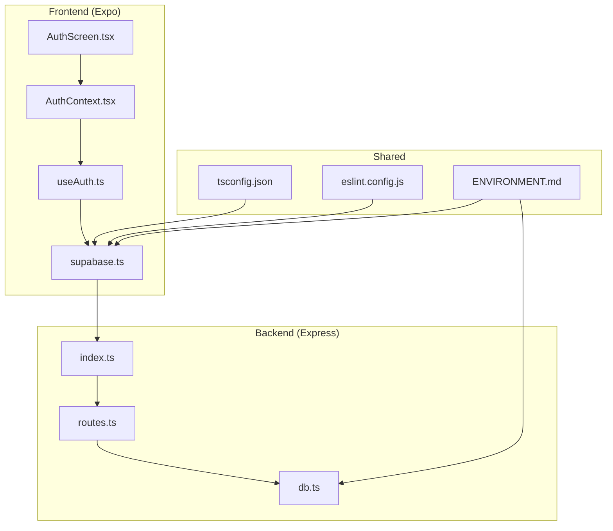
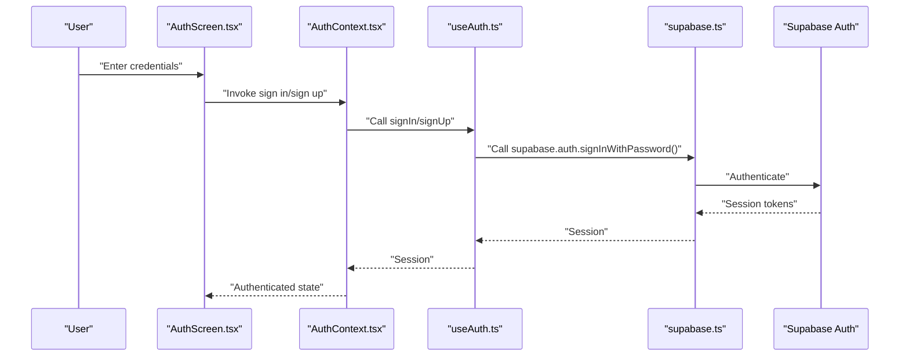
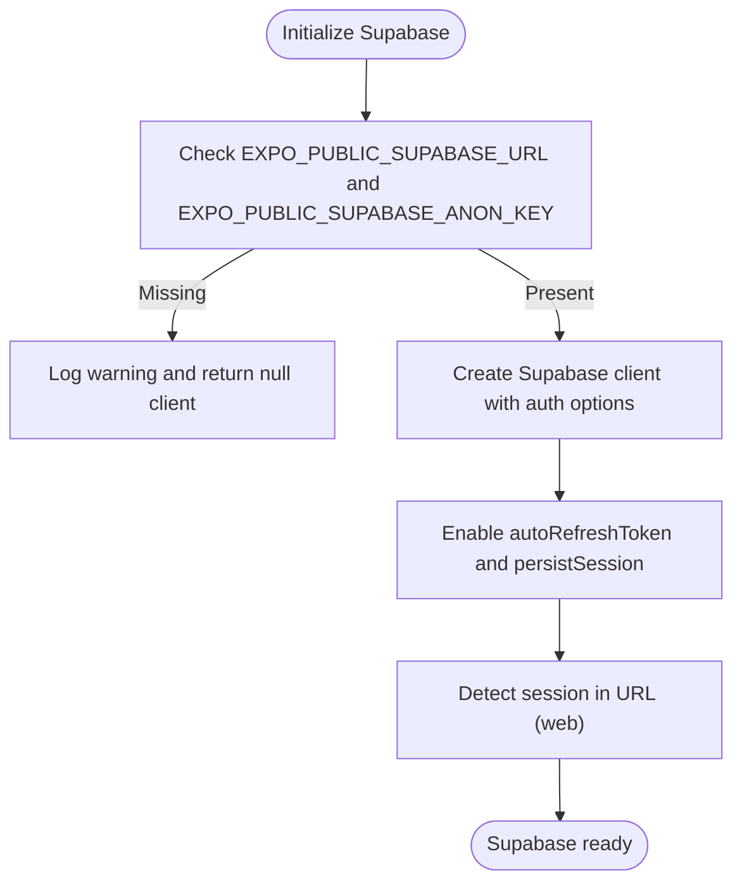
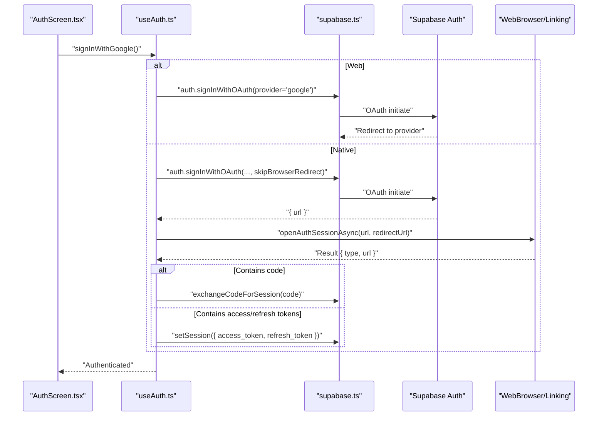
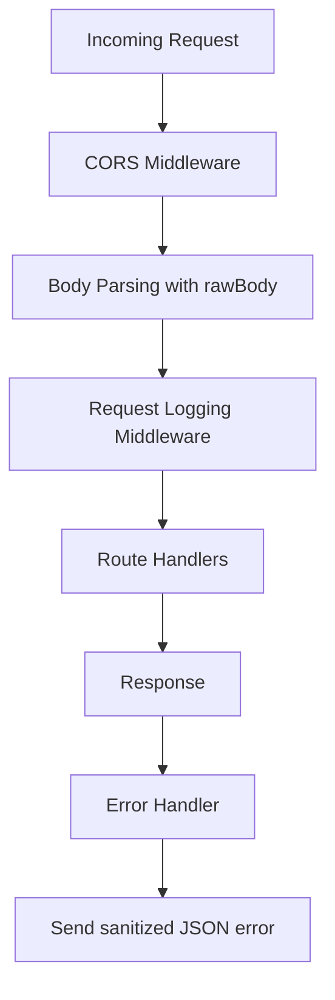
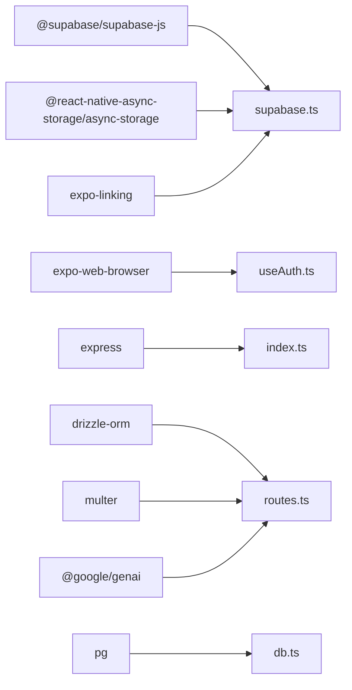

# Security Considerations

<cite>
**Referenced Files in This Document**
- [supabase.ts](file://client/lib/supabase.ts)
- [useAuth.ts](file://client/hooks/useAuth.ts)
- [AuthContext.tsx](file://client/contexts/AuthContext.tsx)
- [AuthScreen.tsx](file://client/screens/AuthScreen.tsx)
- [ENVIRONMENT.md](file://ENVIRONMENT.md)
- [index.ts](file://server/index.ts)
- [db.ts](file://server/db.ts)
- [routes.ts](file://server/routes.ts)
- [package.json](file://package.json)
- [eslint.config.js](file://eslint.config.js)
- [tsconfig.json](file://tsconfig.json)
- [ErrorBoundary.tsx](file://client/components/ErrorBoundary.tsx)
- [ErrorFallback.tsx](file://client/components/ErrorFallback.tsx)
- [PrivacyPolicyScreen.tsx](file://client/screens/PrivacyPolicyScreen.tsx)
- [auth_flow.yml](file://.maestro/auth_flow.yml)
</cite>

## Table of Contents
1. [Introduction](#introduction)
2. [Project Structure](#project-structure)
3. [Core Components](#core-components)
4. [Architecture Overview](#architecture-overview)
5. [Detailed Component Analysis](#detailed-component-analysis)
6. [Dependency Analysis](#dependency-analysis)
7. [Performance Considerations](#performance-considerations)
8. [Troubleshooting Guide](#troubleshooting-guide)
9. [Conclusion](#conclusion)
10. [Appendices](#appendices)

## Introduction
This document consolidates security considerations for the project with a focus on authentication security, data protection, and secure development practices. It documents the Supabase authentication configuration, session management, and token handling security measures, along with environment variable management, API key protection, sensitive data handling, database security, input validation strategies, and protections against common vulnerabilities. It also covers secure communication protocols, encryption requirements, data privacy compliance, monitoring and auditing, incident response, and secure deployment practices.

## Project Structure
The project comprises:
- A React Native Expo frontend that integrates Supabase for authentication and session management.
- An Express backend that serves API routes, integrates with PostgreSQL via Drizzle, and handles marketplace publishing flows.
- Shared schema definitions and configuration files for linting, TypeScript, and environment setup.

**Diagram sources**
- [AuthScreen.tsx](file://client/screens/AuthScreen.tsx#L1-L435)
- [AuthContext.tsx](file://client/contexts/AuthContext.tsx#L1-L31)
- [useAuth.ts](file://client/hooks/useAuth.ts#L1-L151)
- [supabase.ts](file://client/lib/supabase.ts#L1-L39)
- [index.ts](file://server/index.ts#L1-L247)
- [routes.ts](file://server/routes.ts#L1-L493)
- [db.ts](file://server/db.ts#L1-L19)
- [tsconfig.json](file://tsconfig.json#L1-L15)
- [eslint.config.js](file://eslint.config.js#L1-L13)
- [ENVIRONMENT.md](file://ENVIRONMENT.md#L1-L219)

**Section sources**
- [package.json](file://package.json#L1-L85)
- [ENVIRONMENT.md](file://ENVIRONMENT.md#L115-L143)

## Core Components
- Supabase client initialization and session management in the frontend.
- Authentication flows (email/password and OAuth with Google) and session persistence.
- Backend CORS, request logging, error handling, and route-level security.
- Database connectivity and schema usage with Drizzle.
- Privacy policy and error boundary components for user-facing error handling.

**Section sources**
- [supabase.ts](file://client/lib/supabase.ts#L1-L39)
- [useAuth.ts](file://client/hooks/useAuth.ts#L1-L151)
- [AuthContext.tsx](file://client/contexts/AuthContext.tsx#L1-L31)
- [AuthScreen.tsx](file://client/screens/AuthScreen.tsx#L25-L58)
- [index.ts](file://server/index.ts#L16-L98)
- [routes.ts](file://server/routes.ts#L1-L493)
- [db.ts](file://server/db.ts#L1-L19)
- [PrivacyPolicyScreen.tsx](file://client/screens/PrivacyPolicyScreen.tsx#L53-L72)
- [ErrorBoundary.tsx](file://client/components/ErrorBoundary.tsx#L1-L54)
- [ErrorFallback.tsx](file://client/components/ErrorFallback.tsx#L22-L87)

## Architecture Overview
The authentication architecture centers on Supabase Auth for identity and session management, with the frontend using Supabase JS SDK and the backend using server-side keys for protected operations. The backend exposes API endpoints for data retrieval, item management, and marketplace publishing, while enforcing CORS and request logging.

**Diagram sources**
- [AuthScreen.tsx](file://client/screens/AuthScreen.tsx#L25-L58)
- [AuthContext.tsx](file://client/contexts/AuthContext.tsx#L19-L30)
- [useAuth.ts](file://client/hooks/useAuth.ts#L40-L62)
- [supabase.ts](file://client/lib/supabase.ts#L20-L34)

## Detailed Component Analysis

### Supabase Authentication Configuration and Session Management
- Environment variables:
  - Public keys exposed to the frontend: EXPO_PUBLIC_SUPABASE_URL, EXPO_PUBLIC_SUPABASE_ANON_KEY.
  - Server-side keys: SUPABASE_ANON_KEY (used server-side).
- Session persistence and refresh:
  - Auto-refresh enabled and sessions persisted on supported platforms.
  - Redirect URL detection differs by platform (web vs native).
- OAuth with Google:
  - Web uses redirect; native uses deep links and exchanges authorization code or token hash for session.

**Diagram sources**
- [supabase.ts](file://client/lib/supabase.ts#L6-L34)

**Section sources**
- [supabase.ts](file://client/lib/supabase.ts#L1-L39)
- [useAuth.ts](file://client/hooks/useAuth.ts#L72-L137)
- [ENVIRONMENT.md](file://ENVIRONMENT.md#L23-L32)

### Authentication Flows and Token Handling
- Email/password sign-in and sign-up:
  - Frontend validates presence of credentials before invoking Supabase.
  - Errors are surfaced to the UI without exposing internal details.
- Google OAuth:
  - Web: uses redirect with Supabase auth provider.
  - Native: opens external browser session, parses code or token hash, sets session accordingly.

**Diagram sources**
- [useAuth.ts](file://client/hooks/useAuth.ts#L72-L137)
- [supabase.ts](file://client/lib/supabase.ts#L11-L16)

**Section sources**
- [AuthScreen.tsx](file://client/screens/AuthScreen.tsx#L25-L58)
- [useAuth.ts](file://client/hooks/useAuth.ts#L40-L137)

### Backend Security Controls
- CORS:
  - Origin whitelisting based on environment variables and localhost for development.
  - Credentials allowed for whitelisted origins.
- Body parsing:
  - JSON body verification captures raw request body for logging.
- Request logging:
  - Logs method, path, status, duration, and response payload for API paths.
- Error handling:
  - Centralized handler maps errors to status codes and returns sanitized messages.
- Route-level security:
  - Uses server-side Supabase keys for protected operations.
  - Validates presence of required credentials for marketplace publishing.

**Diagram sources**
- [index.ts](file://server/index.ts#L16-L98)
- [routes.ts](file://server/routes.ts#L228-L296)

**Section sources**
- [index.ts](file://server/index.ts#L16-L98)
- [routes.ts](file://server/routes.ts#L228-L296)

### Database Security and Data Protection
- Connection:
  - Requires DATABASE_URL environment variable; throws if missing.
  - SSL configuration present; review production SSL requirements.
- Schema usage:
  - Drizzle ORM used for type-safe queries; ensure strict schema enforcement.
- Sensitive data:
  - Store secrets in environment variables; avoid embedding in client bundles.

**Section sources**
- [db.ts](file://server/db.ts#L7-L16)
- [ENVIRONMENT.md](file://ENVIRONMENT.md#L18-L22)

### Input Validation and Sanitization
- Frontend:
  - Basic presence checks for email and password before submission.
  - UI indicates success/failure with user-friendly messages.
- Backend:
  - Route handlers validate required fields for marketplace publishing.
  - JSON parsing with error handling; falls back to safe defaults when AI parsing fails.

**Section sources**
- [AuthScreen.tsx](file://client/screens/AuthScreen.tsx#L29-L32)
- [routes.ts](file://server/routes.ts#L233-L235)
- [routes.ts](file://server/routes.ts#L209-L221)

### Environment Variable Management and API Key Protection
- Public vs private keys:
  - EXPO_PUBLIC_* variables are safe for client exposure.
  - SUPABASE_ANON_KEY and other secrets are server-side only.
- Secrets storage:
  - Environment variables managed via project configuration; ensure secrets are not committed.
- Local storage:
  - User credentials for integrations are stored locally using secure storage mechanisms.

**Section sources**
- [ENVIRONMENT.md](file://ENVIRONMENT.md#L23-L32)
- [ENVIRONMENT.md](file://ENVIRONMENT.md#L54-L67)

### Secure Communication Protocols and Encryption
- HTTPS:
  - Backend listens on standard ports; ensure reverse proxies terminate TLS in production.
- SSL/TLS:
  - Database connections configured with SSL; verify production certificate settings.
- Token handling:
  - Supabase manages token lifecycle; ensure HTTPS for all auth flows.

**Section sources**
- [index.ts](file://server/index.ts#L24-L28)
- [db.ts](file://server/db.ts#L13-L16)
- [supabase.ts](file://client/lib/supabase.ts#L26-L33)

### Data Privacy Compliance and User Rights
- Privacy notice highlights:
  - AI image processing and recommendations.
  - Data security measures and user rights to access, correct, or delete data.
  - Ability to disconnect marketplace integrations.

**Section sources**
- [PrivacyPolicyScreen.tsx](file://client/screens/PrivacyPolicyScreen.tsx#L53-L72)

### Error Handling Without Exposing Sensitive Information
- Centralized error handling:
  - Converts thrown errors to JSON responses with appropriate status codes.
- Frontend error boundaries:
  - ErrorBoundary and ErrorFallback provide controlled user feedback and developer visibility in development builds.

**Section sources**
- [index.ts](file://server/index.ts#L207-L222)
- [ErrorBoundary.tsx](file://client/components/ErrorBoundary.tsx#L1-L54)
- [ErrorFallback.tsx](file://client/components/ErrorFallback.tsx#L22-L87)

### Security Monitoring, Audit Logging, and Incident Response
- Request logging:
  - Logs API requests with timing and response payloads for diagnostics.
- Error logging:
  - Centralized error handler ensures consistent error reporting.
- Recommendations:
  - Integrate structured logging with severity levels.
  - Add request correlation IDs for traceability.
  - Implement rate limiting and alerting for suspicious activities.

**Section sources**
- [index.ts](file://server/index.ts#L67-L98)
- [index.ts](file://server/index.ts#L207-L222)

### Secure Deployment, Environment Segregation, and Access Control
- Environment segregation:
  - Use separate environment files per deployment stage.
- Access control:
  - Limit server-side key usage to backend services.
  - Enforce least privilege for database users and API integrations.
- Secrets management:
  - Store all secrets in environment variables or secure secret managers.
- CI/CD:
  - Validate environment variables during build and deploy steps.

**Section sources**
- [ENVIRONMENT.md](file://ENVIRONMENT.md#L1-L219)
- [package.json](file://package.json#L5-L17)

## Dependency Analysis

**Diagram sources**
- [supabase.ts](file://client/lib/supabase.ts#L1-L5)
- [useAuth.ts](file://client/hooks/useAuth.ts#L1-L6)
- [index.ts](file://server/index.ts#L1-L6)
- [routes.ts](file://server/routes.ts#L1-L17)
- [db.ts](file://server/db.ts#L1-L3)

**Section sources**
- [package.json](file://package.json#L19-L67)

## Performance Considerations
- Avoid excessive logging of large payloads in production.
- Use streaming or pagination for large dataset endpoints.
- Cache non-sensitive data where appropriate to reduce load.

[No sources needed since this section provides general guidance]

## Troubleshooting Guide
- Supabase authentication failures:
  - Verify EXPO_PUBLIC_SUPABASE_URL and keys are set and valid.
  - Confirm Supabase project is active and API keys are not revoked.
- Backend startup errors:
  - Ensure DATABASE_URL is set; confirm database connectivity.
- CORS issues:
  - Check REPLIT_DEV_DOMAIN and REPLIT_DOMAINS environment variables.
- Marketplace publishing errors:
  - Validate credentials and refresh tokens for integrations.
- UI error handling:
  - Use ErrorBoundary and ErrorFallback to diagnose issues in development.

**Section sources**
- [ENVIRONMENT.md](file://ENVIRONMENT.md#L186-L189)
- [ENVIRONMENT.md](file://ENVIRONMENT.md#L178-L181)
- [index.ts](file://server/index.ts#L16-L53)
- [routes.ts](file://server/routes.ts#L228-L296)
- [ErrorBoundary.tsx](file://client/components/ErrorBoundary.tsx#L1-L54)
- [ErrorFallback.tsx](file://client/components/ErrorFallback.tsx#L22-L87)

## Conclusion
The project implements a clear separation between public and private keys, leverages Supabase for robust authentication and session management, and includes backend middleware for CORS, logging, and error handling. Strengthening production-grade security requires validating SSL/TLS settings, implementing structured logging and alerting, enforcing strict input validation, and maintaining rigorous environment segregation and secrets management.

[No sources needed since this section summarizes without analyzing specific files]

## Appendices

### Practical Secure Coding Practices
- Never log sensitive data; sanitize payloads before logging.
- Validate and sanitize all user inputs on both frontend and backend.
- Use HTTPS everywhere; enforce HSTS in production.
- Rotate secrets regularly and limit their scope.
- Implement rate limiting and monitoring for suspicious activities.

[No sources needed since this section provides general guidance]

### Authentication Flow Examples
- Email/password sign-in and sign-up with frontend validation.
- Google OAuth with platform-specific handling for web and native.

**Section sources**
- [AuthScreen.tsx](file://client/screens/AuthScreen.tsx#L25-L58)
- [useAuth.ts](file://client/hooks/useAuth.ts#L40-L137)

### Testing and Quality Assurance
- Automated UI tests for authentication flows.
- Linting and formatting enforced via ESLint and Prettier.

**Section sources**
- [auth_flow.yml](file://.maestro/auth_flow.yml#L1-L46)
- [eslint.config.js](file://eslint.config.js#L1-L13)
- [tsconfig.json](file://tsconfig.json#L1-L15)