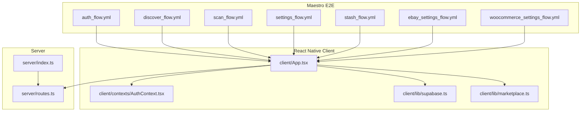
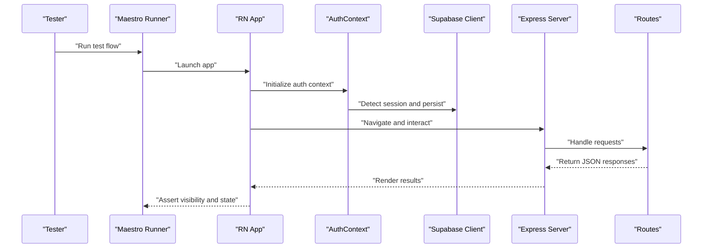
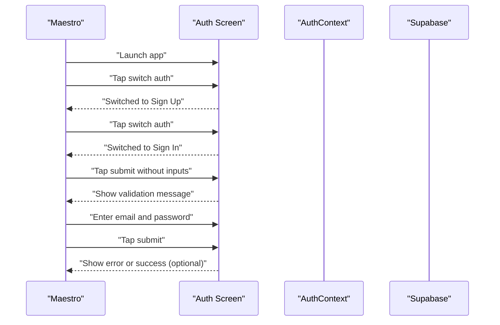
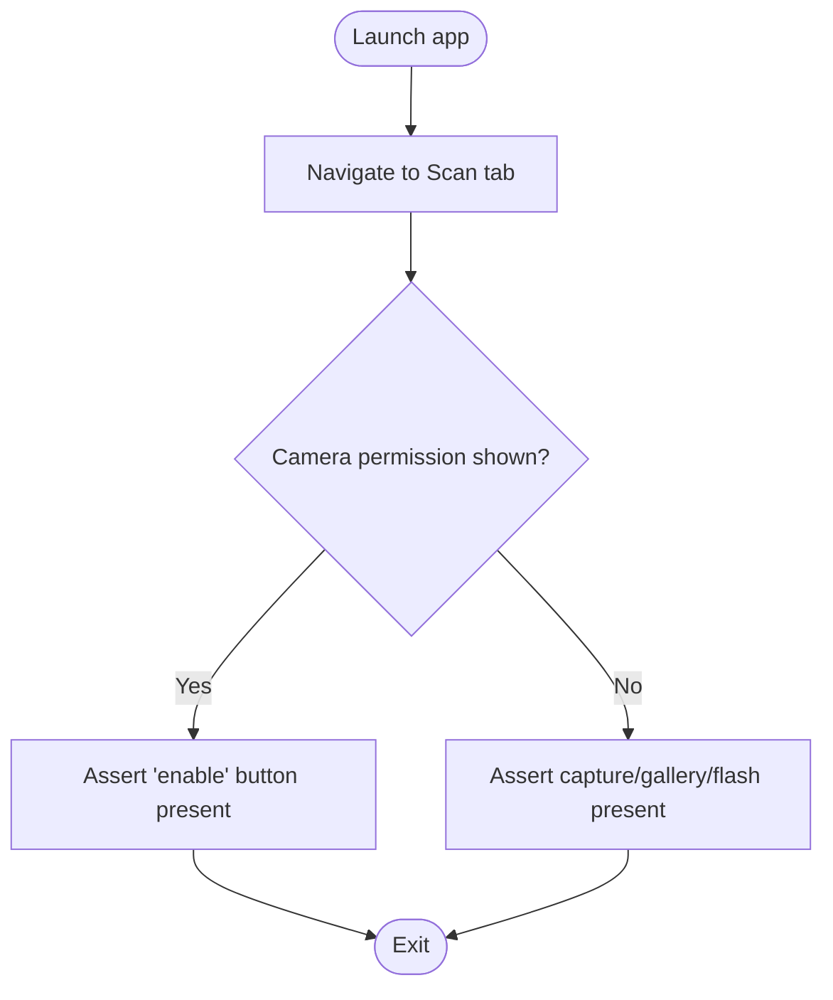
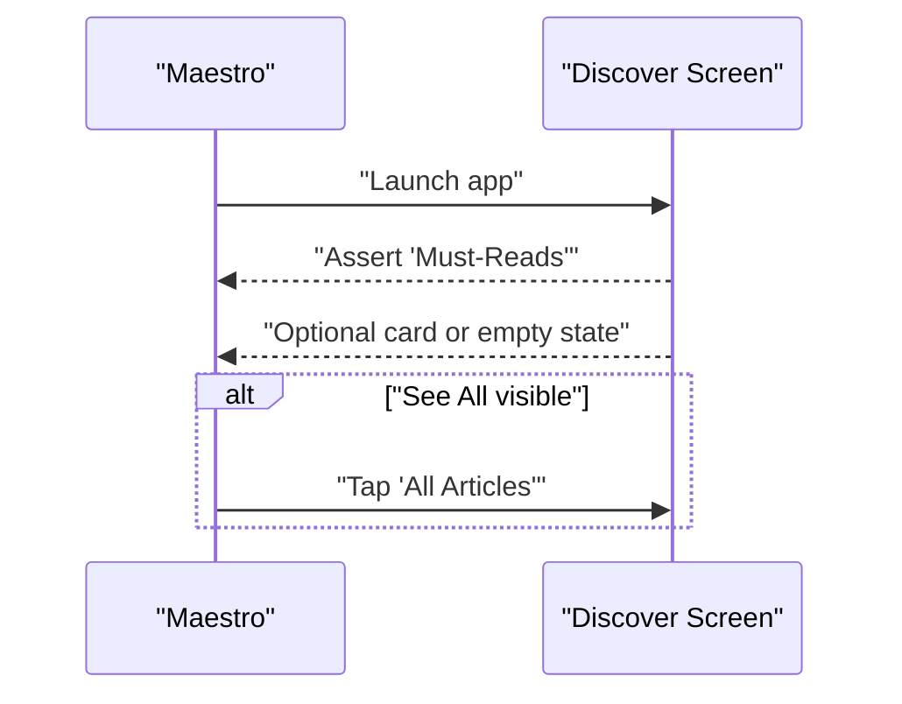
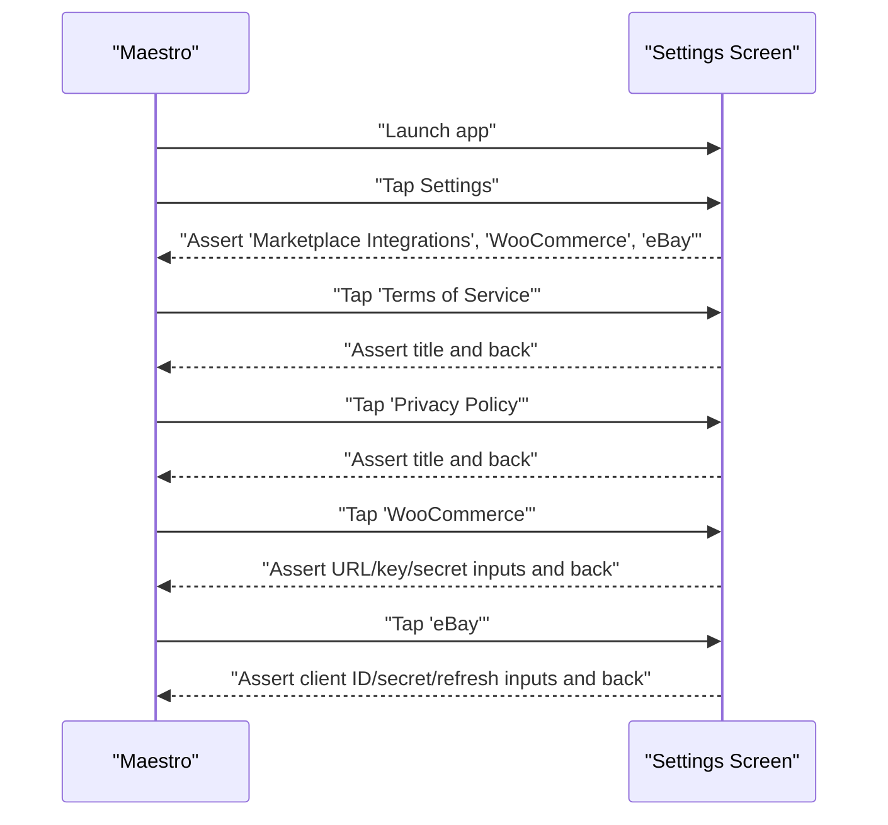
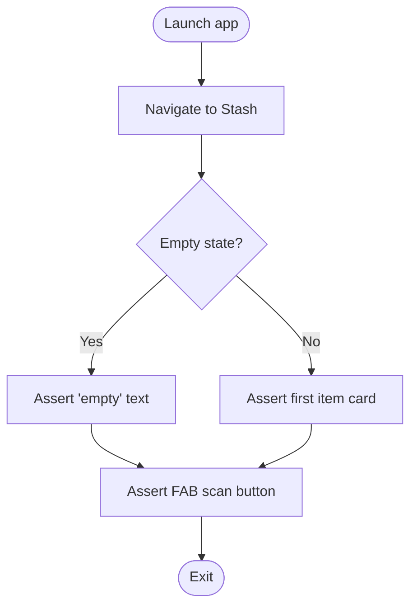
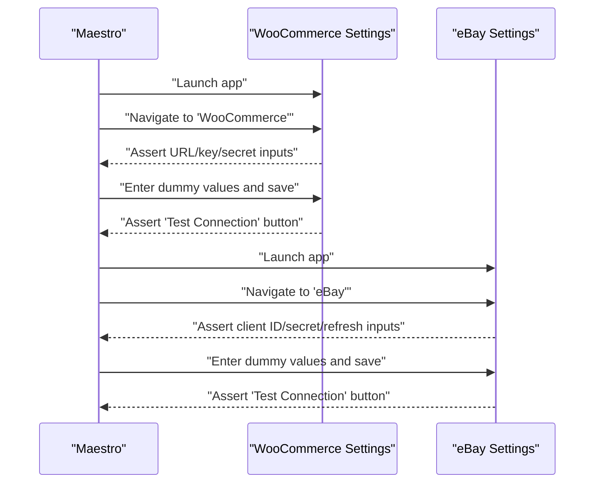
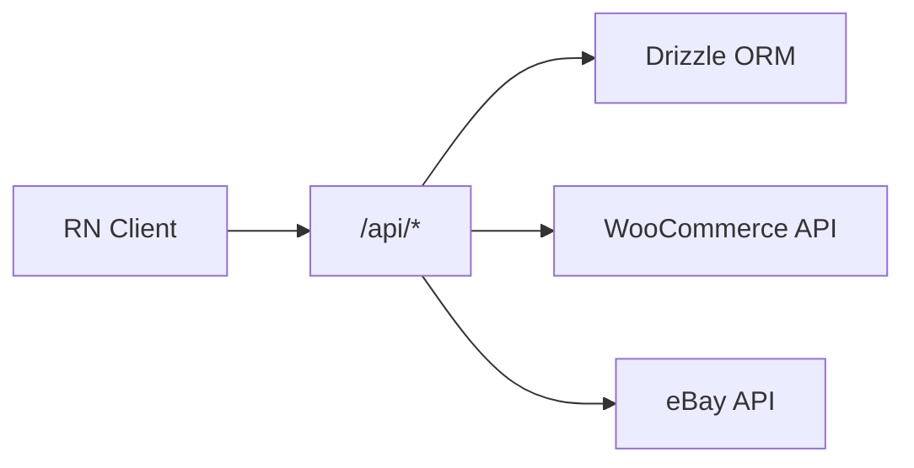
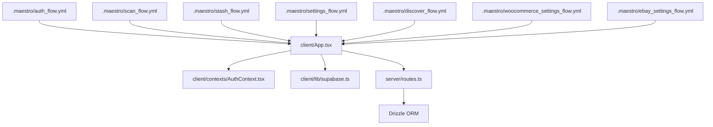

# Testing Strategy

<cite>
**Referenced Files in This Document**
- [.maestro/README.md](file://.maestro/README.md)
- [.maestro/auth_flow.yml](file://.maestro/auth_flow.yml)
- [.maestro/discover_flow.yml](file://.maestro/discover_flow.yml)
- [.maestro/scan_flow.yml](file://.maestro/scan_flow.yml)
- [.maestro/settings_flow.yml](file://.maestro/settings_flow.yml)
- [.maestro/stash_flow.yml](file://.maestro/stash_flow.yml)
- [.maestro/ebay_settings_flow.yml](file://.maestro/ebay_settings_flow.yml)
- [.maestro/woocommerce_settings_flow.yml](file://.maestro/woocommerce_settings_flow.yml)
- [package.json](file://package.json)
- [app.json](file://app.json)
- [client/App.tsx](file://client/App.tsx)
- [client/contexts/AuthContext.tsx](file://client/contexts/AuthContext.tsx)
- [client/lib/marketplace.ts](file://client/lib/marketplace.ts)
- [client/lib/supabase.ts](file://client/lib/supabase.ts)
- [server/index.ts](file://server/index.ts)
- [server/routes.ts](file://server/routes.ts)
</cite>

## Table of Contents
1. [Introduction](#introduction)
2. [Project Structure](#project-structure)
3. [Core Components](#core-components)
4. [Architecture Overview](#architecture-overview)
5. [Detailed Component Analysis](#detailed-component-analysis)
6. [Dependency Analysis](#dependency-analysis)
7. [Performance Considerations](#performance-considerations)
8. [Troubleshooting Guide](#troubleshooting-guide)
9. [Conclusion](#conclusion)
10. [Appendices](#appendices)

## Introduction
This document defines Hidden-Gem’s comprehensive testing strategy grounded in the existing Maestro end-to-end (E2E) test suite and the application’s architecture. It covers test flow configuration, scenario coverage for authentication, scanning, marketplace integrations, and user journeys; outlines CI/CD integration patterns; and provides best practices for React Native, API, and database testing. It also includes guidance for performance and user acceptance testing.

## Project Structure
The testing effort centers around the Maestro test flows located under .maestro/. Each YAML file defines a cohesive user journey with explicit tags and assertions. The React Native client exposes navigation and authentication contexts, while the backend server provides APIs for analytics, inventory, notifications, and marketplace publishing.

**Diagram sources**
- [.maestro/auth_flow.yml](file://.maestro/auth_flow.yml#L1-L47)
- [.maestro/discover_flow.yml](file://.maestro/discover_flow.yml#L1-L27)
- [.maestro/scan_flow.yml](file://.maestro/scan_flow.yml#L1-L31)
- [.maestro/settings_flow.yml](file://.maestro/settings_flow.yml#L1-L51)
- [.maestro/stash_flow.yml](file://.maestro/stash_flow.yml#L1-L28)
- [.maestro/ebay_settings_flow.yml](file://.maestro/ebay_settings_flow.yml#L1-L45)
- [.maestro/woocommerce_settings_flow.yml](file://.maestro/woocommerce_settings_flow.yml#L1-L45)
- [client/App.tsx](file://client/App.tsx#L1-L67)
- [client/contexts/AuthContext.tsx](file://client/contexts/AuthContext.tsx#L1-L31)
- [client/lib/supabase.ts](file://client/lib/supabase.ts#L1-L39)
- [client/lib/marketplace.ts](file://client/lib/marketplace.ts#L1-L129)
- [server/index.ts](file://server/index.ts#L1-L262)
- [server/routes.ts](file://server/routes.ts#L1-L929)

**Section sources**
- [.maestro/README.md](file://.maestro/README.md#L1-L69)
- [package.json](file://package.json#L1-L95)
- [app.json](file://app.json#L1-L52)

## Core Components
- Maestro E2E test flows define user journeys and assertions for authentication, discovery, scanning, settings, stash, and marketplace credential flows.
- React Native app wiring includes navigation, theme, providers, and context for authentication and notifications.
- Backend server exposes REST endpoints for articles, stash, notifications, AI analysis, and marketplace publishing to WooCommerce and eBay.
- Supabase integration provides authentication and secure session persistence.
- Marketplace utilities encapsulate credential retrieval and publishing helpers.

**Section sources**
- [.maestro/README.md](file://.maestro/README.md#L43-L69)
- [client/App.tsx](file://client/App.tsx#L1-L67)
- [client/contexts/AuthContext.tsx](file://client/contexts/AuthContext.tsx#L1-L31)
- [client/lib/supabase.ts](file://client/lib/supabase.ts#L1-L39)
- [client/lib/marketplace.ts](file://client/lib/marketplace.ts#L1-L129)
- [server/routes.ts](file://server/routes.ts#L1-L929)

## Architecture Overview
The testing architecture leverages Maestro to drive the mobile app through realistic user flows, asserting UI visibility and state transitions. The app communicates with the backend server over REST endpoints, while authentication is handled by Supabase. Marketplace publishing flows call external APIs for eBay and WooCommerce.

**Diagram sources**
- [.maestro/auth_flow.yml](file://.maestro/auth_flow.yml#L1-L47)
- [client/App.tsx](file://client/App.tsx#L1-L67)
- [client/contexts/AuthContext.tsx](file://client/contexts/AuthContext.tsx#L1-L31)
- [client/lib/supabase.ts](file://client/lib/supabase.ts#L1-L39)
- [server/index.ts](file://server/index.ts#L1-L262)
- [server/routes.ts](file://server/routes.ts#L1-L929)

## Detailed Component Analysis

### Authentication Flow Testing
Purpose: Validate sign-in/sign-up, form validation, and auth state transitions.

- Test coverage:
  - Switch between sign-in and sign-up views.
  - Empty form submission triggers validation messages.
  - Email and password input fields accept text.
  - Submission attempts and observes error or success messaging.
- Edge cases:
  - Invalid credentials during sign-in.
  - Device-specific permission prompts (e.g., camera) if triggered by subsequent flows.
- CI/CD integration:
  - Use tags to target critical auth tests.
  - Export JUnit results for reporting.

**Diagram sources**
- [.maestro/auth_flow.yml](file://.maestro/auth_flow.yml#L1-L47)
- [client/contexts/AuthContext.tsx](file://client/contexts/AuthContext.tsx#L1-L31)
- [client/lib/supabase.ts](file://client/lib/supabase.ts#L1-L39)

**Section sources**
- [.maestro/auth_flow.yml](file://.maestro/auth_flow.yml#L1-L47)
- [client/contexts/AuthContext.tsx](file://client/contexts/AuthContext.tsx#L1-L31)
- [client/lib/supabase.ts](file://client/lib/supabase.ts#L1-L39)

### Scanning Functionality Testing
Purpose: Validate camera/tab navigation and capture controls.

- Test coverage:
  - Navigate to Scan tab.
  - Assert optional camera permission enable button.
  - Assert presence of capture, gallery, and flash controls.
- Edge cases:
  - First-run camera permission dialog.
  - Permissions denied scenarios (assert enable button presence).
- CI/CD integration:
  - Tag as “scan” and “camera”.
  - Use optional assertions to handle device differences.

**Diagram sources**
- [.maestro/scan_flow.yml](file://.maestro/scan_flow.yml#L1-L31)

**Section sources**
- [.maestro/scan_flow.yml](file://.maestro/scan_flow.yml#L1-L31)
- [app.json](file://app.json#L11-L27)

### Discover (Articles) Tab Testing
Purpose: Validate default tab behavior and content loading.

- Test coverage:
  - Discover tab visible by default.
  - Optional assertion for article cards or empty state.
  - Conditional flow to “See All” and tapping “All Articles”.
- Edge cases:
  - Empty content state.
  - Dynamic content loading.

**Diagram sources**
- [.maestro/discover_flow.yml](file://.maestro/discover_flow.yml#L1-L27)

**Section sources**
- [.maestro/discover_flow.yml](file://.maestro/discover_flow.yml#L1-L27)

### Settings Navigation and Sub-Screens
Purpose: Validate navigation to settings and key sub-screens.

- Test coverage:
  - Navigate to Settings.
  - Assert marketplace sections and app policy links.
  - Navigate to Terms of Service and Privacy Policy.
  - Navigate to marketplace sub-screens and assert form fields.
- Edge cases:
  - Scroll to reveal hidden elements.
  - Back navigation after deep links.

**Diagram sources**
- [.maestro/settings_flow.yml](file://.maestro/settings_flow.yml#L1-L51)

**Section sources**
- [.maestro/settings_flow.yml](file://.maestro/settings_flow.yml#L1-L51)

### Stash (Inventory) Management Testing
Purpose: Validate inventory grid and FAB scan action.

- Test coverage:
  - Navigate to Stash tab.
  - Assert empty state or first item card.
  - Assert floating action button for scanning.
- Edge cases:
  - No items in stash.
  - Presence of item cards when items exist.

**Diagram sources**
- [.maestro/stash_flow.yml](file://.maestro/stash_flow.yml#L1-L28)

**Section sources**
- [.maestro/stash_flow.yml](file://.maestro/stash_flow.yml#L1-L28)

### Marketplace Credential Entry and Connection Testing
Purpose: Validate credential entry and connection test actions for eBay and WooCommerce.

- Test coverage:
  - Navigate to marketplace sub-screens.
  - Assert presence of required input fields.
  - Enter dummy credentials and save.
  - Assert availability of “Test Connection” buttons.
- Edge cases:
  - Dummy values do not trigger real API calls.
  - Optional assertions for UI elements.

**Diagram sources**
- [.maestro/woocommerce_settings_flow.yml](file://.maestro/woocommerce_settings_flow.yml#L1-L45)
- [.maestro/ebay_settings_flow.yml](file://.maestro/ebay_settings_flow.yml#L1-L45)

**Section sources**
- [.maestro/woocommerce_settings_flow.yml](file://.maestro/woocommerce_settings_flow.yml#L1-L45)
- [.maestro/ebay_settings_flow.yml](file://.maestro/ebay_settings_flow.yml#L1-L45)

### API Testing Strategies
- Authentication endpoints: Validate session creation, persistence, and redirect handling.
- Inventory endpoints: CRUD operations for stash items, counts, and deletion.
- Notifications endpoints: Token registration, fetching unread counts, and read status updates.
- AI analysis endpoints: Image upload handling, Gemini content generation, and fallback behavior.
- Marketplace publishing endpoints: Validate publishing to WooCommerce and eBay with appropriate error handling.

**Diagram sources**
- [server/routes.ts](file://server/routes.ts#L1-L929)
- [client/lib/marketplace.ts](file://client/lib/marketplace.ts#L1-L129)

**Section sources**
- [server/routes.ts](file://server/routes.ts#L1-L929)
- [client/lib/marketplace.ts](file://client/lib/marketplace.ts#L1-L129)

### Database Testing Approaches
- Drizzle ORM is used for schema definitions and queries.
- Testing strategies:
  - Unit tests for query logic and schema mappings.
  - Integration tests against a test database instance.
  - Migration verification using migration scripts and journal snapshots.

**Section sources**
- [server/db.ts](file://server/db.ts#L1-L200)
- [drizzle.config.ts](file://drizzle.config.ts#L1-L200)
- [migrations/0000_sticky_night_thrasher.sql](file://migrations/0000_sticky_night_thrasher.sql#L1-L200)
- [migrations/0001_flipagent_tables.sql](file://migrations/0001_flipagent_tables.sql#L1-L200)
- [migrations/0002_rls_policies.sql](file://migrations/0002_rls_policies.sql#L1-L200)

### CI/CD Integration and Continuous Testing
- Maestro commands support tagging, JUnit output, and recording videos.
- Recommended pipeline stages:
  - Prebuild and install dependencies.
  - Start local server and seed test data if needed.
  - Run Maestro tests with tags for smoke/critical.
  - Export JUnit XML for CI reports.
  - Record videos for flaky or regression runs.
- Environment setup:
  - Configure environment variables for Supabase and AI providers.
  - Ensure Expo dev server and emulators/simulators are ready.

**Section sources**
- [.maestro/README.md](file://.maestro/README.md#L24-L41)
- [package.json](file://package.json#L5-L23)

### React Native Testing Best Practices
- Use testID props consistently for UI assertions.
- Prefer optional assertions for device-specific UI elements.
- Wrap navigation and providers with ErrorBoundary for stability.
- Mock external services (e.g., camera, marketplace APIs) in E2E tests using dummy values.

**Section sources**
- [.maestro/README.md](file://.maestro/README.md#L55-L68)
- [client/App.tsx](file://client/App.tsx#L1-L67)
- [client/lib/marketplace.ts](file://client/lib/marketplace.ts#L1-L129)

### Performance Testing Considerations
- Load testing scenarios:
  - Simulate concurrent users performing authentication and article browsing.
  - Measure API latency for inventory and notification endpoints.
  - Evaluate camera capture and image upload throughput.
- Recommendations:
  - Use synthetic monitoring to track response times and error rates.
  - Introduce throttling for network conditions.
  - Monitor server logs for slow requests and retries.

[No sources needed since this section provides general guidance]

### User Acceptance Testing Procedures
- Acceptance criteria:
  - All critical flows pass (authentication, scanning, stash, marketplace).
  - UI elements are visible and responsive.
  - Error messages are actionable and localized.
- Regression testing:
  - Run tagged critical tests on every PR.
  - Periodically run all flows to catch UI regressions.

**Section sources**
- [.maestro/README.md](file://.maestro/README.md#L43-L54)

## Dependency Analysis
The E2E flows depend on the app’s navigation and context providers, which in turn rely on Supabase for authentication and the server for data and marketplace publishing.

**Diagram sources**
- [.maestro/auth_flow.yml](file://.maestro/auth_flow.yml#L1-L47)
- [.maestro/scan_flow.yml](file://.maestro/scan_flow.yml#L1-L31)
- [.maestro/stash_flow.yml](file://.maestro/stash_flow.yml#L1-L28)
- [.maestro/settings_flow.yml](file://.maestro/settings_flow.yml#L1-L51)
- [.maestro/discover_flow.yml](file://.maestro/discover_flow.yml#L1-L27)
- [.maestro/woocommerce_settings_flow.yml](file://.maestro/woocommerce_settings_flow.yml#L1-L45)
- [.maestro/ebay_settings_flow.yml](file://.maestro/ebay_settings_flow.yml#L1-L45)
- [client/App.tsx](file://client/App.tsx#L1-L67)
- [client/contexts/AuthContext.tsx](file://client/contexts/AuthContext.tsx#L1-L31)
- [client/lib/supabase.ts](file://client/lib/supabase.ts#L1-L39)
- [server/routes.ts](file://server/routes.ts#L1-L929)

**Section sources**
- [client/App.tsx](file://client/App.tsx#L1-L67)
- [client/contexts/AuthContext.tsx](file://client/contexts/AuthContext.tsx#L1-L31)
- [client/lib/supabase.ts](file://client/lib/supabase.ts#L1-L39)
- [server/routes.ts](file://server/routes.ts#L1-L929)

## Performance Considerations
- Network-bound flows (marketplace publishing) should be tested under varying latency and bandwidth conditions.
- UI-heavy flows (articles and inventory grids) should be profiled for rendering performance.
- Server-side scheduling tasks (e.g., price checks) should be monitored for long-running jobs.

[No sources needed since this section provides general guidance]

## Troubleshooting Guide
- Camera permission prompts:
  - Grant permissions on first run; flows include optional assertions for enable button.
- Supabase configuration:
  - Ensure environment variables are set; otherwise, authentication features may be disabled.
- Marketplace credentials:
  - Dummy values are used; real publishing is not executed in tests.
- CI/CD:
  - Use JUnit output and recordings to diagnose failures; verify emulator/simulator readiness.

**Section sources**
- [.maestro/README.md](file://.maestro/README.md#L63-L68)
- [client/lib/supabase.ts](file://client/lib/supabase.ts#L20-L34)
- [.maestro/ebay_settings_flow.yml](file://.maestro/ebay_settings_flow.yml#L25-L45)
- [.maestro/woocommerce_settings_flow.yml](file://.maestro/woocommerce_settings_flow.yml#L25-L45)

## Conclusion
Hidden-Gem’s testing strategy combines robust Maestro E2E flows with a clear separation of concerns across the React Native client, Supabase authentication, and server-side APIs. By leveraging tags, optional assertions, and CI-friendly outputs, teams can maintain high confidence in critical user journeys while scaling testing across authentication, scanning, marketplace integrations, and inventory management.

## Appendices
- Example commands for running and exporting test results are documented in the Maestro README.
- Environment variables and build scripts are defined in package.json and app.json.

**Section sources**
- [.maestro/README.md](file://.maestro/README.md#L24-L41)
- [package.json](file://package.json#L5-L23)
- [app.json](file://app.json#L1-L52)