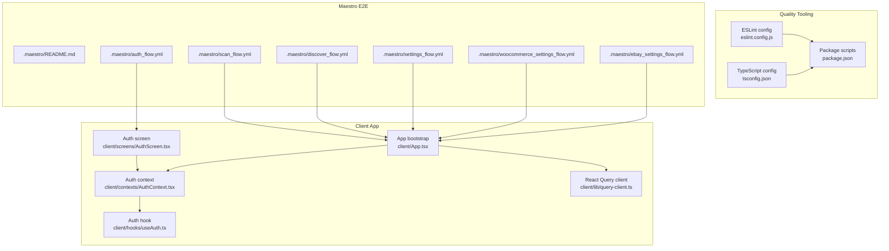
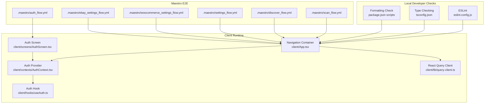
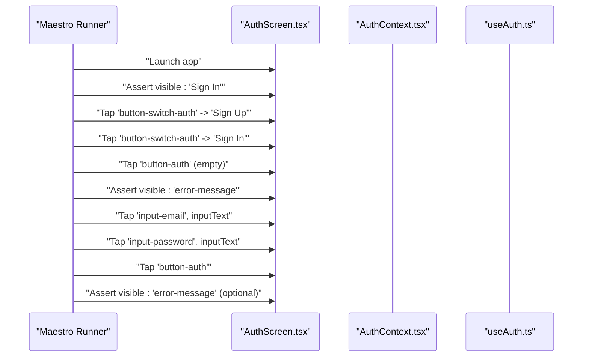
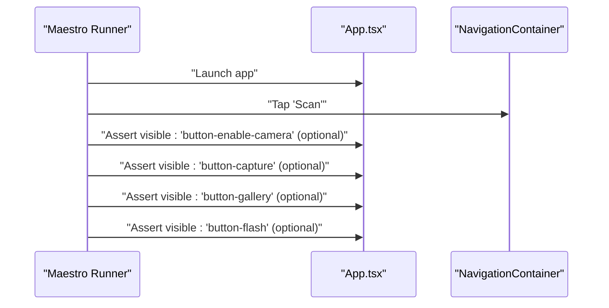
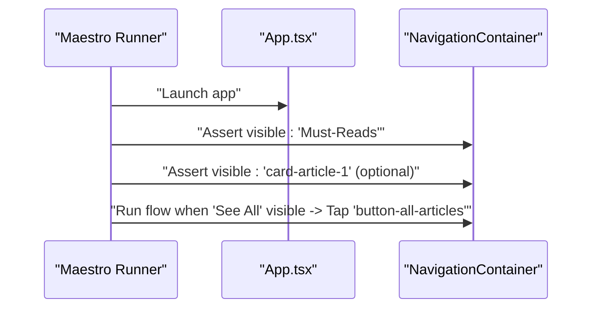
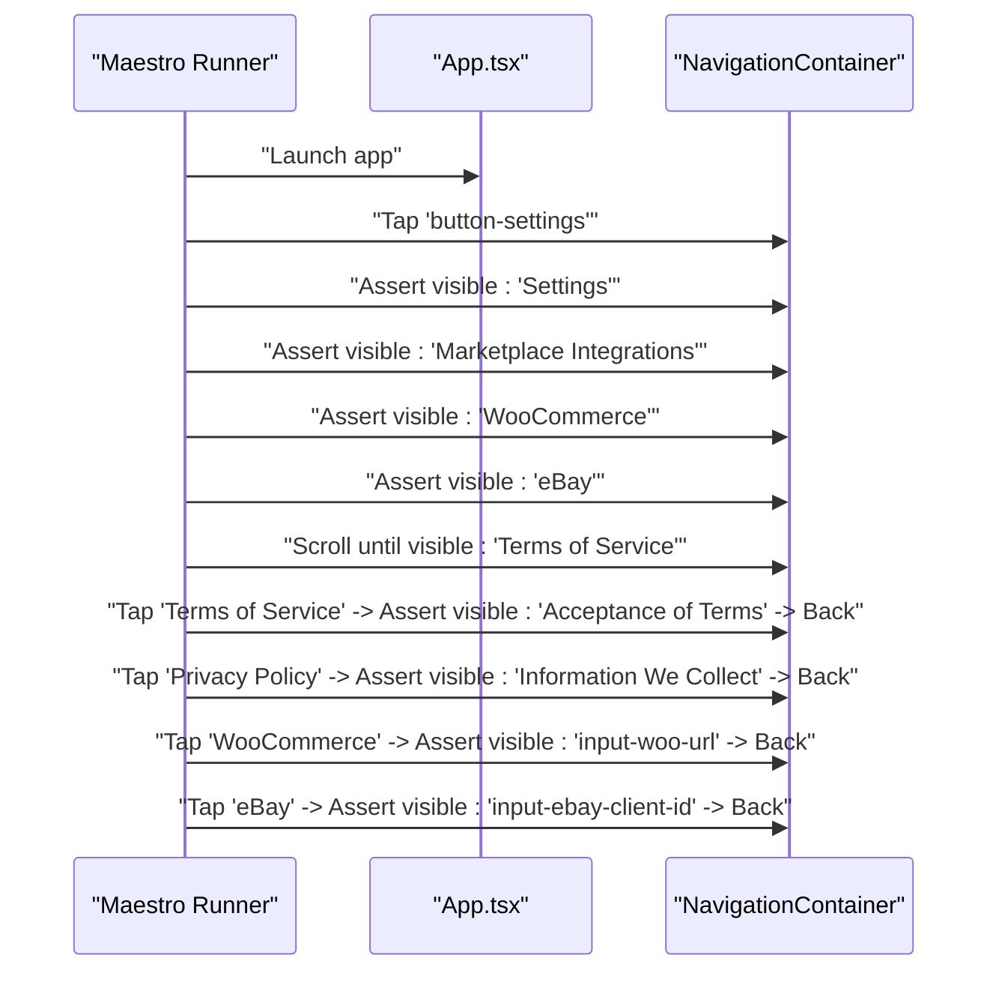
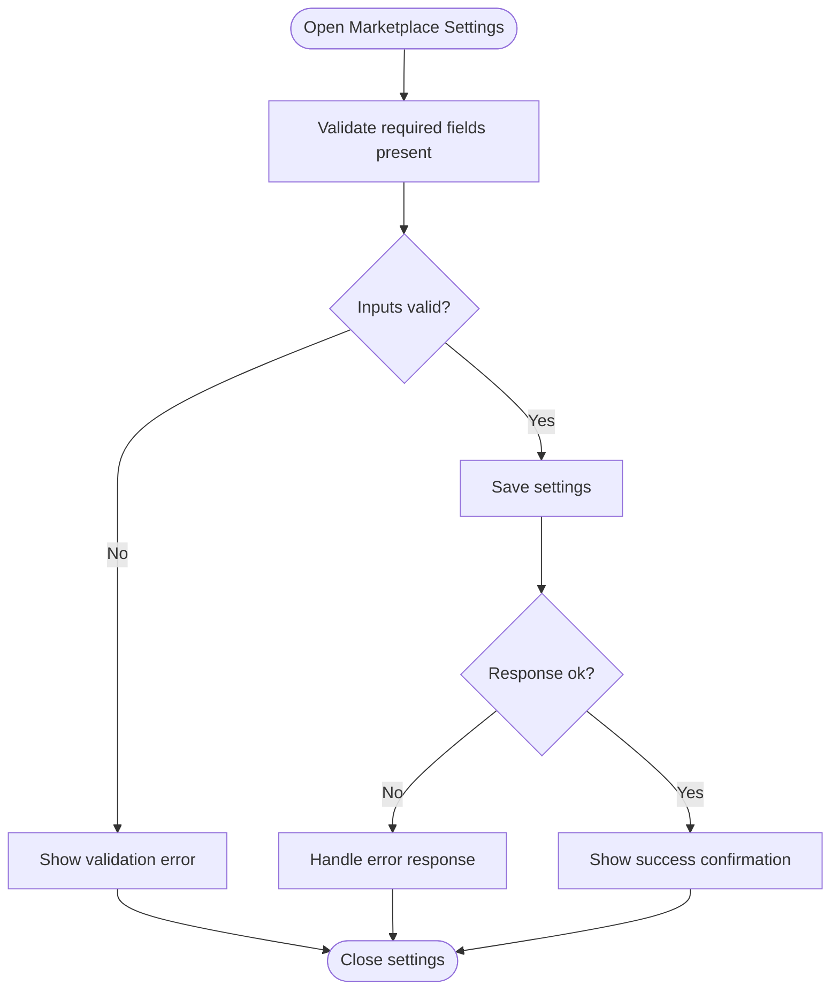
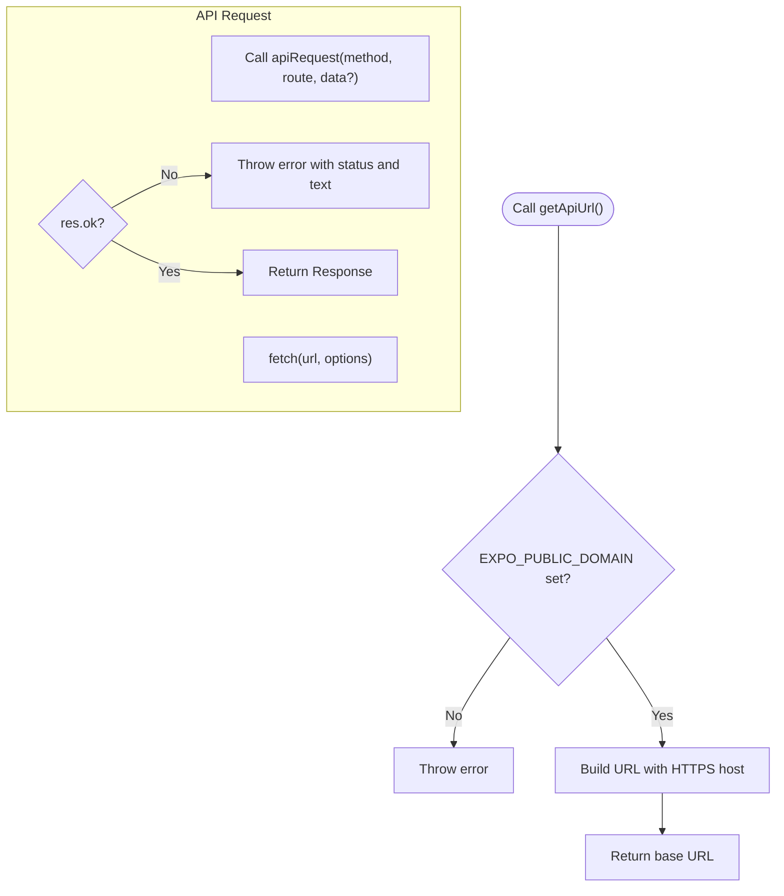
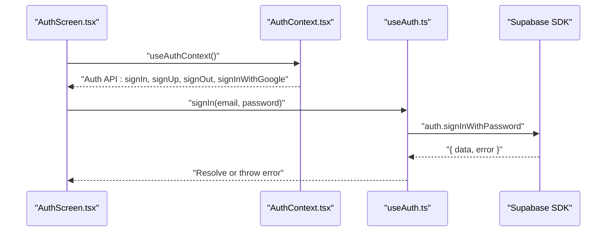
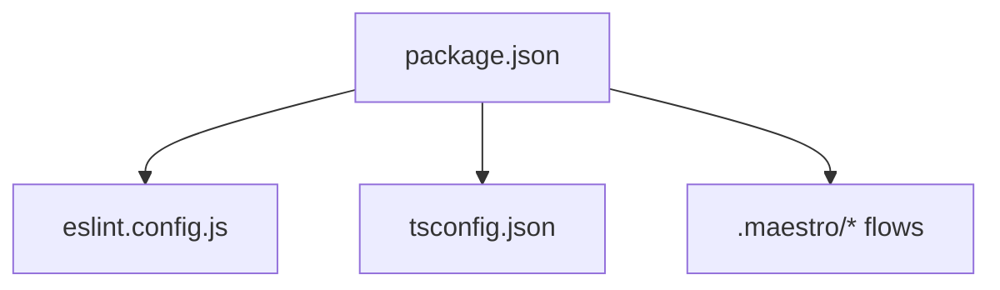

# Testing and Quality Assurance

<cite>
**Referenced Files in This Document**
- [eslint.config.js](file://eslint.config.js)
- [tsconfig.json](file://tsconfig.json)
- [package.json](file://package.json)
- [.maestro/README.md](file://.maestro/README.md)
- [.maestro/auth_flow.yml](file://.maestro/auth_flow.yml)
- [.maestro/scan_flow.yml](file://.maestro/scan_flow.yml)
- [.maestro/discover_flow.yml](file://.maestro/discover_flow.yml)
- [.maestro/settings_flow.yml](file://.maestro/settings_flow.yml)
- [.maestro/woocomerce_settings_flow.yml](file://.maestro/woocommerce_settings_flow.yml)
- [.maestro/ebay_settings_flow.yml](file://.maestro/ebay_settings_flow.yml)
- [client/App.tsx](file://client/App.tsx)
- [client/lib/query-client.ts](file://client/lib/query-client.ts)
- [client/contexts/AuthContext.tsx](file://client/contexts/AuthContext.tsx)
- [client/hooks/useAuth.ts](file://client/hooks/useAuth.ts)
- [client/screens/AuthScreen.tsx](file://client/screens/AuthScreen.tsx)
</cite>

## Table of Contents
1. [Introduction](#introduction)
2. [Project Structure](#project-structure)
3. [Core Components](#core-components)
4. [Architecture Overview](#architecture-overview)
5. [Detailed Component Analysis](#detailed-component-analysis)
6. [Dependency Analysis](#dependency-analysis)
7. [Performance Considerations](#performance-considerations)
8. [Troubleshooting Guide](#troubleshooting-guide)
9. [Conclusion](#conclusion)
10. [Appendices](#appendices)

## Introduction
This document defines comprehensive testing and quality assurance practices for the project, covering:
- Unit, integration, and end-to-end (E2E) testing strategies
- Code quality enforcement via ESLint, TypeScript type checking, and Prettier formatting
- Mobile E2E testing with Maestro, including authentication, scanning, discovery, settings, and marketplace integrations
- Mock strategies for external API dependencies
- Continuous integration testing pipelines and quality gates
- Code coverage expectations, performance testing, and accessibility guidelines
- Practical examples, debugging techniques, and maintenance tips for reliable automated testing

## Project Structure
The repository organizes testing and QA artifacts as follows:
- Quality tooling: ESLint configuration, TypeScript compiler options, and Prettier checks are defined in dedicated configuration files
- Client-side app and libraries: React Native application bootstrap, navigation, authentication context, and React Query integration live under the client directory
- Maestro E2E flows: YAML-based test scenarios for authentication, scanning, discovery, settings, and marketplace integrations reside under .maestro

**Diagram sources**
- [eslint.config.js](file://eslint.config.js#L1-L13)
- [tsconfig.json](file://tsconfig.json#L1-L15)
- [package.json](file://package.json#L1-L85)
- [client/App.tsx](file://client/App.tsx#L1-L57)
- [client/contexts/AuthContext.tsx](file://client/contexts/AuthContext.tsx#L1-L31)
- [client/hooks/useAuth.ts](file://client/hooks/useAuth.ts#L1-L151)
- [client/lib/query-client.ts](file://client/lib/query-client.ts#L1-L80)
- [client/screens/AuthScreen.tsx](file://client/screens/AuthScreen.tsx#L1-L435)
- [.maestro/README.md](file://.maestro/README.md)
- [.maestro/auth_flow.yml](file://.maestro/auth_flow.yml#L1-L47)
- [.maestro/scan_flow.yml](file://.maestro/scan_flow.yml#L1-L31)
- [.maestro/discover_flow.yml](file://.maestro/discover_flow.yml#L1-L27)
- [.maestro/settings_flow.yml](file://.maestro/settings_flow.yml#L1-L51)
- [.maestro/woocomerce_settings_flow.yml](file://.maestro/woocommerce_settings_flow.yml)
- [.maestro/ebay_settings_flow.yml](file://.maestro/ebay_settings_flow.yml)

**Section sources**
- [eslint.config.js](file://eslint.config.js#L1-L13)
- [tsconfig.json](file://tsconfig.json#L1-L15)
- [package.json](file://package.json#L1-L85)
- [client/App.tsx](file://client/App.tsx#L1-L57)
- [client/contexts/AuthContext.tsx](file://client/contexts/AuthContext.tsx#L1-L31)
- [client/hooks/useAuth.ts](file://client/hooks/useAuth.ts#L1-L151)
- [client/lib/query-client.ts](file://client/lib/query-client.ts#L1-L80)
- [client/screens/AuthScreen.tsx](file://client/screens/AuthScreen.tsx#L1-L435)
- [.maestro/README.md](file://.maestro/README.md)
- [.maestro/auth_flow.yml](file://.maestro/auth_flow.yml#L1-L47)
- [.maestro/scan_flow.yml](file://.maestro/scan_flow.yml#L1-L31)
- [.maestro/discover_flow.yml](file://.maestro/discover_flow.yml#L1-L27)
- [.maestro/settings_flow.yml](file://.maestro/settings_flow.yml#L1-L51)
- [.maestro/woocomerce_settings_flow.yml](file://.maestro/woocommerce_settings_flow.yml)
- [.maestro/ebay_settings_flow.yml](file://.maestro/ebay_settings_flow.yml)

## Core Components
This section outlines the core testing and QA components and how they interact.

- ESLint configuration enforces code quality and integrates with Prettier for consistent formatting. It extends Expo’s recommended flat config and adds Prettier’s recommended plugin.
- TypeScript configuration enables strict mode, path aliases, and includes all TS/TSX files while excluding test files and build artifacts.
- Package scripts define linting, type checking, and formatting commands, enabling local and CI-driven quality enforcement.
- Maestro YAML flows automate mobile app journeys across authentication, scanning, discovery, settings, and marketplace integrations.
- Client app wiring integrates React Navigation, React Query, and authentication providers, forming the foundation for unit and integration tests.

**Section sources**
- [eslint.config.js](file://eslint.config.js#L1-L13)
- [tsconfig.json](file://tsconfig.json#L1-L15)
- [package.json](file://package.json#L5-L17)
- [client/App.tsx](file://client/App.tsx#L1-L57)
- [client/lib/query-client.ts](file://client/lib/query-client.ts#L1-L80)
- [client/contexts/AuthContext.tsx](file://client/contexts/AuthContext.tsx#L1-L31)
- [client/hooks/useAuth.ts](file://client/hooks/useAuth.ts#L1-L151)
- [.maestro/auth_flow.yml](file://.maestro/auth_flow.yml#L1-L47)
- [.maestro/scan_flow.yml](file://.maestro/scan_flow.yml#L1-L31)
- [.maestro/discover_flow.yml](file://.maestro/discover_flow.yml#L1-L27)
- [.maestro/settings_flow.yml](file://.maestro/settings_flow.yml#L1-L51)

## Architecture Overview
The testing architecture combines local developer checks with automated E2E flows and backend service validations.

**Diagram sources**
- [eslint.config.js](file://eslint.config.js#L1-L13)
- [tsconfig.json](file://tsconfig.json#L1-L15)
- [package.json](file://package.json#L5-L17)
- [client/App.tsx](file://client/App.tsx#L1-L57)
- [client/contexts/AuthContext.tsx](file://client/contexts/AuthContext.tsx#L1-L31)
- [client/hooks/useAuth.ts](file://client/hooks/useAuth.ts#L1-L151)
- [client/lib/query-client.ts](file://client/lib/query-client.ts#L1-L80)
- [client/screens/AuthScreen.tsx](file://client/screens/AuthScreen.tsx#L1-L435)
- [.maestro/auth_flow.yml](file://.maestro/auth_flow.yml#L1-L47)
- [.maestro/scan_flow.yml](file://.maestro/scan_flow.yml#L1-L31)
- [.maestro/discover_flow.yml](file://.maestro/discover_flow.yml#L1-L27)
- [.maestro/settings_flow.yml](file://.maestro/settings_flow.yml#L1-L51)
- [.maestro/woocomerce_settings_flow.yml](file://.maestro/woocommerce_settings_flow.yml)
- [.maestro/ebay_settings_flow.yml](file://.maestro/ebay_settings_flow.yml)

## Detailed Component Analysis

### ESLint, TypeScript, and Formatting Standards
- ESLint configuration:
  - Extends Expo’s flat config and Prettier’s recommended plugin to enforce consistent style and catch common issues
  - Ignores distribution folders during linting
- TypeScript configuration:
  - Enables strict mode and path aliases for internal modules
  - Includes TS/TSX files and excludes test files and build outputs
- Formatting and type checks:
  - Scripts provide lint, lint fix, type check, and formatting check commands

Practical usage:
- Run lint and type checks locally before committing
- Use formatting scripts to normalize code style across contributors

**Section sources**
- [eslint.config.js](file://eslint.config.js#L1-L13)
- [tsconfig.json](file://tsconfig.json#L1-L15)
- [package.json](file://package.json#L5-L17)

### Authentication Flow Testing with Maestro
The authentication flow validates sign-in/sign-up transitions, empty form validation, and submission behavior.

**Diagram sources**
- [.maestro/auth_flow.yml](file://.maestro/auth_flow.yml#L1-L47)
- [client/screens/AuthScreen.tsx](file://client/screens/AuthScreen.tsx#L1-L435)
- [client/contexts/AuthContext.tsx](file://client/contexts/AuthContext.tsx#L1-L31)
- [client/hooks/useAuth.ts](file://client/hooks/useAuth.ts#L1-L151)

**Section sources**
- [.maestro/auth_flow.yml](file://.maestro/auth_flow.yml#L1-L47)
- [client/screens/AuthScreen.tsx](file://client/screens/AuthScreen.tsx#L1-L435)
- [client/contexts/AuthContext.tsx](file://client/contexts/AuthContext.tsx#L1-L31)
- [client/hooks/useAuth.ts](file://client/hooks/useAuth.ts#L1-L151)

### Scanning Workflow Testing with Maestro
The scanning flow verifies camera permission prompts and capture controls visibility.

**Diagram sources**
- [.maestro/scan_flow.yml](file://.maestro/scan_flow.yml#L1-L31)
- [client/App.tsx](file://client/App.tsx#L1-L57)

**Section sources**
- [.maestro/scan_flow.yml](file://.maestro/scan_flow.yml#L1-L31)
- [client/App.tsx](file://client/App.tsx#L1-L57)

### Discovery (Must-Reads) Testing with Maestro
The discovery flow validates default tab visibility and article navigation.

**Diagram sources**
- [.maestro/discover_flow.yml](file://.maestro/discover_flow.yml#L1-L27)
- [client/App.tsx](file://client/App.tsx#L1-L57)

**Section sources**
- [.maestro/discover_flow.yml](file://.maestro/discover_flow.yml#L1-L27)
- [client/App.tsx](file://client/App.tsx#L1-L57)

### Settings Navigation and Marketplace Integration Testing with Maestro
The settings flow validates navigation to settings, terms/privacy policies, and marketplace integrations.

**Diagram sources**
- [.maestro/settings_flow.yml](file://.maestro/settings_flow.yml#L1-L51)
- [client/App.tsx](file://client/App.tsx#L1-L57)

**Section sources**
- [.maestro/settings_flow.yml](file://.maestro/settings_flow.yml#L1-L51)
- [client/App.tsx](file://client/App.tsx#L1-L57)

### Marketplace Publishing Tests (Conceptual)
Conceptually, marketplace publishing tests would validate:
- Input field presence and validation for marketplace credentials
- Successful save actions and feedback messages
- Navigation to external marketplace dashboards (conceptual)

[No sources needed since this diagram shows conceptual workflow, not actual code structure]

### React Query and API Layer Testing
The React Query client centralizes API requests and error handling, enabling focused unit and integration tests around:
- Base URL resolution via environment variable
- Request construction and response validation
- Unauthorized handling behavior

**Diagram sources**
- [client/lib/query-client.ts](file://client/lib/query-client.ts#L1-L80)

**Section sources**
- [client/lib/query-client.ts](file://client/lib/query-client.ts#L1-L80)

### Authentication Hook and Context Testing
The authentication hook and context coordinate session state, sign-in/sign-up/sign-out, and Google OAuth flows. Testing should focus on:
- Session retrieval and subscription lifecycle
- Error propagation from Supabase operations
- OAuth redirect handling and token exchange

**Diagram sources**
- [client/screens/AuthScreen.tsx](file://client/screens/AuthScreen.tsx#L1-L435)
- [client/contexts/AuthContext.tsx](file://client/contexts/AuthContext.tsx#L1-L31)
- [client/hooks/useAuth.ts](file://client/hooks/useAuth.ts#L1-L151)

**Section sources**
- [client/screens/AuthScreen.tsx](file://client/screens/AuthScreen.tsx#L1-L435)
- [client/contexts/AuthContext.tsx](file://client/contexts/AuthContext.tsx#L1-L31)
- [client/hooks/useAuth.ts](file://client/hooks/useAuth.ts#L1-L151)

## Dependency Analysis
Testing and QA dependencies are primarily declared in the package configuration and enforced by tooling.

**Diagram sources**
- [package.json](file://package.json#L1-L85)
- [eslint.config.js](file://eslint.config.js#L1-L13)
- [tsconfig.json](file://tsconfig.json#L1-L15)
- [.maestro/auth_flow.yml](file://.maestro/auth_flow.yml#L1-L47)
- [.maestro/scan_flow.yml](file://.maestro/scan_flow.yml#L1-L31)
- [.maestro/discover_flow.yml](file://.maestro/discover_flow.yml#L1-L27)
- [.maestro/settings_flow.yml](file://.maestro/settings_flow.yml#L1-L51)
- [.maestro/woocomerce_settings_flow.yml](file://.maestro/woocommerce_settings_flow.yml)
- [.maestro/ebay_settings_flow.yml](file://.maestro/ebay_settings_flow.yml)

**Section sources**
- [package.json](file://package.json#L1-L85)
- [eslint.config.js](file://eslint.config.js#L1-L13)
- [tsconfig.json](file://tsconfig.json#L1-L15)
- [.maestro/auth_flow.yml](file://.maestro/auth_flow.yml#L1-L47)
- [.maestro/scan_flow.yml](file://.maestro/scan_flow.yml#L1-L31)
- [.maestro/discover_flow.yml](file://.maestro/discover_flow.yml#L1-L27)
- [.maestro/settings_flow.yml](file://.maestro/settings_flow.yml#L1-L51)
- [.maestro/woocomerce_settings_flow.yml](file://.maestro/woocommerce_settings_flow.yml)
- [.maestro/ebay_settings_flow.yml](file://.maestro/ebay_settings_flow.yml)

## Performance Considerations
- Prefer deterministic UI identifiers (e.g., testID attributes) in components to stabilize E2E tests
- Use minimal network calls in unit tests; mock external APIs via adapters or in-memory stubs
- Keep Maestro flows scoped to functional areas to reduce flakiness and improve speed
- Centralize API base URL resolution to simplify mocking and environment isolation
- Avoid unnecessary refetches in React Query during tests by configuring staleTime and refetch behavior appropriately

[No sources needed since this section provides general guidance]

## Troubleshooting Guide
Common issues and resolutions:
- Missing environment variables:
  - Symptom: API base URL errors or runtime exceptions
  - Resolution: Ensure the environment variable is set before running tests or in the test harness
- Authentication failures:
  - Symptom: Empty form validation triggers or sign-in errors
  - Resolution: Provide valid credentials in test flows or mock Supabase responses
- Camera permission prompts:
  - Symptom: Tests halt on permission dialogs
  - Resolution: Configure device permissions or simulate permission acceptance in the test environment
- Network errors:
  - Symptom: API request failures
  - Resolution: Mock network responses or spin up a local test server

**Section sources**
- [client/lib/query-client.ts](file://client/lib/query-client.ts#L1-L80)
- [client/hooks/useAuth.ts](file://client/hooks/useAuth.ts#L1-L151)
- [.maestro/scan_flow.yml](file://.maestro/scan_flow.yml#L1-L31)

## Conclusion
This testing and QA strategy blends developer-enforced quality (ESLint, TypeScript, Prettier) with robust Maestro E2E flows covering critical user journeys. By centralizing API and authentication logic, teams can write reliable unit and integration tests while maintaining fast, stable E2E pipelines. Establishing clear quality gates and coverage targets ensures consistent delivery standards for production deployments.

[No sources needed since this section summarizes without analyzing specific files]

## Appendices

### Testing Strategy Matrix
- Unit tests:
  - Focus on pure functions, React Query adapters, and small components
  - Use mocking for external dependencies (Supabase, API)
- Integration tests:
  - Validate React Query caching, auth state changes, and navigation flows
  - Stub network endpoints and database interactions
- End-to-end tests:
  - Use Maestro flows to validate real user journeys across authentication, scanning, discovery, and marketplace settings

[No sources needed since this section provides general guidance]

### Mock Strategies for External API Dependencies
- React Query:
  - Override queryClient defaults to point to a test server or mock adapter
  - Use queryKey-based mocking to simulate success/failure states
- Supabase:
  - Wrap Supabase client in an injectable adapter for tests
  - Provide mock sessions and OAuth redirects for sign-in flows
- Network:
  - Use a lightweight test server or library like a mock service worker to intercept fetch calls

[No sources needed since this section provides general guidance]

### Continuous Integration Testing Pipelines and Quality Gates
- Pre-commit:
  - Run lint, type check, and formatting checks
- Pull request:
  - Run unit and integration tests
  - Run Maestro E2E tests against a provisioned device farm or emulator
- Release:
  - Gate deployment on passing tests and adherence to coverage thresholds
  - Enforce minimum code quality scores

[No sources needed since this section provides general guidance]