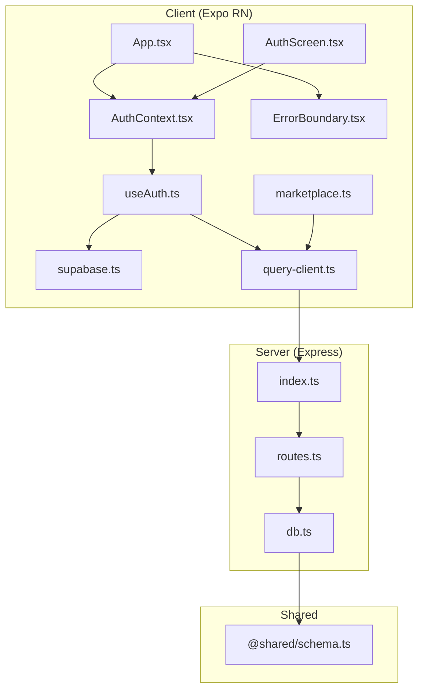
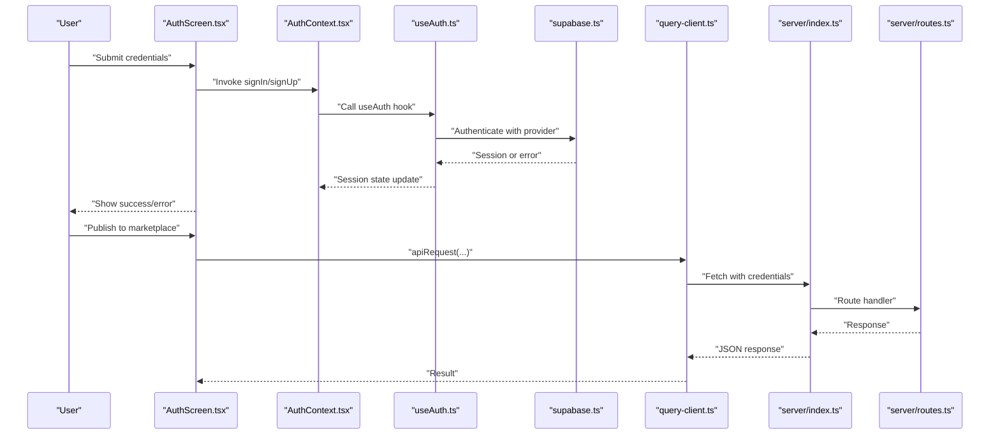
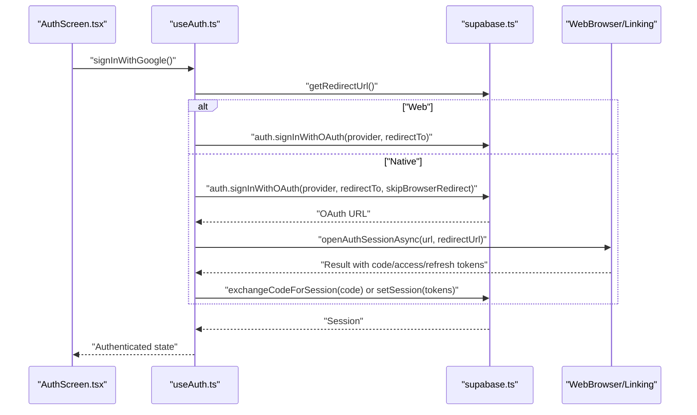
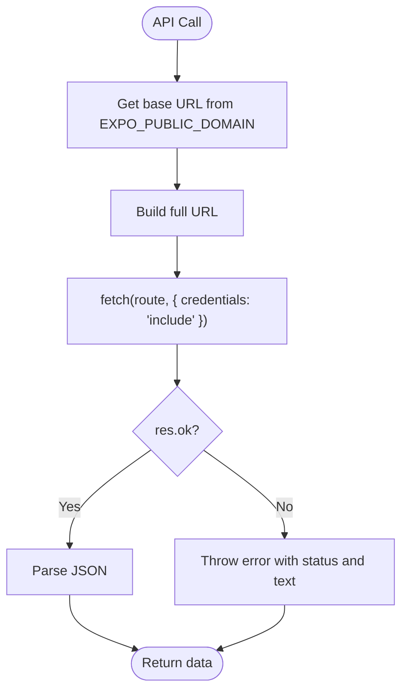
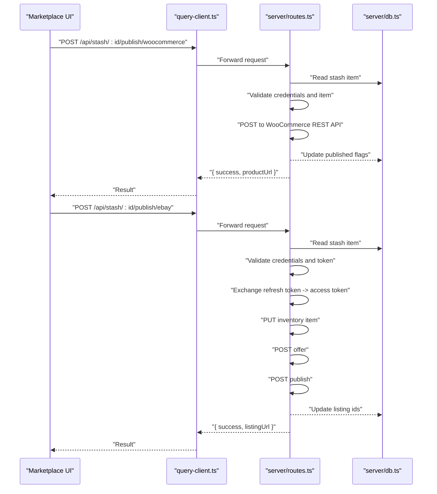
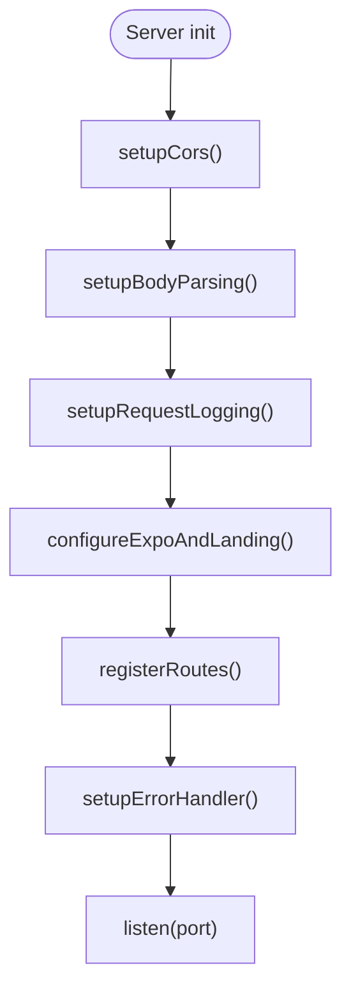
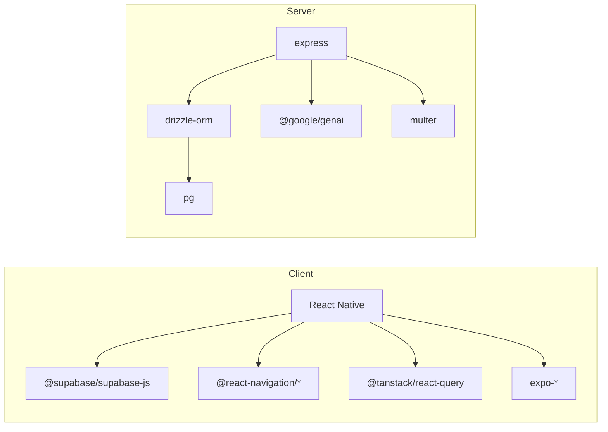

# Troubleshooting and FAQ

<cite>
**Referenced Files in This Document**
- [package.json](file://package.json)
- [ENVIRONMENT.md](file://ENVIRONMENT.md)
- [app.json](file://app.json)
- [client/App.tsx](file://client/App.tsx)
- [client/components/ErrorBoundary.tsx](file://client/components/ErrorBoundary.tsx)
- [client/screens/AuthScreen.tsx](file://client/screens/AuthScreen.tsx)
- [client/contexts/AuthContext.tsx](file://client/contexts/AuthContext.tsx)
- [client/hooks/useAuth.ts](file://client/hooks/useAuth.ts)
- [client/lib/supabase.ts](file://client/lib/supabase.ts)
- [client/lib/query-client.ts](file://client/lib/query-client.ts)
- [client/lib/marketplace.ts](file://client/lib/marketplace.ts)
- [server/index.ts](file://server/index.ts)
- [server/routes.ts](file://server/routes.ts)
- [server/db.ts](file://server/db.ts)
</cite>

## Table of Contents
1. [Introduction](#introduction)
2. [Project Structure](#project-structure)
3. [Core Components](#core-components)
4. [Architecture Overview](#architecture-overview)
5. [Detailed Component Analysis](#detailed-component-analysis)
6. [Dependency Analysis](#dependency-analysis)
7. [Performance Considerations](#performance-considerations)
8. [Troubleshooting Guide](#troubleshooting-guide)
9. [Conclusion](#conclusion)
10. [Appendices](#appendices)

## Introduction
This document provides comprehensive troubleshooting and FAQ guidance for the HiddenGem application. It covers development environment issues, dependency and build problems, platform-specific concerns, API integration errors (Supabase authentication, Google Gemini, marketplace integrations), authentication failures, database connectivity, server startup issues, debugging techniques (console logging, network inspection, database queries, error analysis), performance and optimization, and platform-specific diagnostics for iOS and Android.

## Project Structure
The project is a hybrid React Native Expo frontend and Express backend with shared schema and integrations:
- Frontend (client): React Navigation, TanStack Query, Supabase client, marketplace helpers, and screens.
- Backend (server): Express server, route handlers, database connection via Drizzle and Postgres, and AI integration with Google Gemini.
- Shared: Database schema definitions used by both frontend and backend.

**Diagram sources**
- [client/App.tsx](file://client/App.tsx#L30-L49)
- [client/contexts/AuthContext.tsx](file://client/contexts/AuthContext.tsx#L19-L22)
- [client/hooks/useAuth.ts](file://client/hooks/useAuth.ts#L12-L38)
- [client/lib/supabase.ts](file://client/lib/supabase.ts#L20-L34)
- [client/lib/query-client.ts](file://client/lib/query-client.ts#L7-L17)
- [client/lib/marketplace.ts](file://client/lib/marketplace.ts#L19-L44)
- [client/components/ErrorBoundary.tsx](file://client/components/ErrorBoundary.tsx#L16-L36)
- [client/screens/AuthScreen.tsx](file://client/screens/AuthScreen.tsx#L13-L58)
- [server/index.ts](file://server/index.ts#L224-L246)
- [server/routes.ts](file://server/routes.ts#L24-L492)
- [server/db.ts](file://server/db.ts#L1-L19)

**Section sources**
- [package.json](file://package.json#L1-L85)
- [ENVIRONMENT.md](file://ENVIRONMENT.md#L115-L144)
- [app.json](file://app.json#L1-L52)

## Core Components
- Supabase authentication client and configuration for web and native platforms.
- React Query client for API requests with credential handling and error propagation.
- Marketplace integrations for WooCommerce and eBay publishing.
- Express server with CORS, body parsing, request logging, landing page, and route registration.
- Drizzle ORM database connection with Postgres.

**Section sources**
- [client/lib/supabase.ts](file://client/lib/supabase.ts#L1-L39)
- [client/lib/query-client.ts](file://client/lib/query-client.ts#L1-L80)
- [client/lib/marketplace.ts](file://client/lib/marketplace.ts#L1-L129)
- [server/index.ts](file://server/index.ts#L16-L98)
- [server/db.ts](file://server/db.ts#L1-L19)

## Architecture Overview
High-level flow:
- Client initializes providers and navigators, mounts AuthContext, and uses Supabase for auth and TanStack Query for API calls.
- Server sets up middleware, routes, and exposes endpoints for articles, stash, image analysis, and marketplace publishing.
- Database is accessed via Drizzle ORM with Postgres.

**Diagram sources**
- [client/screens/AuthScreen.tsx](file://client/screens/AuthScreen.tsx#L25-L58)
- [client/contexts/AuthContext.tsx](file://client/contexts/AuthContext.tsx#L19-L22)
- [client/hooks/useAuth.ts](file://client/hooks/useAuth.ts#L40-L70)
- [client/lib/supabase.ts](file://client/lib/supabase.ts#L20-L34)
- [client/lib/query-client.ts](file://client/lib/query-client.ts#L26-L43)
- [server/index.ts](file://server/index.ts#L224-L246)
- [server/routes.ts](file://server/routes.ts#L228-L296)

## Detailed Component Analysis

### Supabase Authentication Flow
- Client creates a Supabase client with environment variables for URL and anon key.
- Auth state is tracked via getSession and onAuthStateChange.
- OAuth with Google uses platform-aware redirect URLs and handles both web and native flows.

**Diagram sources**
- [client/hooks/useAuth.ts](file://client/hooks/useAuth.ts#L72-L137)
- [client/lib/supabase.ts](file://client/lib/supabase.ts#L11-L16)

**Section sources**
- [client/lib/supabase.ts](file://client/lib/supabase.ts#L1-L39)
- [client/hooks/useAuth.ts](file://client/hooks/useAuth.ts#L1-L151)
- [client/screens/AuthScreen.tsx](file://client/screens/AuthScreen.tsx#L60-L79)

### API Requests and Error Handling
- API base URL is derived from EXPO_PUBLIC_DOMAIN; missing variable causes an error.
- Fetch requests include credentials to support cookies/sessions.
- QueryClient centralizes unauthorized behavior and retries.

**Diagram sources**
- [client/lib/query-client.ts](file://client/lib/query-client.ts#L26-L43)

**Section sources**
- [client/lib/query-client.ts](file://client/lib/query-client.ts#L1-L80)

### Marketplace Publishing (WooCommerce and eBay)
- WooCommerce: Validates credentials, posts product to WC REST API, updates local record.
- eBay: Exchanges refresh token for access token, creates inventory item, posts offer, publishes listing, and updates local record.

**Diagram sources**
- [client/lib/marketplace.ts](file://client/lib/marketplace.ts#L81-L103)
- [client/lib/marketplace.ts](file://client/lib/marketplace.ts#L105-L128)
- [server/routes.ts](file://server/routes.ts#L228-L296)
- [server/routes.ts](file://server/routes.ts#L298-L488)
- [server/db.ts](file://server/db.ts#L1-L19)

**Section sources**
- [client/lib/marketplace.ts](file://client/lib/marketplace.ts#L1-L129)
- [server/routes.ts](file://server/routes.ts#L228-L488)

### Server Startup and Middleware
- CORS allows Replit domains and localhost for Expo web dev.
- Body parsing captures rawBody for logging.
- Request logging prints method, path, status, duration, and response payload.
- Landing page and Expo manifest routing for iOS/Android.
- Centralized error handler returns JSON with status and message.

**Diagram sources**
- [server/index.ts](file://server/index.ts#L224-L246)

**Section sources**
- [server/index.ts](file://server/index.ts#L16-L98)
- [server/index.ts](file://server/index.ts#L163-L205)
- [server/index.ts](file://server/index.ts#L207-L222)

## Dependency Analysis
- Frontend depends on Supabase JS, React Navigation, TanStack Query, Expo modules, and platform-specific storage.
- Backend depends on Express, Multer, Drizzle ORM, Postgres driver, and Google GenAI SDK.
- Scripts orchestrate development, build, and database migration tasks.

**Diagram sources**
- [package.json](file://package.json#L19-L67)
- [server/routes.ts](file://server/routes.ts#L9-L17)
- [server/db.ts](file://server/db.ts#L1-L3)

**Section sources**
- [package.json](file://package.json#L1-L85)

## Performance Considerations
- Minimize unnecessary re-fetches by configuring TanStack Query defaults (no refetch on window focus, infinite stale time).
- Avoid excessive logging in production; adjust request logging verbosity.
- Use streaming or chunked uploads for large images; current multer memory storage may impact memory under load.
- Ensure database connections reuse ports and SSL settings are appropriate for hosting environment.
- Prefer lightweight JSON responses and avoid serializing large objects unnecessarily.

[No sources needed since this section provides general guidance]

## Troubleshooting Guide

### Development Environment Problems
- Ports already in use:
  - Backend runs on port 5000; frontend dev server on 8081.
  - Free ports using OS-specific commands.
- Hot reload not working:
  - Restart dev servers and clear caches.
- Missing environment variables:
  - DATABASE_URL must be set for database connectivity.
  - EXPO_PUBLIC_DOMAIN must be set for API base URL resolution.
  - Supabase variables must be configured for authentication.

**Section sources**
- [ENVIRONMENT.md](file://ENVIRONMENT.md#L174-L184)
- [server/db.ts](file://server/db.ts#L7-L9)
- [client/lib/query-client.ts](file://client/lib/query-client.ts#L7-L17)
- [client/lib/supabase.ts](file://client/lib/supabase.ts#L6-L9)

### Dependency Conflicts and Build Errors
- Ensure Node.js version meets prerequisites.
- Use npm scripts consistently for development and builds.
- For production builds, verify bundling steps for both client and server.

**Section sources**
- [ENVIRONMENT.md](file://ENVIRONMENT.md#L7-L11)
- [package.json](file://package.json#L5-L17)

### Platform-Specific Issues
- iOS camera/photo permissions:
  - Info.plist includes usage descriptions for camera and photo library.
- Android adaptive icons and edge-to-edge behavior configured in app.json.
- Web testing differences noted; some native features have web fallbacks.

**Section sources**
- [app.json](file://app.json#L11-L27)

### Authentication Failure Troubleshooting
Common symptoms:
- Supabase credentials not configured warnings.
- OAuth redirects failing on native platforms.
- Sign-in/sign-up throwing errors.

Diagnostic steps:
- Verify EXPO_PUBLIC_SUPABASE_URL and EXPO_PUBLIC_SUPABASE_ANON_KEY are present.
- Confirm redirect URL generation matches platform expectations.
- On native, ensure skipBrowserRedirect is used and exchangeCodeForSession or setSession is handled.
- Inspect console logs for error messages during sign-in attempts.

**Section sources**
- [client/lib/supabase.ts](file://client/lib/supabase.ts#L6-L9)
- [client/lib/supabase.ts](file://client/lib/supabase.ts#L11-L16)
- [client/hooks/useAuth.ts](file://client/hooks/useAuth.ts#L72-L137)
- [client/screens/AuthScreen.tsx](file://client/screens/AuthScreen.tsx#L48-L58)

### Database Connection Issues
Symptoms:
- Server fails to start due to missing DATABASE_URL.
- Drizzle connection pool errors.

Diagnostics:
- Confirm DATABASE_URL environment variable is set.
- Validate Postgres connectivity using psql against DATABASE_URL.
- Review server logs for connection errors.

**Section sources**
- [server/db.ts](file://server/db.ts#L7-L9)
- [ENVIRONMENT.md](file://ENVIRONMENT.md#L178-L181)

### Server Startup Problems
Symptoms:
- Server does not listen or crashes immediately.
- CORS or routing issues for Expo manifests.

Diagnostics:
- Check PORT environment variable and default to 5000.
- Verify setupCors allows localhost for Expo web dev.
- Ensure configureExpoAndLanding serves manifests for ios/android.
- Review centralized error handler logs.

**Section sources**
- [server/index.ts](file://server/index.ts#L235-L245)
- [server/index.ts](file://server/index.ts#L16-L53)
- [server/index.ts](file://server/index.ts#L163-L205)
- [server/index.ts](file://server/index.ts#L207-L222)

### API Integration Errors

#### Supabase Authentication
- Ensure EXPO_PUBLIC_SUPABASE_URL and keys are set.
- On Replit, confirm secrets are configured in the Secrets panel.
- For native OAuth, verify redirect handling and token exchange.

**Section sources**
- [ENVIRONMENT.md](file://ENVIRONMENT.md#L23-L32)
- [client/lib/supabase.ts](file://client/lib/supabase.ts#L6-L9)
- [client/hooks/useAuth.ts](file://client/hooks/useAuth.ts#L72-L137)

#### Google Gemini API
- Verify AI_INTEGRATIONS_GEMINI_API_KEY and optional base URL are configured.
- Check server logs for Gemini API errors.
- Confirm quotas and rate limits are sufficient.

**Section sources**
- [ENVIRONMENT.md](file://ENVIRONMENT.md#L43-L46)
- [server/routes.ts](file://server/routes.ts#L11-L17)

#### Marketplace Integrations
- WooCommerce:
  - Ensure store URL, consumer key, and consumer secret are provided.
  - Validate WC REST API connectivity and credentials.
- eBay:
  - Ensure client ID, client secret, and refresh token are provided.
  - Confirm environment selection (sandbox vs production).
  - Business policies must be configured in Seller Hub before listing.

**Section sources**
- [client/lib/marketplace.ts](file://client/lib/marketplace.ts#L81-L103)
- [client/lib/marketplace.ts](file://client/lib/marketplace.ts#L105-L128)
- [server/routes.ts](file://server/routes.ts#L228-L296)
- [server/routes.ts](file://server/routes.ts#L298-L488)

### Debugging Guides

#### Console Logging
- Client-side:
  - Use standard console logs in screens and hooks for quick checks.
  - ErrorBoundary can capture rendering errors and display fallback UI.
- Server-side:
  - setupRequestLogging prints method, path, status, duration, and response payload.
  - Centralized error handler logs and returns structured error JSON.

**Section sources**
- [client/screens/AuthScreen.tsx](file://client/screens/AuthScreen.tsx#L48-L58)
- [client/components/ErrorBoundary.tsx](file://client/components/ErrorBoundary.tsx#L16-L36)
- [server/index.ts](file://server/index.ts#L67-L98)
- [server/index.ts](file://server/index.ts#L207-L222)

#### Network Inspection
- Use browser dev tools or mobile network inspection to monitor API requests.
- Verify credentials are included (cookies/sessions) and response payloads.
- Check CORS headers and preflight OPTIONS handling.

**Section sources**
- [client/lib/query-client.ts](file://client/lib/query-client.ts#L34-L43)
- [server/index.ts](file://server/index.ts#L16-L53)

#### Database Queries
- Confirm DATABASE_URL and Postgres connectivity.
- Use psql to validate connectivity and run simple SELECT statements.
- Review server logs for SQL-related errors.

**Section sources**
- [server/db.ts](file://server/db.ts#L7-L9)
- [ENVIRONMENT.md](file://ENVIRONMENT.md#L178-L181)

#### Error Analysis Techniques
- Capture and log error messages from Supabase, marketplace APIs, and server routes.
- Use ErrorBoundary to prevent app crashes and surface user-friendly messages.
- Centralized error handler ensures consistent error responses.

**Section sources**
- [client/components/ErrorBoundary.tsx](file://client/components/ErrorBoundary.tsx#L16-L36)
- [server/index.ts](file://server/index.ts#L207-L222)

### Performance Issues, Memory Leaks, and Optimization Strategies
- Reduce unnecessary refetches with TanStack Query defaults.
- Avoid large payloads in API responses; paginate where appropriate.
- Monitor memory usage during image analysis and uploads; consider streaming or disk-based storage for large files.
- Tune database connection pool settings and SSL configuration for hosting.

**Section sources**
- [client/lib/query-client.ts](file://client/lib/query-client.ts#L66-L79)

### Frequently Asked Questions (FAQ)

Q: How do I start the development servers?
A: Start the backend and frontend in separate terminals, and optionally push migrations.

Q: Why is my app crashing on startup?
A: Check for missing environment variables (DATABASE_URL, EXPO_PUBLIC_DOMAIN, Supabase keys) and review server logs.

Q: How do I fix Supabase authentication errors?
A: Verify Supabase URL and keys are set, ensure OAuth redirect URLs match platform expectations, and check Replit secrets.

Q: Why is the AI analysis not working?
A: Confirm Gemini API key and base URL are configured and check server logs for API errors.

Q: How do I publish to WooCommerce/eBay?
A: Provide required credentials and ensure marketplace APIs are reachable. For eBay, configure business policies in Seller Hub.

Q: How do I test on web vs mobile?
A: Use the Expo dev server web option for web testing and Expo Go for mobile devices.

Q: How do I resolve port conflicts?
A: Kill processes using ports 5000 (backend) and 8081 (frontend) and restart servers.

**Section sources**
- [ENVIRONMENT.md](file://ENVIRONMENT.md#L69-L114)
- [ENVIRONMENT.md](file://ENVIRONMENT.md#L172-L195)

### Platform-Specific Troubleshooting

#### iOS
- Camera and photo library permissions are declared in app.json.
- Manifest routing and scheme are configured for iOS.

**Section sources**
- [app.json](file://app.json#L11-L17)
- [app.json](file://app.json#L8-L9)

#### Android
- Adaptive icon and edge-to-edge behavior configured.
- Package identifier and permissions set.

**Section sources**
- [app.json](file://app.json#L19-L27)

### Step-by-Step Diagnostic Procedures

1. Verify environment variables:
   - DATABASE_URL, EXPO_PUBLIC_DOMAIN, Supabase keys, AI integration keys.
2. Start servers:
   - Backend: npm run server:dev
   - Frontend: npm run expo:dev
3. Check database:
   - Confirm connectivity with psql against DATABASE_URL.
4. Test authentication:
   - Attempt sign-in/sign-up and inspect console logs.
5. Test API endpoints:
   - Use browser/network inspector to verify requests/responses.
6. Test marketplace publishing:
   - Provide credentials and observe server logs for external API responses.
7. Resolve platform issues:
   - iOS/Android permissions and web compatibility.

**Section sources**
- [ENVIRONMENT.md](file://ENVIRONMENT.md#L69-L114)
- [ENVIRONMENT.md](file://ENVIRONMENT.md#L178-L195)
- [client/lib/query-client.ts](file://client/lib/query-client.ts#L7-L17)
- [client/lib/supabase.ts](file://client/lib/supabase.ts#L6-L9)
- [server/db.ts](file://server/db.ts#L7-L9)

### Escalation Paths for Complex Issues
- For Supabase issues: validate project status, keys, and OAuth configuration; check Replit secrets.
- For AI integration: verify API key/base URL, quotas, and server logs.
- For marketplace integrations: validate credentials, external service statuses, and policy requirements.
- For database: confirm connection string, SSL settings, and hosting environment.

**Section sources**
- [ENVIRONMENT.md](file://ENVIRONMENT.md#L186-L195)
- [server/routes.ts](file://server/routes.ts#L11-L17)
- [server/routes.ts](file://server/routes.ts#L298-L488)
- [server/db.ts](file://server/db.ts#L11-L16)

## Conclusion
This guide consolidates actionable troubleshooting steps for development, authentication, API integrations, database connectivity, server startup, debugging, performance, and platform-specific concerns. Use the diagnostic procedures and escalation paths to isolate and resolve issues efficiently.

[No sources needed since this section summarizes without analyzing specific files]

## Appendices

### Quick Reference: Environment Variables
- DATABASE_URL: PostgreSQL connection string
- EXPO_PUBLIC_SUPABASE_URL, EXPO_PUBLIC_SUPABASE_ANON_KEY, SUPABASE_ANON_KEY: Supabase configuration
- SESSION_SECRET: Express session encryption secret
- AI_INTEGRATIONS_GEMINI_API_KEY, AI_INTEGRATIONS_GEMINI_BASE_URL: Google Gemini configuration
- EXPO_PUBLIC_DOMAIN: API base URL for client

**Section sources**
- [ENVIRONMENT.md](file://ENVIRONMENT.md#L18-L68)
- [client/lib/query-client.ts](file://client/lib/query-client.ts#L7-L17)