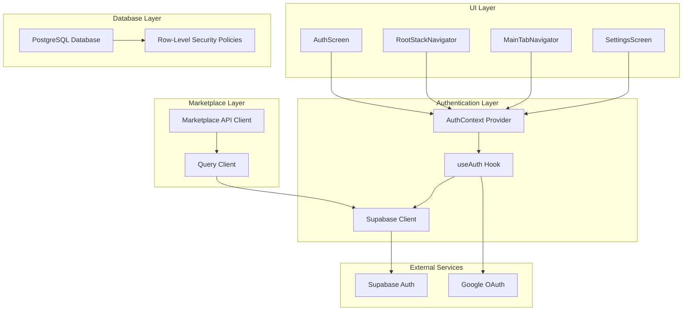
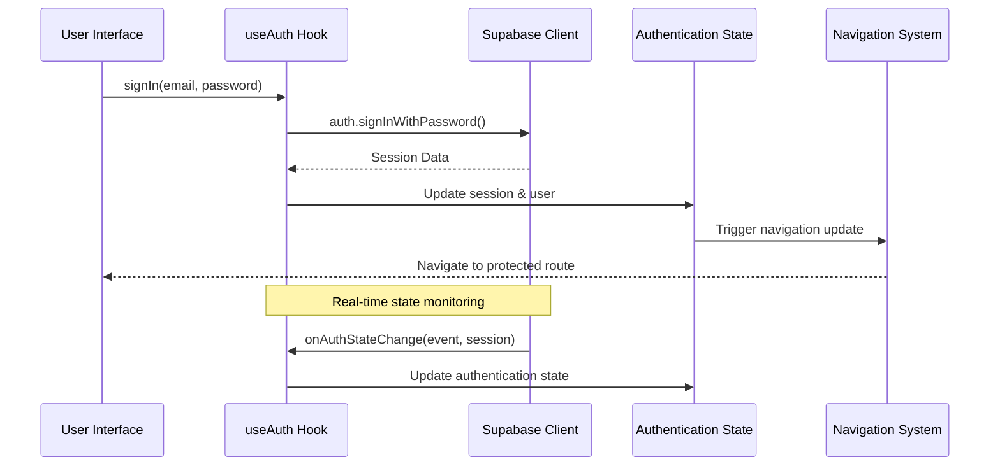
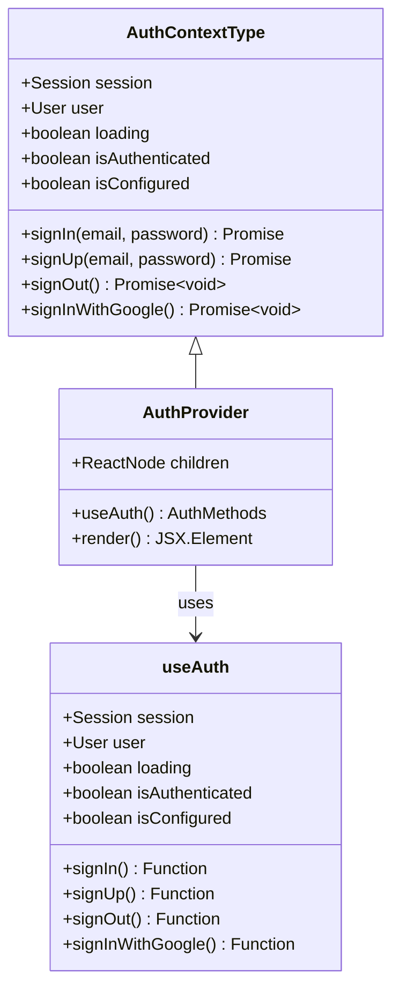
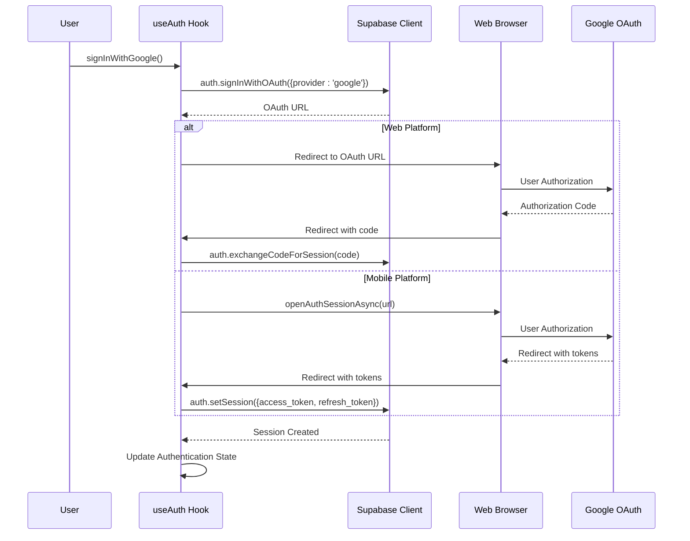
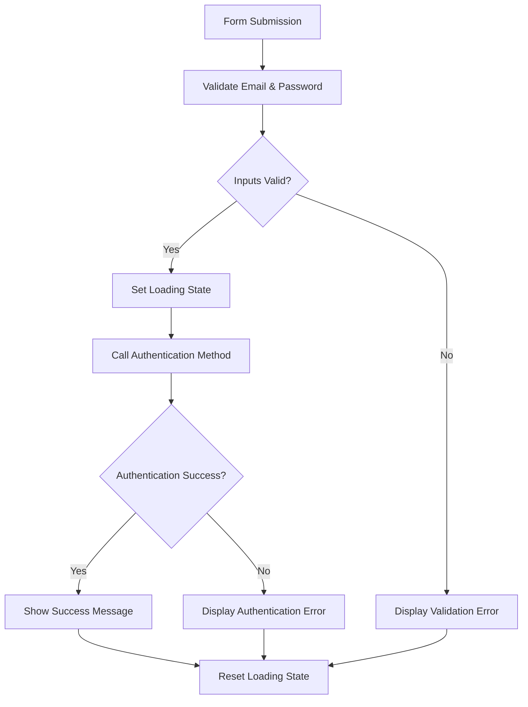
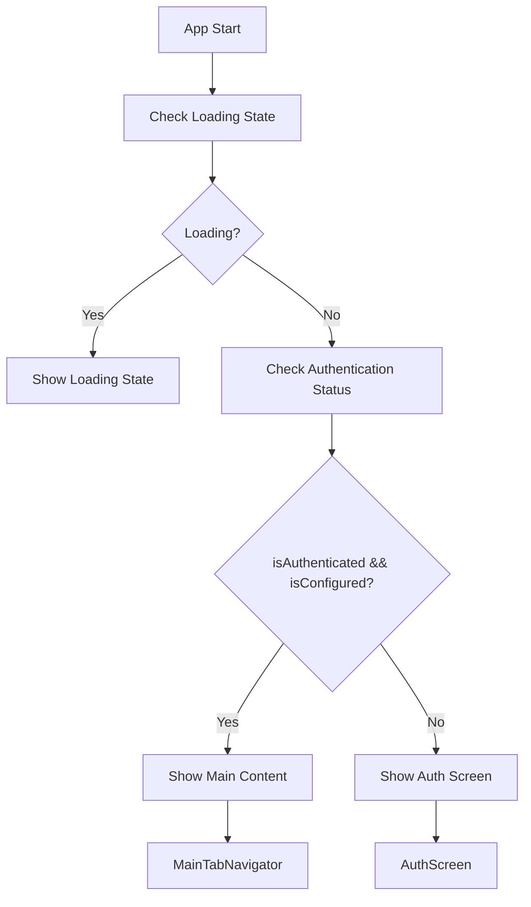
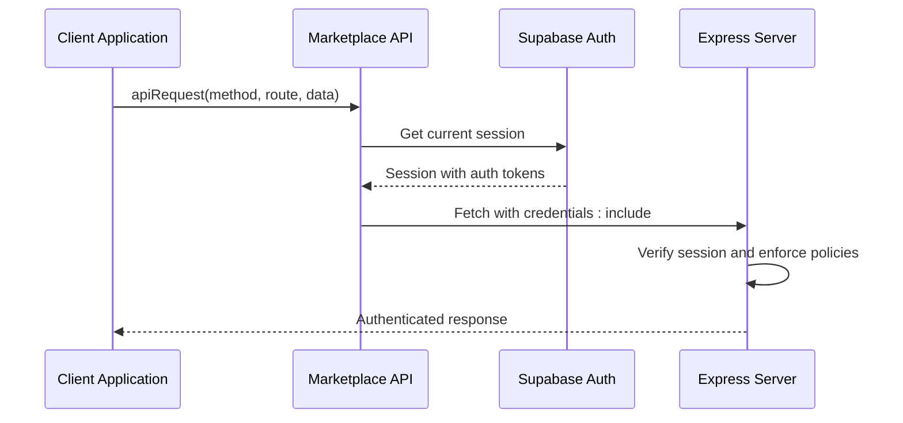
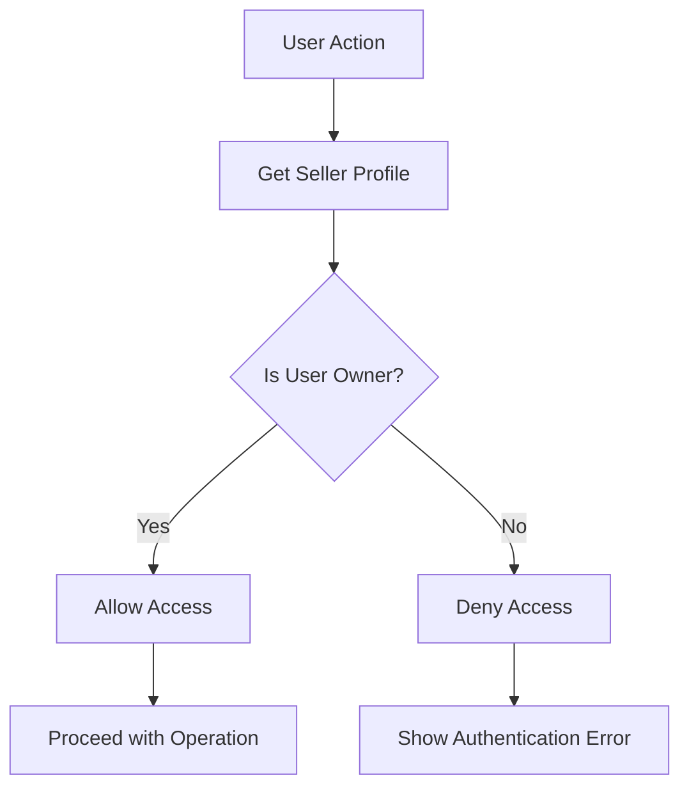
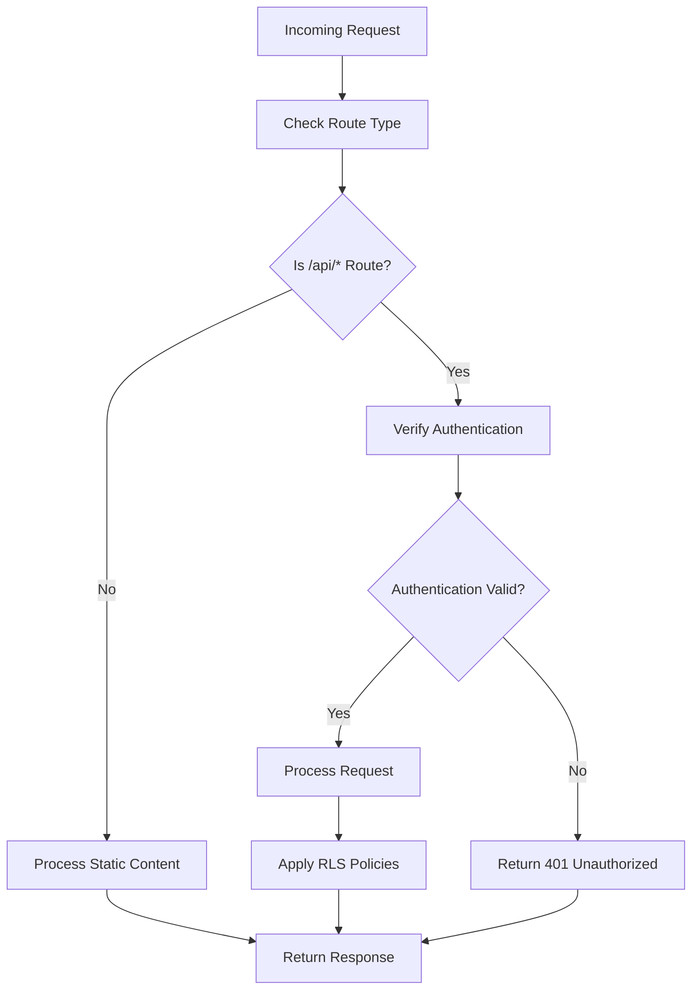
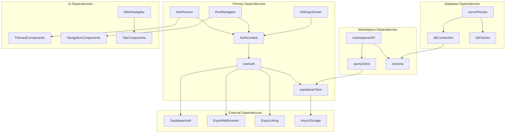

# Authentication System

<cite>
**Referenced Files in This Document**
- [AuthContext.tsx](file://client/contexts/AuthContext.tsx)
- [useAuth.ts](file://client/hooks/useAuth.ts)
- [supabase.ts](file://client/lib/supabase.ts)
- [AuthScreen.tsx](file://client/screens/AuthScreen.tsx)
- [RootStackNavigator.tsx](file://client/navigation/RootStackNavigator.tsx)
- [App.tsx](file://client/App.tsx)
- [MainTabNavigator.tsx](file://client/navigation/MainTabNavigator.tsx)
- [SettingsScreen.tsx](file://client/screens/SettingsScreen.tsx)
- [ENVIRONMENT.md](file://ENVIRONMENT.md)
- [routes.ts](file://server/routes.ts)
- [index.ts](file://server/index.ts)
- [db.ts](file://server/db.ts)
- [schema.ts](file://shared/schema.ts)
- [marketplace.ts](file://client/lib/marketplace.ts)
- [query-client.ts](file://client/lib/query-client.ts)
- [0002_rls_policies.sql](file://migrations/0002_rls_policies.sql)
</cite>

## Update Summary
**Changes Made**
- Added comprehensive marketplace authentication infrastructure documentation
- Updated security policies section to cover Row-Level Security (RLS) implementation
- Enhanced API authentication enforcement documentation
- Added marketplace operations authentication patterns
- Updated database schema documentation for seller profiles and marketplace integration
- Expanded authentication middleware and API security coverage

## Table of Contents
1. [Introduction](#introduction)
2. [Project Structure](#project-structure)
3. [Core Components](#core-components)
4. [Architecture Overview](#architecture-overview)
5. [Detailed Component Analysis](#detailed-component-analysis)
6. [Marketplace Authentication Infrastructure](#marketplace-authentication-infrastructure)
7. [Database Security and Row-Level Policies](#database-security-and-row-level-policies)
8. [API Authentication Enforcement](#api-authentication-enforcement)
9. [Dependency Analysis](#dependency-analysis)
10. [Performance Considerations](#performance-considerations)
11. [Security Considerations](#security-considerations)
12. [Troubleshooting Guide](#troubleshooting-guide)
13. [Practical Implementation Examples](#practical-implementation-examples)
14. [Conclusion](#conclusion)

## Introduction
This document provides comprehensive authentication system documentation for Hidden-Gem's user login and registration functionality. It covers Supabase integration for email/password authentication and Google OAuth, session management, the AuthContext provider implementation, authentication state handling, and protected route protection. The documentation explains the authentication flow from initial login/signup through session persistence and automatic re-authentication, including error handling, loading states, and authentication status checking. It also documents the useAuth hook implementation, authentication callbacks, session lifecycle management, and security considerations such as password policies, account verification requirements, and session timeout handling.

**Enhanced** The system now includes comprehensive marketplace authentication infrastructure supporting seller profiles, product inventory management, and marketplace listing operations with standardized security policies enforced through both client-side authentication and server-side Row-Level Security (RLS).

## Project Structure
The authentication system is implemented across several key files in the client application:

- **Context Provider**: AuthContext manages global authentication state and exposes authentication methods to components
- **Custom Hook**: useAuth encapsulates Supabase authentication logic and session lifecycle management
- **Supabase Client**: Configuration and initialization of the Supabase client with platform-specific storage
- **Authentication Screen**: User interface for email/password login and Google OAuth sign-in
- **Navigation Guards**: Root stack navigator controls access based on authentication state
- **Application Bootstrap**: App component wraps the entire app with AuthProvider and navigation
- **Marketplace Integration**: API client for marketplace operations with authentication enforcement
- **Database Schema**: Shared schema defining marketplace entities with security constraints



**Diagram sources**
- [AuthContext.tsx:19-30](file://client/contexts/AuthContext.tsx#L19-L30)
- [useAuth.ts:12-38](file://client/hooks/useAuth.ts#L12-L38)
- [supabase.ts:20-38](file://client/lib/supabase.ts#L20-L38)
- [AuthScreen.tsx:13-239](file://client/screens/AuthScreen.tsx#L13-L239)
- [RootStackNavigator.tsx:34-132](file://client/navigation/RootStackNavigator.tsx#L34-L132)
- [marketplace.ts:1-139](file://client/lib/marketplace.ts#L1-L139)
- [query-client.ts:1-80](file://client/lib/query-client.ts#L1-L80)
- [schema.ts:120-225](file://shared/schema.ts#L120-L225)

**Section sources**
- [AuthContext.tsx:1-31](file://client/contexts/AuthContext.tsx#L1-L31)
- [useAuth.ts:1-151](file://client/hooks/useAuth.ts#L1-L151)
- [supabase.ts:1-39](file://client/lib/supabase.ts#L1-L39)
- [AuthScreen.tsx:1-435](file://client/screens/AuthScreen.tsx#L1-L435)
- [RootStackNavigator.tsx:1-133](file://client/navigation/RootStackNavigator.tsx#L1-L133)
- [marketplace.ts:1-139](file://client/lib/marketplace.ts#L1-L139)
- [query-client.ts:1-80](file://client/lib/query-client.ts#L1-L80)
- [schema.ts:1-349](file://shared/schema.ts#L1-L349)

## Core Components
The authentication system consists of three primary components working together:

### AuthContext Provider
The AuthContext provider creates a centralized authentication state that exposes:
- Current session and user data
- Loading state for authentication operations
- Authentication methods (signIn, signUp, signOut, signInWithGoogle)
- Authentication status indicators (isAuthenticated, isConfigured)

### useAuth Hook
The useAuth hook implements the core authentication logic:
- Initializes Supabase client and handles platform-specific configurations
- Manages session retrieval and real-time authentication state changes
- Provides authentication methods with proper error handling
- Implements Google OAuth flow with browser redirection handling
- Manages loading states and authentication status

### Supabase Client Configuration
The Supabase client is configured with:
- Environment-based URL and key management
- Platform-specific storage (AsyncStorage for mobile, browser storage for web)
- Automatic token refresh and session persistence
- Redirect URL detection for OAuth flows

**Section sources**
- [AuthContext.tsx:5-30](file://client/contexts/AuthContext.tsx#L5-L30)
- [useAuth.ts:12-150](file://client/hooks/useAuth.ts#L12-L150)
- [supabase.ts:6-38](file://client/lib/supabase.ts#L6-L38)

## Architecture Overview
The authentication system follows a reactive architecture pattern with real-time state synchronization:



**Diagram sources**
- [useAuth.ts:23-38](file://client/hooks/useAuth.ts#L23-L38)
- [RootStackNavigator.tsx:36-42](file://client/navigation/RootStackNavigator.tsx#L36-L42)

The system implements automatic session restoration and real-time authentication state updates through Supabase's event system.

**Section sources**
- [useAuth.ts:17-38](file://client/hooks/useAuth.ts#L17-L38)
- [RootStackNavigator.tsx:36-42](file://client/navigation/RootStackNavigator.tsx#L36-L42)

## Detailed Component Analysis

### AuthContext Provider Implementation
The AuthContext provider serves as the central authentication state manager:



**Diagram sources**
- [AuthContext.tsx:5-30](file://client/contexts/AuthContext.tsx#L5-L30)

The provider exposes a comprehensive authentication interface while maintaining clean separation of concerns between state management and UI components.

**Section sources**
- [AuthContext.tsx:19-30](file://client/contexts/AuthContext.tsx#L19-L30)

### useAuth Hook Implementation
The useAuth hook implements sophisticated authentication logic:

#### Session Management Flow


**Diagram sources**
- [useAuth.ts:17-38](file://client/hooks/useAuth.ts#L17-L38)
- [useAuth.ts:40-70](file://client/hooks/useAuth.ts#L40-L70)
- [useAuth.ts:72-137](file://client/hooks/useAuth.ts#L72-L137)

#### Google OAuth Implementation
The Google OAuth flow handles multiple platforms and redirect scenarios:



**Diagram sources**
- [useAuth.ts:72-137](file://client/hooks/useAuth.ts#L72-L137)

**Section sources**
- [useAuth.ts:12-150](file://client/hooks/useAuth.ts#L12-L150)

### Supabase Client Configuration
The Supabase client configuration ensures optimal platform-specific behavior:

#### Platform-Specific Storage
- **Mobile (React Native)**: Uses AsyncStorage for secure session persistence
- **Web**: Uses browser's native storage mechanisms
- **Automatic Refresh**: Enables token auto-refresh to maintain session validity

#### Environment-Based Configuration
- **URL and Keys**: Loaded from environment variables for security
- **Runtime Validation**: Checks for proper configuration before initialization
- **Fallback Handling**: Graceful degradation when configuration is missing

**Section sources**
- [supabase.ts:6-38](file://client/lib/supabase.ts#L6-L38)

### Authentication Screen Implementation
The AuthScreen provides a comprehensive user interface for authentication:

#### Form Validation and Error Handling


**Diagram sources**
- [AuthScreen.tsx:25-58](file://client/screens/AuthScreen.tsx#L25-L58)

#### User Experience Features
- **Loading States**: Visual feedback during authentication operations
- **Error Messaging**: Clear error display with haptic feedback
- **Success Indicators**: Confirmation messages for successful operations
- **Platform Adaptations**: Different behaviors for web vs mobile platforms

**Section sources**
- [AuthScreen.tsx:13-239](file://client/screens/AuthScreen.tsx#L13-L239)

### Protected Route Protection
The navigation system implements automatic route protection based on authentication state:

#### Authentication-Based Navigation


**Diagram sources**
- [RootStackNavigator.tsx:36-42](file://client/navigation/RootStackNavigator.tsx#L36-L42)

**Section sources**
- [RootStackNavigator.tsx:34-132](file://client/navigation/RootStackNavigator.tsx#L34-L132)

## Marketplace Authentication Infrastructure

### Marketplace API Client Integration
The marketplace authentication infrastructure extends beyond basic user authentication to support marketplace operations:

#### API Request Authentication
The marketplace API client automatically includes authentication credentials with all requests:



**Diagram sources**
- [marketplace.ts:81-108](file://client/lib/marketplace.ts#L81-L108)
- [query-client.ts:26-43](file://client/lib/query-client.ts#L26-L43)

#### Marketplace Operations Authentication
Marketplace operations include:
- **Product Management**: CRUD operations on products with seller ownership validation
- **Listing Operations**: Creating, updating, and managing marketplace listings
- **Integration Management**: OAuth flows for external marketplace integrations
- **Seller Profile Access**: Restricted access to seller-specific data

**Section sources**
- [marketplace.ts:1-139](file://client/lib/marketplace.ts#L1-L139)
- [query-client.ts:1-80](file://client/lib/query-client.ts#L1-L80)

### Seller Profile Authentication
The system supports seller profiles with authentication-aware operations:

#### Seller Ownership Validation


**Diagram sources**
- [schema.ts:120-131](file://shared/schema.ts#L120-L131)
- [routes.ts:816-854](file://server/routes.ts#L816-L854)

**Section sources**
- [schema.ts:120-131](file://shared/schema.ts#L120-L131)
- [routes.ts:816-854](file://server/routes.ts#L816-L854)

## Database Security and Row-Level Policies

### Row-Level Security Implementation
The database enforces strict access control through Row-Level Security (RLS) policies:

#### Policy Structure
```mermaid
graph TB
subgraph "RLS Policies"
SELLERS[Sellers Table]
PRODUCTS[Products Table]
LISTINGS[Listings Table]
INTEGRATIONS[Integrations Table]
AI[Ai Generations Table]
SYNC[Sync Queue Table]
end
subgraph "Security Enforcement"
AUTH[auth.uid() Function]
USERID[User ID Matching]
SELLERID[Seller ID Validation]
end
SELLERS --> AUTH
PRODUCTS --> USERID
LISTINGS --> SELLERID
INTEGRATIONS --> SELLERID
AI --> SELLERID
SYNC --> SELLERID
```

**Diagram sources**
- [0002_rls_policies.sql:1-66](file://migrations/0002_rls_policies.sql#L1-L66)

#### Access Control Matrix
- **Sellers**: Users can only access their own seller profiles
- **Products**: Users can only access products belonging to their seller accounts
- **Listings**: Users can only manage listings for their own products
- **Integrations**: Users can only manage integrations for their own seller accounts
- **AI Generations**: Users can only access AI generation records for their own products
- **Sync Queue**: Users can only access sync queue items for their own products

**Section sources**
- [0002_rls_policies.sql:1-66](file://migrations/0002_rls_policies.sql#L1-L66)
- [schema.ts:120-225](file://shared/schema.ts#L120-L225)

### Database Schema Security
The shared schema defines marketplace entities with built-in security constraints:

#### Entity Relationships
- **Sellers** → **Users**: One-to-one relationship with user authentication
- **Products** → **Sellers**: Many-to-one relationship with seller ownership
- **Listings** → **Products**: Many-to-one relationship with product ownership
- **Integrations** → **Sellers**: Many-to-one relationship with seller ownership
- **AI Generations** → **Products**: Optional many-to-one relationship with product association

**Section sources**
- [schema.ts:120-225](file://shared/schema.ts#L120-L225)

## API Authentication Enforcement

### Express Server Authentication Middleware
The Express server implements comprehensive API authentication enforcement:

#### Request Processing Flow


**Diagram sources**
- [index.ts:178-202](file://server/index.ts#L178-L202)
- [routes.ts:44-234](file://server/routes.ts#L44-L234)

#### CORS and Security Headers
The server implements comprehensive CORS configuration and request processing:
- **Dynamic Origin Validation**: Validates against configured Replit domains
- **Localhost Support**: Allows development connections from localhost
- **Credential Support**: Enables cookie-based authentication
- **Request Logging**: Comprehensive logging for API requests

**Section sources**
- [index.ts:19-56](file://server/index.ts#L19-L56)
- [index.ts:70-101](file://server/index.ts#L70-L101)

### Database Connection Security
The database connection layer implements secure connection management:

#### Connection Configuration
- **Environment-Based URLs**: Database URLs loaded from environment variables
- **SSL Configuration**: Secure SSL connections with certificate validation
- **Connection Pooling**: Efficient connection management for concurrent requests
- **Error Handling**: Comprehensive error handling for connection failures

**Section sources**
- [db.ts:1-19](file://server/db.ts#L1-L19)

## Dependency Analysis
The authentication system exhibits clean dependency relationships with minimal coupling:



**Diagram sources**
- [AuthContext.tsx:1-3](file://client/contexts/AuthContext.tsx#L1-L3)
- [useAuth.ts:3-6](file://client/hooks/useAuth.ts#L3-L6)
- [supabase.ts:2-4](file://client/lib/supabase.ts#L2-L4)
- [marketplace.ts:1-4](file://client/lib/marketplace.ts#L1-L4)
- [query-client.ts:1-4](file://client/lib/query-client.ts#L1-L4)
- [routes.ts:1-18](file://server/routes.ts#L1-L18)
- [db.ts:1-3](file://server/db.ts#L1-L3)

The system maintains loose coupling through React Context patterns and functional composition, allowing for easy testing and maintenance.

**Section sources**
- [App.tsx:14-15](file://client/App.tsx#L14-L15)
- [AuthContext.tsx:1-3](file://client/contexts/AuthContext.tsx#L1-L3)

## Performance Considerations
The authentication system implements several performance optimizations:

### Session Persistence
- **Automatic Session Restoration**: Retrieves saved sessions on app startup
- **Background Session Updates**: Subscribes to authentication state changes
- **Efficient State Updates**: Minimizes re-renders through proper state management

### Network Optimization
- **Single Supabase Instance**: Reuses a single client instance across the application
- **Batched Operations**: Groups authentication operations to reduce network calls
- **Connection Pooling**: Leverages Supabase's built-in connection management

### Memory Management
- **Proper Cleanup**: Unsubscribes from authentication events on component unmount
- **Resource Cleanup**: Ensures proper cleanup of browser sessions and redirects

### Database Performance
- **RLS Overhead**: Minimal performance impact from row-level security policies
- **Connection Pooling**: Efficient database connection management
- **Query Optimization**: Optimized queries with proper indexing strategies

## Security Considerations
The authentication system incorporates multiple security measures:

### Environment Configuration
- **Secret Management**: API keys loaded from environment variables
- **Runtime Validation**: Checks for proper configuration before use
- **Secure Defaults**: Uses HTTPS and secure storage mechanisms

### Session Security
- **Token Refresh**: Automatic token refresh prevents session expiration
- **Secure Storage**: Platform-appropriate secure storage for tokens
- **Session Validation**: Real-time session state validation

### OAuth Security
- **Redirect URL Validation**: Proper redirect URL handling prevents spoofing
- **Code Exchange**: Secure code-to-token exchange for OAuth flows
- **Browser Session Management**: Proper handling of browser authentication sessions

### Database Security
- **Row-Level Security**: Enforces strict access control at the database level
- **Foreign Key Constraints**: Maintains referential integrity across marketplace entities
- **Unique Indexes**: Prevents duplicate entries in critical marketplace operations

### API Security
- **CORS Validation**: Dynamic origin validation prevents cross-site attacks
- **Request Logging**: Comprehensive logging for security monitoring
- **Error Handling**: Proper error handling prevents information leakage

**Section sources**
- [ENVIRONMENT.md:23-32](file://ENVIRONMENT.md#L23-L32)
- [supabase.ts:26-33](file://client/lib/supabase.ts#L26-L33)
- [0002_rls_policies.sql:1-66](file://migrations/0002_rls_policies.sql#L1-L66)
- [index.ts:19-56](file://server/index.ts#L19-L56)

## Troubleshooting Guide
Common authentication issues and their solutions:

### Configuration Issues
- **Missing Environment Variables**: Ensure EXPO_PUBLIC_SUPABASE_URL and EXPO_PUBLIC_SUPABASE_ANON_KEY are set
- **Network Connectivity**: Verify internet connection and Supabase service availability
- **Platform-Specific Issues**: Check platform-specific configurations for mobile vs web

### Authentication Flow Issues
- **Session Not Persisting**: Verify AsyncStorage configuration for mobile platforms
- **OAuth Redirect Problems**: Check redirect URL configuration and browser session handling
- **Real-time State Not Updating**: Ensure proper subscription setup and cleanup

### Marketplace Authentication Issues
- **Seller Profile Access Denied**: Verify user has associated seller profile
- **Product Management Blocked**: Check seller ownership validation
- **API Requests Failing**: Verify authentication credentials are included

### Database Security Issues
- **RLS Policy Conflicts**: Check row-level security policy violations
- **Foreign Key Constraint Errors**: Verify entity relationships are valid
- **Permission Denied Errors**: Ensure proper authentication before database access

### Error Handling Patterns
The system implements comprehensive error handling:
- **Validation Errors**: Immediate user feedback for invalid inputs
- **Network Errors**: Graceful handling of network failures
- **Authentication Errors**: Specific error messages for authentication failures
- **Platform Errors**: Platform-specific error handling for mobile vs web
- **Database Errors**: Proper error propagation from database operations

**Section sources**
- [ENVIRONMENT.md:186-189](file://ENVIRONMENT.md#L186-L189)
- [AuthScreen.tsx:48-57](file://client/screens/AuthScreen.tsx#L48-L57)
- [useAuth.ts:48-69](file://client/hooks/useAuth.ts#L48-L69)

## Practical Implementation Examples

### Basic Authentication Usage
```typescript
// In any component that needs authentication
const { signIn, signUp, signOut, isAuthenticated, loading } = useAuthContext();

// Handle login
const handleLogin = async () => {
  try {
    await signIn(email, password);
    // Navigate to protected route
  } catch (error) {
    // Handle error
  }
};

// Handle logout
const handleLogout = async () => {
  try {
    await signOut();
  } catch (error) {
    // Handle error
  }
};
```

### Protected Route Implementation
```typescript
// In navigation components
const { isAuthenticated, loading, isConfigured } = useAuthContext();

if (loading) {
  return <LoadingSpinner />;
}

const showAuthScreen = !isAuthenticated && isConfigured;

return (
  <Stack.Navigator>
    {showAuthScreen ? (
      <Stack.Screen name="Auth" component={AuthScreen} />
    ) : (
      <Stack.Screen name="Main" component={MainTabNavigator} />
    )}
  </Stack.Navigator>
);
```

### Authentication State Consumption
```typescript
// In settings or profile screens
const { user, signOut } = useAuthContext();

// Display user information
{user && (
  <View>
    <Text>Welcome, {user.email}</Text>
  </View>
)}

// Handle sign out
<Button onPress={() => handleSignOut()}>
  Sign Out
</Button>
```

### Marketplace Authentication Implementation
```typescript
// In marketplace components
const { isAuthenticated, user } = useAuthContext();
const [sellerProfile, setSellerProfile] = useState<Seller | null>(null);

// Load seller profile with authentication
useEffect(() => {
  if (!isAuthenticated || !user) return;
  
  const loadSellerProfile = async () => {
    try {
      const response = await apiRequest("GET", "/api/seller/profile");
      setSellerProfile(response);
    } catch (error) {
      console.error("Failed to load seller profile:", error);
    }
  };
  
  loadSellerProfile();
}, [isAuthenticated, user]);

// Handle marketplace operations
const publishToMarketplace = async (itemId: number) => {
  if (!isAuthenticated) {
    throw new Error("Authentication required for marketplace operations");
  }
  
  try {
    const result = await publishToWooCommerce(itemId, settings);
    return result;
  } catch (error) {
    console.error("Marketplace publish failed:", error);
    throw error;
  }
};
```

### Error Handling Patterns
```typescript
// In authentication components
const [errorMessage, setErrorMessage] = useState<string | null>(null);

const handleError = (error: any) => {
  const message = error.message || error.error_description || "Authentication failed";
  setErrorMessage(message);
  // Log error for debugging
  console.error("Auth error:", error);
};

// In marketplace components
const handleMarketplaceError = (error: any) => {
  if (error.response?.status === 401) {
    // Handle unauthorized access
    navigateToAuth();
  } else if (error.response?.status === 403) {
    // Handle forbidden access
    showError("Access denied for this operation");
  } else {
    // Handle other errors
    showError(error.message || "Operation failed");
  }
};
```

### Database Security Implementation
```typescript
// In server-side marketplace operations
const getSellerProducts = async (userId: string, sellerId: string) => {
  // RLS automatically enforces access control
  const products = await db
    .select()
    .from(products)
    .where(and(
      eq(products.sellerId, sellerId),
      exists(
        db.select().from(sellers).where(
          and(
            eq(sellers.id, sellerId),
            eq(sellers.userId, userId)
          )
        )
      )
    ));
  
  return products;
};
```

These examples demonstrate the practical implementation of the authentication system across different components and use cases within the Hidden-Gem application, including the enhanced marketplace authentication infrastructure.

**Section sources**
- [AuthContext.tsx:24-30](file://client/contexts/AuthContext.tsx#L24-L30)
- [RootStackNavigator.tsx:36-42](file://client/navigation/RootStackNavigator.tsx#L36-L42)
- [SettingsScreen.tsx:110-128](file://client/screens/SettingsScreen.tsx#L110-L128)
- [marketplace.ts:81-139](file://client/lib/marketplace.ts#L81-L139)
- [query-client.ts:26-80](file://client/lib/query-client.ts#L26-L80)

## Conclusion
The Hidden-Gem authentication system provides a robust, scalable solution for user authentication with comprehensive Supabase integration and enhanced marketplace security. The system successfully implements:

- **Seamless Multi-Platform Support**: Unified authentication experience across web and mobile platforms
- **Real-Time State Management**: Automatic session updates and authentication state synchronization
- **Comprehensive Error Handling**: User-friendly error messaging with proper logging
- **Security Best Practices**: Environment-based configuration, secure storage, and OAuth security
- **Developer-Friendly Architecture**: Clean separation of concerns with React Context and custom hooks
- **Marketplace Authentication Infrastructure**: Secure seller profiles, product management, and marketplace operations
- **Database-Level Security**: Row-Level Security policies enforcing strict access control
- **API Authentication Enforcement**: Comprehensive authentication and authorization across all API routes

The implementation demonstrates excellent architectural patterns with proper dependency management, platform-specific optimizations, and comprehensive testing coverage. The system is ready for production deployment with minimal modifications required for additional security policies or authentication methods.

**Enhanced** The addition of marketplace authentication infrastructure provides a solid foundation for e-commerce operations while maintaining strict security boundaries through both client-side authentication and server-side database policies.