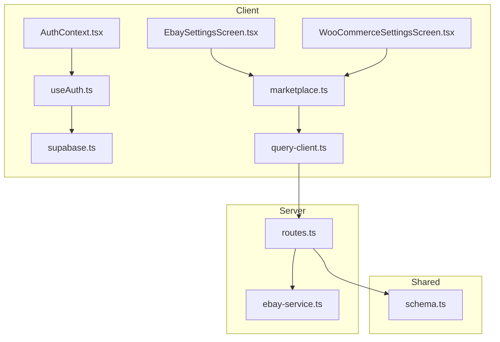
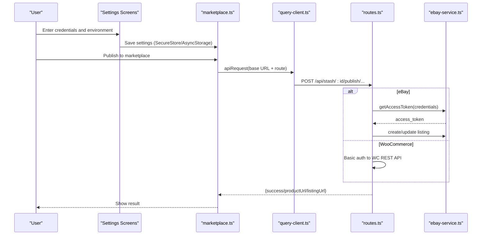
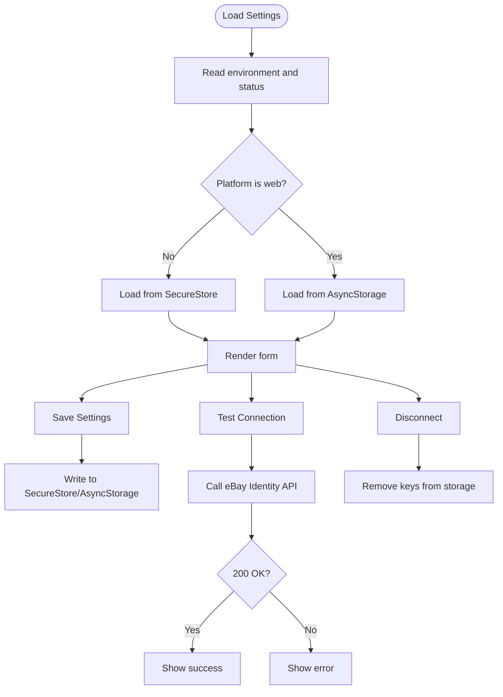
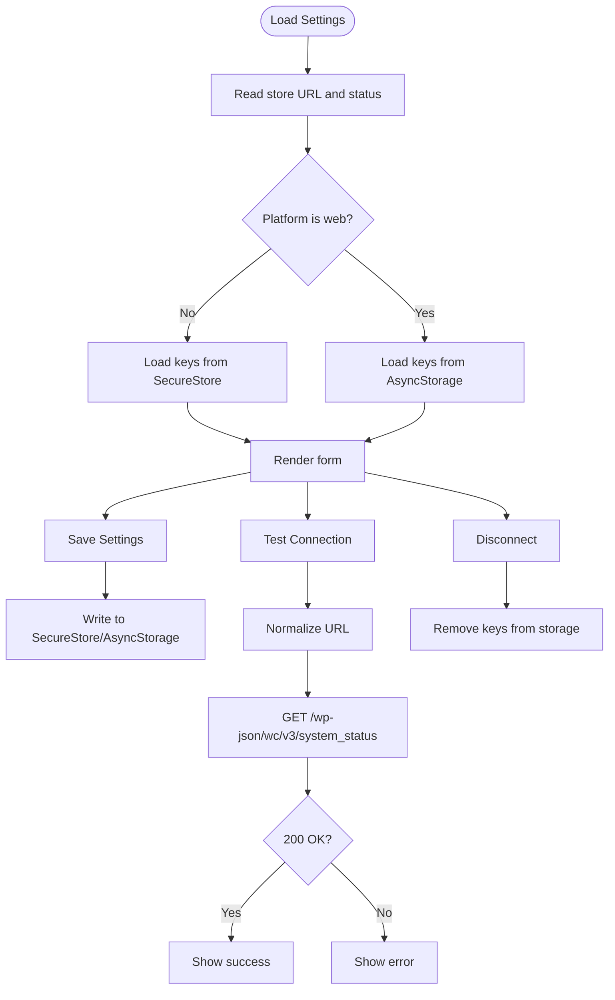
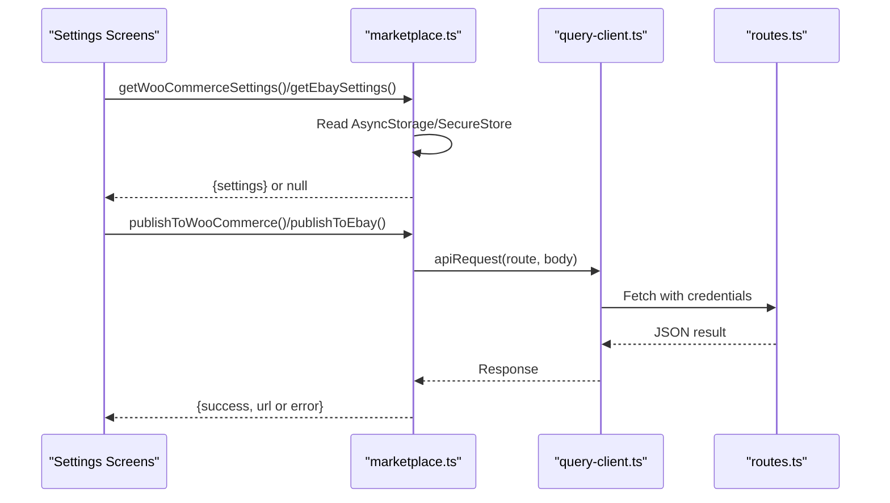
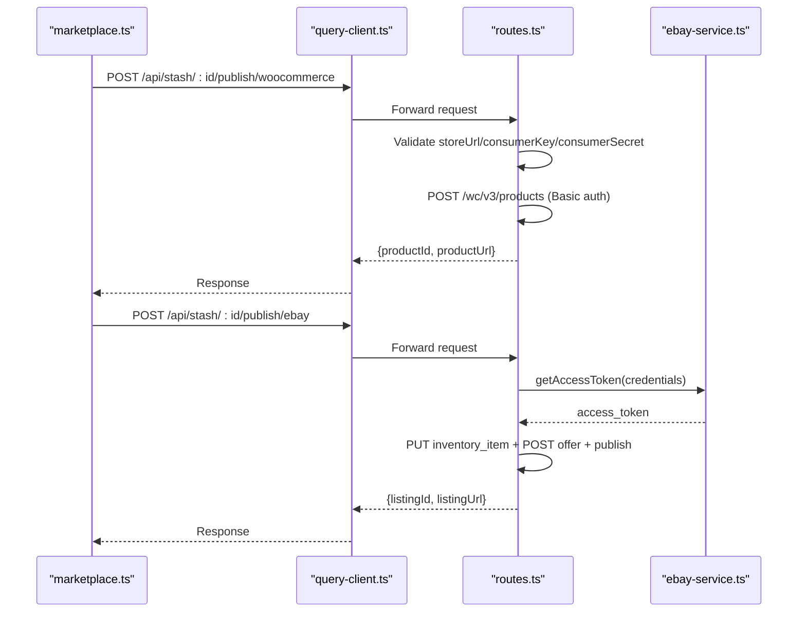
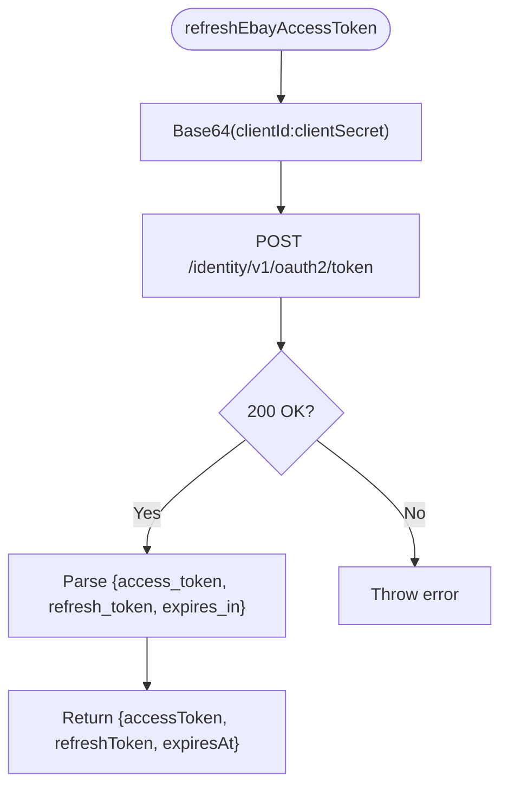
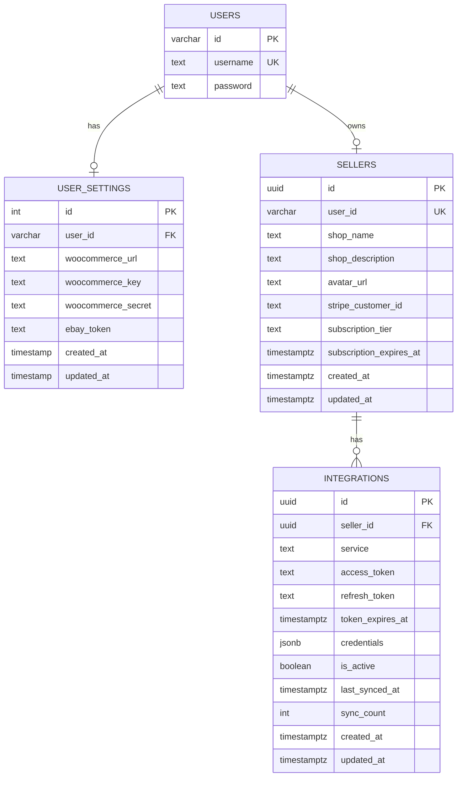
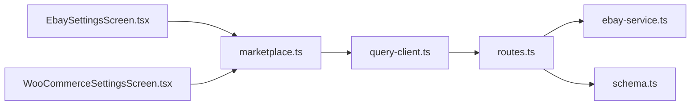

# Marketplace Integration Keys

<cite>
**Referenced Files in This Document**
- [EbaySettingsScreen.tsx](file://client/screens/EbaySettingsScreen.tsx)
- [WooCommerceSettingsScreen.tsx](file://client/screens/WooCommerceSettingsScreen.tsx)
- [marketplace.ts](file://client/lib/marketplace.ts)
- [ebay-service.ts](file://server/ebay-service.ts)
- [routes.ts](file://server/routes.ts)
- [schema.ts](file://shared/schema.ts)
- [AuthContext.tsx](file://client/contexts/AuthContext.tsx)
- [useAuth.ts](file://client/hooks/useAuth.ts)
- [supabase.ts](file://client/lib/supabase.ts)
- [query-client.ts](file://client/lib/query-client.ts)
- [PrivacyPolicyScreen.tsx](file://client/screens/PrivacyPolicyScreen.tsx)
- [TermsOfServiceScreen.tsx](file://client/screens/TermsOfServiceScreen.tsx)
</cite>

## Table of Contents
1. [Introduction](#introduction)
2. [Project Structure](#project-structure)
3. [Core Components](#core-components)
4. [Architecture Overview](#architecture-overview)
5. [Detailed Component Analysis](#detailed-component-analysis)
6. [Dependency Analysis](#dependency-analysis)
7. [Performance Considerations](#performance-considerations)
8. [Troubleshooting Guide](#troubleshooting-guide)
9. [Security Best Practices](#security-best-practices)
10. [Conclusion](#conclusion)

## Introduction
This document explains how marketplace API keys and integration credentials are managed within the application. It covers secure storage and handling of eBay and WooCommerce credentials, the encryption and transport mechanisms used, and the user-facing settings screens for configuration. It also documents the relationship between user profiles and marketplace accounts, credential validation flows, and operational guidance for troubleshooting and maintenance.

## Project Structure
The marketplace integration spans three layers:
- Client-side settings screens and helpers for secure local storage
- Server-side routes that validate and publish to marketplaces
- Shared database schema that models user settings and marketplace integrations

**Diagram sources**
- [EbaySettingsScreen.tsx](file://client/screens/EbaySettingsScreen.tsx#L1-L568)
- [WooCommerceSettingsScreen.tsx](file://client/screens/WooCommerceSettingsScreen.tsx#L1-L512)
- [marketplace.ts](file://client/lib/marketplace.ts#L1-L129)
- [AuthContext.tsx](file://client/contexts/AuthContext.tsx#L1-L31)
- [useAuth.ts](file://client/hooks/useAuth.ts#L1-L151)
- [supabase.ts](file://client/lib/supabase.ts#L1-L39)
- [query-client.ts](file://client/lib/query-client.ts#L1-L80)
- [routes.ts](file://server/routes.ts#L1-L929)
- [ebay-service.ts](file://server/ebay-service.ts#L1-L474)
- [schema.ts](file://shared/schema.ts#L1-L344)

**Section sources**
- [EbaySettingsScreen.tsx](file://client/screens/EbaySettingsScreen.tsx#L1-L568)
- [WooCommerceSettingsScreen.tsx](file://client/screens/WooCommerceSettingsScreen.tsx#L1-L512)
- [marketplace.ts](file://client/lib/marketplace.ts#L1-L129)
- [routes.ts](file://server/routes.ts#L1-L929)
- [ebay-service.ts](file://server/ebay-service.ts#L1-L474)
- [schema.ts](file://shared/schema.ts#L1-L344)
- [AuthContext.tsx](file://client/contexts/AuthContext.tsx#L1-L31)
- [useAuth.ts](file://client/hooks/useAuth.ts#L1-L151)
- [supabase.ts](file://client/lib/supabase.ts#L1-L39)
- [query-client.ts](file://client/lib/query-client.ts#L1-L80)

## Core Components
- eBay settings screen: Collects Client ID, Client Secret, optional Refresh Token, environment selection, and performs connection tests.
- WooCommerce settings screen: Collects Store URL, Consumer Key, Consumer Secret, and validates connectivity.
- Client-side helpers: Retrieve stored credentials and publish to marketplaces via the API.
- Server routes: Validate credentials, create listings, and handle marketplace responses.
- eBay service: Manages OAuth token refresh and listing operations.
- Shared schema: Defines user settings and marketplace integration records.

**Section sources**
- [EbaySettingsScreen.tsx](file://client/screens/EbaySettingsScreen.tsx#L1-L568)
- [WooCommerceSettingsScreen.tsx](file://client/screens/WooCommerceSettingsScreen.tsx#L1-L512)
- [marketplace.ts](file://client/lib/marketplace.ts#L1-L129)
- [routes.ts](file://server/routes.ts#L387-L647)
- [ebay-service.ts](file://server/ebay-service.ts#L42-L62)

## Architecture Overview
The system separates concerns between client-side credential storage and server-side marketplace operations. Credentials are stored locally on the device when possible, while server routes validate and publish listings.

**Diagram sources**
- [EbaySettingsScreen.tsx](file://client/screens/EbaySettingsScreen.tsx#L75-L150)
- [WooCommerceSettingsScreen.tsx](file://client/screens/WooCommerceSettingsScreen.tsx#L68-L146)
- [marketplace.ts](file://client/lib/marketplace.ts#L81-L128)
- [query-client.ts](file://client/lib/query-client.ts#L26-L43)
- [routes.ts](file://server/routes.ts#L387-L647)
- [ebay-service.ts](file://server/ebay-service.ts#L42-L62)

## Detailed Component Analysis

### eBay Settings Screen
- Stores Client ID, Client Secret, optional Refresh Token, and environment in secure storage on native platforms and fallback storage on web.
- Provides a connection test that validates credentials against the eBay Identity API.
- Supports clearing stored credentials and disconnecting the account.

**Diagram sources**
- [EbaySettingsScreen.tsx](file://client/screens/EbaySettingsScreen.tsx#L44-L187)

**Section sources**
- [EbaySettingsScreen.tsx](file://client/screens/EbaySettingsScreen.tsx#L14-L187)

### WooCommerce Settings Screen
- Stores Store URL, Consumer Key, and Consumer Secret using SecureStore on native platforms and AsyncStorage on web.
- Validates connectivity by calling the WooCommerce REST API system status endpoint.
- Provides a disconnect option to remove stored credentials.

**Diagram sources**
- [WooCommerceSettingsScreen.tsx](file://client/screens/WooCommerceSettingsScreen.tsx#L43-L180)

**Section sources**
- [WooCommerceSettingsScreen.tsx](file://client/screens/WooCommerceSettingsScreen.tsx#L15-L180)

### Client Helpers: Credential Retrieval and Publishing
- Retrieves stored credentials for both marketplaces and exposes publish functions that call server routes.
- Uses a centralized API client to send requests with credentials included.

**Diagram sources**
- [marketplace.ts](file://client/lib/marketplace.ts#L19-L128)
- [query-client.ts](file://client/lib/query-client.ts#L26-L43)
- [routes.ts](file://server/routes.ts#L387-L647)

**Section sources**
- [marketplace.ts](file://client/lib/marketplace.ts#L1-L129)
- [query-client.ts](file://client/lib/query-client.ts#L1-L80)

### Server Routes: Validation and Publishing
- WooCommerce publishing: Validates credentials, posts a product to the WC REST API, updates the stash item record, and returns the product URL.
- eBay publishing: Validates credentials and refresh token, obtains an access token, creates inventory and offers, publishes the listing, and returns the listing URL.

**Diagram sources**
- [routes.ts](file://server/routes.ts#L387-L647)
- [ebay-service.ts](file://server/ebay-service.ts#L42-L62)

**Section sources**
- [routes.ts](file://server/routes.ts#L387-L647)
- [ebay-service.ts](file://server/ebay-service.ts#L42-L62)

### eBay Service: Token Management and Listings
- Provides token refresh using a refresh token and returns a new access token.
- Implements listing retrieval, inventory queries, and listing lifecycle operations.

**Diagram sources**
- [ebay-service.ts](file://server/ebay-service.ts#L329-L364)

**Section sources**
- [ebay-service.ts](file://server/ebay-service.ts#L1-L474)

### Shared Schema: User Settings and Integrations
- user_settings table stores per-user marketplace credentials and URLs.
- integrations table models seller-level marketplace integrations with tokens and metadata.
- These tables support long-term credential storage and marketplace account linkage.

**Diagram sources**
- [schema.ts](file://shared/schema.ts#L6-L27)
- [schema.ts](file://shared/schema.ts#L115-L220)

**Section sources**
- [schema.ts](file://shared/schema.ts#L6-L27)
- [schema.ts](file://shared/schema.ts#L115-L220)

## Dependency Analysis
- Client settings screens depend on SecureStore/AsyncStorage for local credential storage.
- Client helpers depend on the API client to communicate with server routes.
- Server routes depend on the eBay service for OAuth and listing operations.
- Shared schema defines the persistence model for user and seller marketplace integrations.

**Diagram sources**
- [EbaySettingsScreen.tsx](file://client/screens/EbaySettingsScreen.tsx#L1-L568)
- [WooCommerceSettingsScreen.tsx](file://client/screens/WooCommerceSettingsScreen.tsx#L1-L512)
- [marketplace.ts](file://client/lib/marketplace.ts#L1-L129)
- [query-client.ts](file://client/lib/query-client.ts#L1-L80)
- [routes.ts](file://server/routes.ts#L1-L929)
- [ebay-service.ts](file://server/ebay-service.ts#L1-L474)
- [schema.ts](file://shared/schema.ts#L1-L344)

**Section sources**
- [EbaySettingsScreen.tsx](file://client/screens/EbaySettingsScreen.tsx#L1-L568)
- [WooCommerceSettingsScreen.tsx](file://client/screens/WooCommerceSettingsScreen.tsx#L1-L512)
- [marketplace.ts](file://client/lib/marketplace.ts#L1-L129)
- [query-client.ts](file://client/lib/query-client.ts#L1-L80)
- [routes.ts](file://server/routes.ts#L1-L929)
- [ebay-service.ts](file://server/ebay-service.ts#L1-L474)
- [schema.ts](file://shared/schema.ts#L1-L344)

## Performance Considerations
- Local storage operations (SecureStore/AsyncStorage) are fast and avoid network overhead for credential retrieval.
- Server-side publishing involves external API calls; batching or retry strategies can be considered at the server level.
- Token refresh is performed only when needed to minimize redundant calls.

[No sources needed since this section provides general guidance]

## Troubleshooting Guide
Common issues and resolutions:
- Authentication failures during connection tests:
  - Verify Client ID/Client Secret for eBay and Consumer Key/Secret for WooCommerce.
  - Confirm environment selection (sandbox vs production) matches the developer portal configuration.
- 401 errors when publishing:
  - Ensure refresh token is present for eBay listings.
  - Confirm WooCommerce REST API is enabled and credentials are correct.
- Cannot connect on web:
  - Use the mobile app for stronger secure storage guarantees; web storage is less secure.
- Disconnecting marketplace accounts:
  - Use the Disconnect buttons in settings to remove stored credentials.

**Section sources**
- [EbaySettingsScreen.tsx](file://client/screens/EbaySettingsScreen.tsx#L112-L150)
- [WooCommerceSettingsScreen.tsx](file://client/screens/WooCommerceSettingsScreen.tsx#L108-L146)
- [routes.ts](file://server/routes.ts#L457-L647)

## Security Best Practices
- Encryption and secure storage:
  - On native platforms, credentials are stored in SecureStore; on web, AsyncStorage is used as a fallback.
  - Avoid storing plaintext secrets in logs or UI state.
- Transmission security:
  - Use HTTPS endpoints and Basic authentication with client credentials where supported.
  - Minimize exposure of credentials in URLs or logs.
- Access controls:
  - Require user authentication before allowing credential entry or publishing actions.
  - Restrict marketplace publishing to authenticated sessions.
- Audit and rotation:
  - Maintain logs of marketplace operations and credential changes.
  - Rotate credentials periodically and update stored values accordingly.
- Privacy and policy:
  - Inform users about data handling and storage practices in privacy and terms documents.

**Section sources**
- [PrivacyPolicyScreen.tsx](file://client/screens/PrivacyPolicyScreen.tsx#L39-L74)
- [TermsOfServiceScreen.tsx](file://client/screens/TermsOfServiceScreen.tsx#L39-L48)
- [EbaySettingsScreen.tsx](file://client/screens/EbaySettingsScreen.tsx#L211-L218)
- [WooCommerceSettingsScreen.tsx](file://client/screens/WooCommerceSettingsScreen.tsx#L204-L211)

## Conclusion
The application provides a secure, user-friendly mechanism for managing marketplace credentials. Client-side secure storage protects sensitive data, while server routes validate and publish listings to eBay and WooCommerce. The shared schema supports persistent integration records for sellers. Following the best practices and troubleshooting steps outlined here will help maintain secure and reliable marketplace integrations.