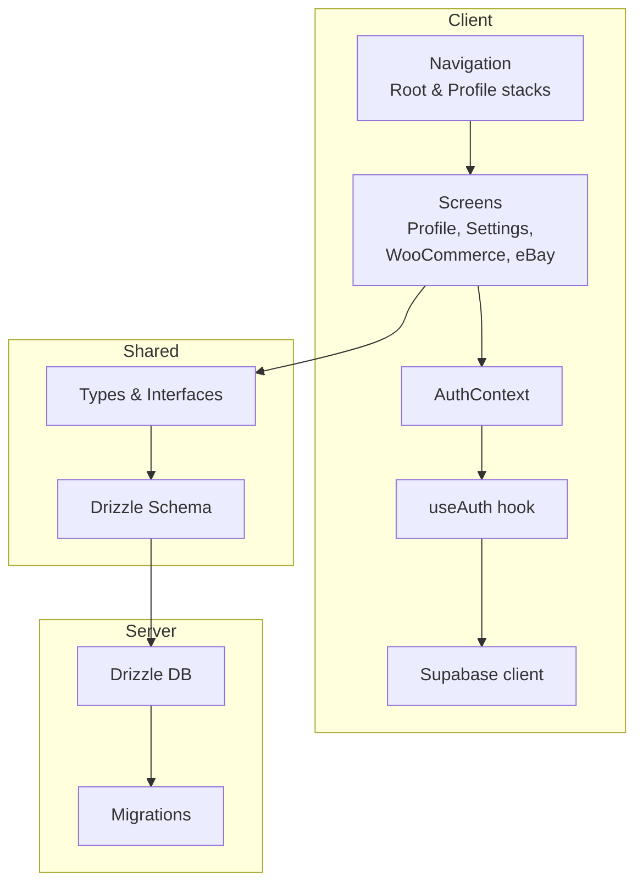
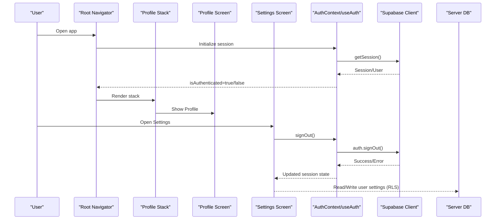
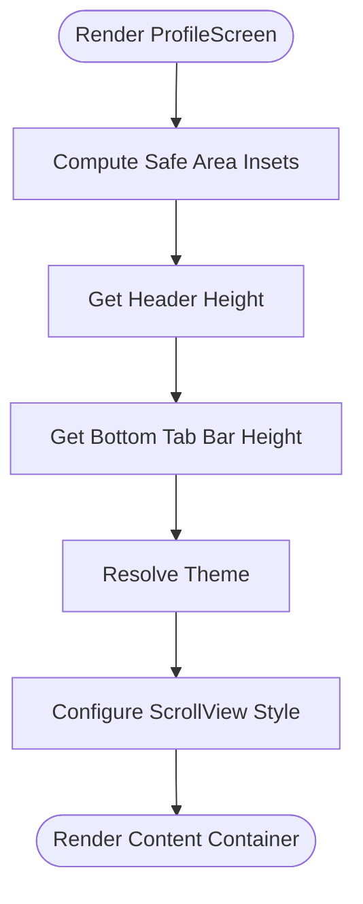
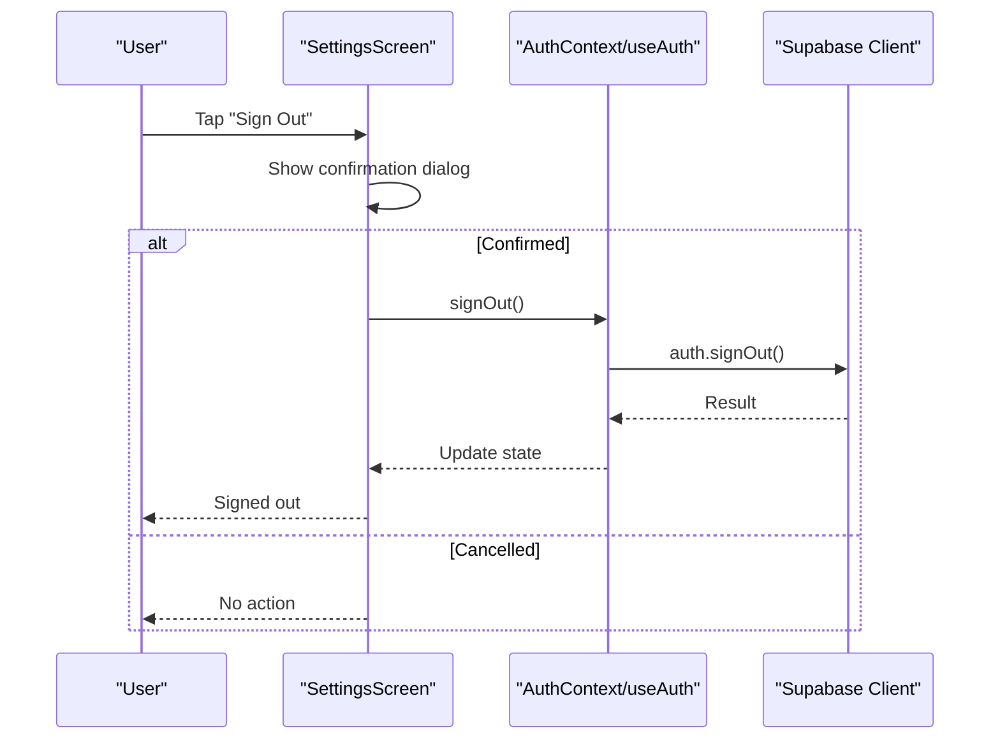
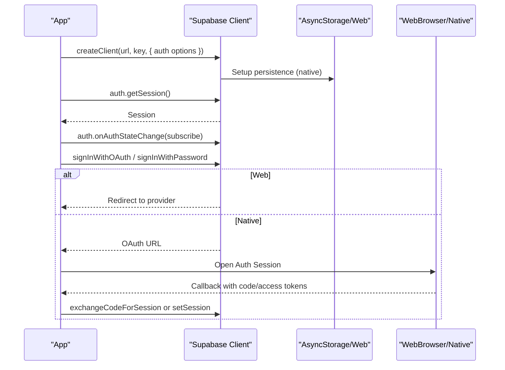
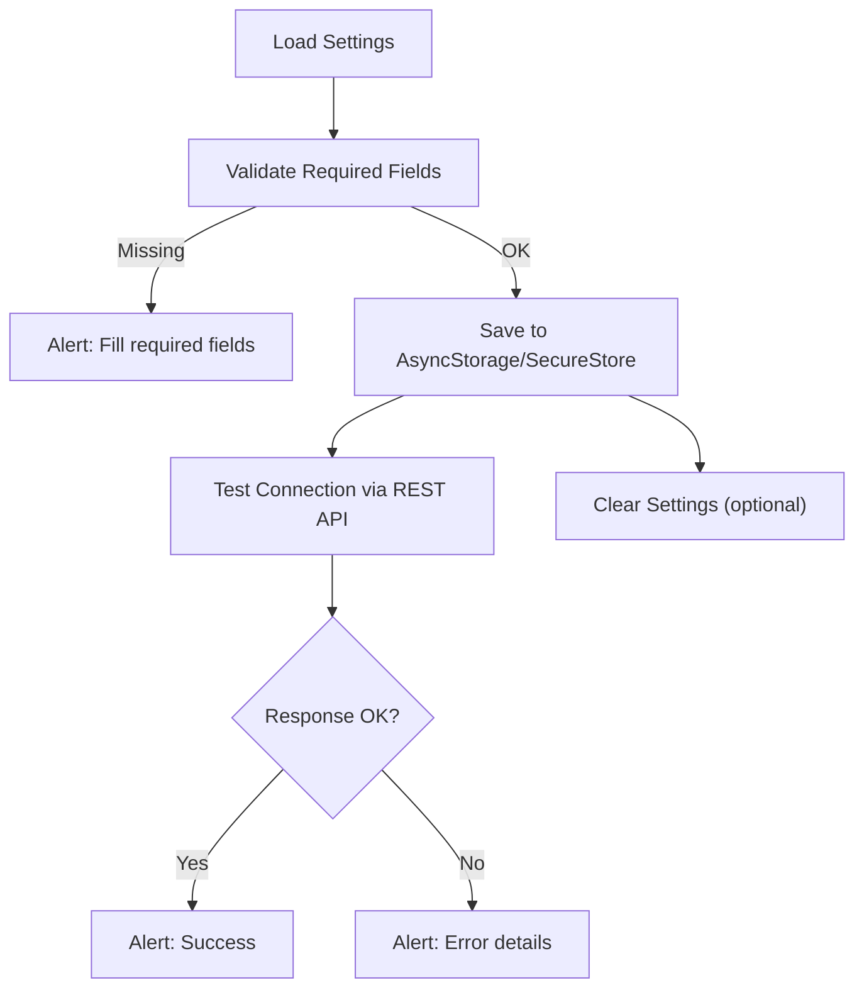
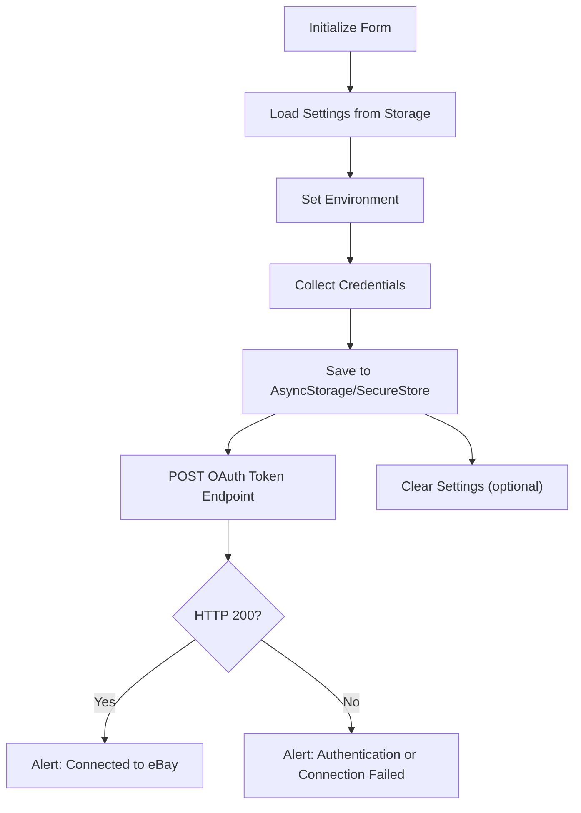
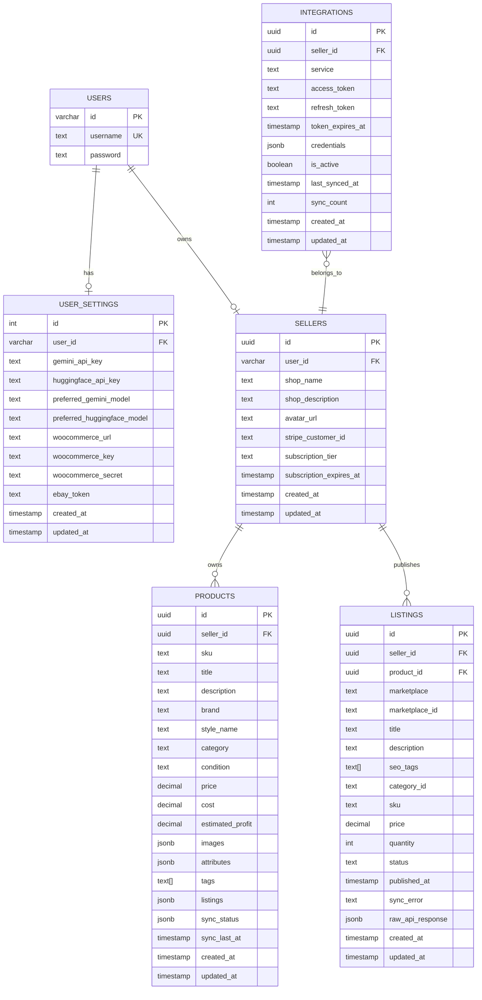
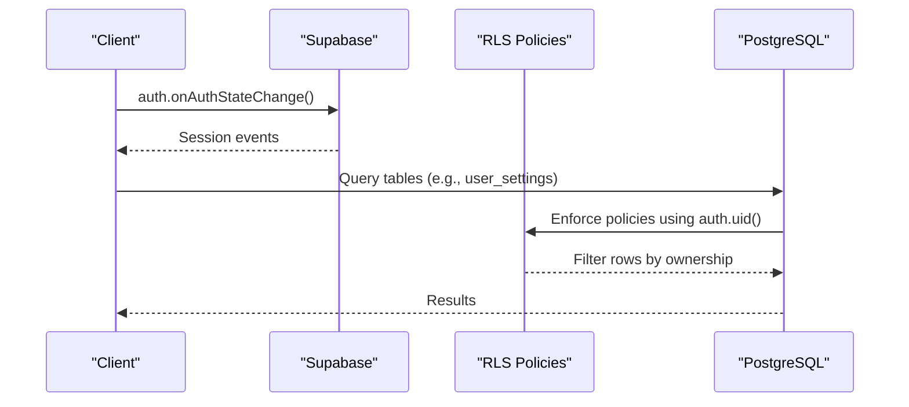
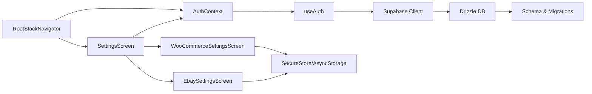

# Profile Management

<cite>
**Referenced Files in This Document**
- [ProfileScreen.tsx](file://client/screens/ProfileScreen.tsx)
- [SettingsScreen.tsx](file://client/screens/SettingsScreen.tsx)
- [EbaySettingsScreen.tsx](file://client/screens/EbaySettingsScreen.tsx)
- [WooCommerceSettingsScreen.tsx](file://client/screens/WooCommerceSettingsScreen.tsx)
- [AuthContext.tsx](file://client/contexts/AuthContext.tsx)
- [useAuth.ts](file://client/hooks/useAuth.ts)
- [supabase.ts](file://client/lib/supabase.ts)
- [types.ts](file://shared/types.ts)
- [schema.ts](file://shared/schema.ts)
- [db.ts](file://server/db.ts)
- [drizzle.config.ts](file://drizzle.config.ts)
- [0001_flipagent_tables.sql](file://migrations/0001_flipagent_tables.sql)
- [0002_rls_policies.sql](file://migrations/0002_rls_policies.sql)
- [ProfileStackNavigator.tsx](file://client/navigation/ProfileStackNavigator.tsx)
- [RootStackNavigator.tsx](file://client/navigation/RootStackNavigator.tsx)
</cite>

## Table of Contents
1. [Introduction](#introduction)
2. [Project Structure](#project-structure)
3. [Core Components](#core-components)
4. [Architecture Overview](#architecture-overview)
5. [Detailed Component Analysis](#detailed-component-analysis)
6. [Dependency Analysis](#dependency-analysis)
7. [Performance Considerations](#performance-considerations)
8. [Troubleshooting Guide](#troubleshooting-guide)
9. [Conclusion](#conclusion)
10. [Appendices](#appendices)

## Introduction
This document describes profile management and personal settings in Hidden-Gem. It covers:
- The profile and settings surfaces
- Authentication integration with Supabase
- Marketplace integrations (WooCommerce and eBay)
- Profile data structures and database relationships
- Real-time behavior and RLS policies
- Validation, form handling, and error management
- Privacy and data lifecycle topics (export/deletion)

Where relevant, we map UI flows to actual source files and highlight how Supabase-backed user sessions and server-side RLS protect data.

## Project Structure
Profile and settings functionality spans client screens, navigation, authentication, and shared data models. The server uses Drizzle ORM with PostgreSQL and applies row-level security policies.

**Diagram sources**
- [RootStackNavigator.tsx](file://client/navigation/RootStackNavigator.tsx#L34-L131)
- [ProfileStackNavigator.tsx](file://client/navigation/ProfileStackNavigator.tsx#L13-L26)
- [AuthContext.tsx](file://client/contexts/AuthContext.tsx#L19-L30)
- [useAuth.ts](file://client/hooks/useAuth.ts#L12-L38)
- [supabase.ts](file://client/lib/supabase.ts#L20-L38)
- [SettingsScreen.tsx](file://client/screens/SettingsScreen.tsx#L76-L189)
- [WooCommerceSettingsScreen.tsx](file://client/screens/WooCommerceSettingsScreen.tsx#L26-L339)
- [EbaySettingsScreen.tsx](file://client/screens/EbaySettingsScreen.tsx#L27-L369)
- [types.ts](file://shared/types.ts#L75-L100)
- [schema.ts](file://shared/schema.ts#L14-L27)
- [db.ts](file://server/db.ts#L1-L19)
- [drizzle.config.ts](file://drizzle.config.ts#L11-L18)
- [0001_flipagent_tables.sql](file://migrations/0001_flipagent_tables.sql#L5-L77)
- [0002_rls_policies.sql](file://migrations/0002_rls_policies.sql#L6-L65)

**Section sources**
- [ProfileScreen.tsx](file://client/screens/ProfileScreen.tsx#L9-L26)
- [SettingsScreen.tsx](file://client/screens/SettingsScreen.tsx#L76-L189)
- [WooCommerceSettingsScreen.tsx](file://client/screens/WooCommerceSettingsScreen.tsx#L26-L339)
- [EbaySettingsScreen.tsx](file://client/screens/EbaySettingsScreen.tsx#L27-L369)
- [AuthContext.tsx](file://client/contexts/AuthContext.tsx#L19-L30)
- [useAuth.ts](file://client/hooks/useAuth.ts#L12-L38)
- [supabase.ts](file://client/lib/supabase.ts#L20-L38)
- [types.ts](file://shared/types.ts#L75-L100)
- [schema.ts](file://shared/schema.ts#L14-L27)
- [db.ts](file://server/db.ts#L1-L19)
- [drizzle.config.ts](file://drizzle.config.ts#L11-L18)
- [0001_flipagent_tables.sql](file://migrations/0001_flipagent_tables.sql#L5-L77)
- [0002_rls_policies.sql](file://migrations/0002_rls_policies.sql#L6-L65)

## Core Components
- Profile screen: renders a scrollable container and theme-aware layout.
- Settings screen: displays account header, marketplace connections, and app info.
- Marketplace settings screens: manage credentials and connection status for WooCommerce and eBay.
- Authentication: Supabase-based session management with OAuth and local persistence.
- Shared types and schema: define user settings and marketplace integration records.

Key responsibilities:
- ProfileScreen: UI scaffold for profile content.
- SettingsScreen: aggregates account actions and marketplace status.
- useAuth + AuthContext: provide session and sign-out.
- Supabase client: handles auth state and redirects.
- Marketplace screens: validate inputs, persist securely, test connectivity, and clear settings.

**Section sources**
- [ProfileScreen.tsx](file://client/screens/ProfileScreen.tsx#L9-L26)
- [SettingsScreen.tsx](file://client/screens/SettingsScreen.tsx#L76-L189)
- [WooCommerceSettingsScreen.tsx](file://client/screens/WooCommerceSettingsScreen.tsx#L68-L106)
- [EbaySettingsScreen.tsx](file://client/screens/EbaySettingsScreen.tsx#L75-L110)
- [AuthContext.tsx](file://client/contexts/AuthContext.tsx#L19-L30)
- [useAuth.ts](file://client/hooks/useAuth.ts#L40-L70)
- [supabase.ts](file://client/lib/supabase.ts#L20-L38)

## Architecture Overview
The profile and settings architecture integrates client-side navigation and screens with Supabase authentication and server-side data via Drizzle.

**Diagram sources**
- [RootStackNavigator.tsx](file://client/navigation/RootStackNavigator.tsx#L34-L131)
- [ProfileStackNavigator.tsx](file://client/navigation/ProfileStackNavigator.tsx#L13-L26)
- [ProfileScreen.tsx](file://client/screens/ProfileScreen.tsx#L9-L26)
- [SettingsScreen.tsx](file://client/screens/SettingsScreen.tsx#L110-L128)
- [AuthContext.tsx](file://client/contexts/AuthContext.tsx#L19-L30)
- [useAuth.ts](file://client/hooks/useAuth.ts#L64-L70)
- [supabase.ts](file://client/lib/supabase.ts#L20-L38)
- [schema.ts](file://shared/schema.ts#L14-L27)
- [0002_rls_policies.sql](file://migrations/0002_rls_policies.sql#L13-L47)

## Detailed Component Analysis

### Profile Screen
- Purpose: Provides a themed scroll container for profile content.
- Behavior: Uses safe area insets, header height, and tab bar height to compute content insets. Applies theme background and spacing.

**Diagram sources**
- [ProfileScreen.tsx](file://client/screens/ProfileScreen.tsx#L9-L26)

**Section sources**
- [ProfileScreen.tsx](file://client/screens/ProfileScreen.tsx#L9-L26)

### Settings Screen
- Purpose: Central hub for account actions and marketplace integrations.
- Features:
  - Account header with avatar and email.
  - Sign-out with confirmation.
  - Marketplace integration rows with connection status badges.
- Navigation: Links to AI providers, terms, privacy, and marketplace settings screens.

**Diagram sources**
- [SettingsScreen.tsx](file://client/screens/SettingsScreen.tsx#L110-L128)
- [AuthContext.tsx](file://client/contexts/AuthContext.tsx#L19-L30)
- [useAuth.ts](file://client/hooks/useAuth.ts#L64-L70)

**Section sources**
- [SettingsScreen.tsx](file://client/screens/SettingsScreen.tsx#L76-L189)
- [AuthContext.tsx](file://client/contexts/AuthContext.tsx#L19-L30)
- [useAuth.ts](file://client/hooks/useAuth.ts#L64-L70)

### Supabase Authentication Integration
- Client initialization: Creates a Supabase client with platform-specific storage and auto-refresh.
- Auth state: Subscribes to auth state changes and exposes sign-in/sign-up/sign-out.
- Redirect handling: Configures redirect URLs for web and native platforms.

**Diagram sources**
- [supabase.ts](file://client/lib/supabase.ts#L20-L38)
- [useAuth.ts](file://client/hooks/useAuth.ts#L72-L137)

**Section sources**
- [supabase.ts](file://client/lib/supabase.ts#L20-L38)
- [useAuth.ts](file://client/hooks/useAuth.ts#L12-L38)
- [useAuth.ts](file://client/hooks/useAuth.ts#L40-L70)
- [useAuth.ts](file://client/hooks/useAuth.ts#L72-L137)

### Marketplace Settings: WooCommerce
- Purpose: Store and validate WooCommerce credentials and store URL.
- Inputs: Store URL, Consumer Key, Consumer Secret.
- Persistence: Securely stores credentials depending on platform; tests connectivity via REST API.
- Actions: Save, Test Connection, Disconnect.

**Diagram sources**
- [WooCommerceSettingsScreen.tsx](file://client/screens/WooCommerceSettingsScreen.tsx#L43-L106)
- [WooCommerceSettingsScreen.tsx](file://client/screens/WooCommerceSettingsScreen.tsx#L108-L146)
- [WooCommerceSettingsScreen.tsx](file://client/screens/WooCommerceSettingsScreen.tsx#L148-L180)

**Section sources**
- [WooCommerceSettingsScreen.tsx](file://client/screens/WooCommerceSettingsScreen.tsx#L26-L339)

### Marketplace Settings: eBay
- Purpose: Store and validate eBay credentials and environment.
- Inputs: Client ID, Client Secret, optional Refresh Token; environment toggle (sandbox/production).
- Persistence: Securely stores credentials depending on platform; tests connectivity via OAuth token endpoint.
- Actions: Save, Test Connection, Disconnect.

**Diagram sources**
- [EbaySettingsScreen.tsx](file://client/screens/EbaySettingsScreen.tsx#L40-L73)
- [EbaySettingsScreen.tsx](file://client/screens/EbaySettingsScreen.tsx#L112-L150)
- [EbaySettingsScreen.tsx](file://client/screens/EbaySettingsScreen.tsx#L152-L187)

**Section sources**
- [EbaySettingsScreen.tsx](file://client/screens/EbaySettingsScreen.tsx#L27-L369)

### Profile Data Model and Database Relationships
- User settings table: Stores per-user preferences and marketplace tokens.
- Integrations table: Stores marketplace access tokens and credentials.
- RLS policies: Enforce row-level access based on the authenticated user’s session.

**Diagram sources**
- [schema.ts](file://shared/schema.ts#L6-L12)
- [schema.ts](file://shared/schema.ts#L14-L27)
- [schema.ts](file://shared/schema.ts#L115-L126)
- [schema.ts](file://shared/schema.ts#L128-L151)
- [schema.ts](file://shared/schema.ts#L153-L172)
- [schema.ts](file://shared/schema.ts#L205-L220)

**Section sources**
- [schema.ts](file://shared/schema.ts#L14-L27)
- [schema.ts](file://shared/schema.ts#L115-L126)
- [schema.ts](file://shared/schema.ts#L128-L151)
- [schema.ts](file://shared/schema.ts#L153-L172)
- [schema.ts](file://shared/schema.ts#L205-L220)
- [types.ts](file://shared/types.ts#L75-L100)

### Real-Time Updates and RLS
- Real-time behavior: Supabase auth state subscriptions propagate session changes to the UI.
- RLS enforcement: Policies restrict access to seller-owned rows, ensuring isolation between users.

**Diagram sources**
- [useAuth.ts](file://client/hooks/useAuth.ts#L31-L35)
- [0002_rls_policies.sql](file://migrations/0002_rls_policies.sql#L13-L47)

**Section sources**
- [useAuth.ts](file://client/hooks/useAuth.ts#L31-L35)
- [0002_rls_policies.sql](file://migrations/0002_rls_policies.sql#L13-L47)

## Dependency Analysis
- Client navigation depends on AuthContext to decide whether to show Auth or Main stacks.
- SettingsScreen depends on AuthContext for sign-out and on AsyncStorage to reflect marketplace statuses.
- Marketplace screens depend on platform-specific secure storage and AsyncStorage for persistence.
- Server-side data access relies on Drizzle ORM and RLS policies enforced by the database.

**Diagram sources**
- [RootStackNavigator.tsx](file://client/navigation/RootStackNavigator.tsx#L34-L131)
- [SettingsScreen.tsx](file://client/screens/SettingsScreen.tsx#L76-L189)
- [WooCommerceSettingsScreen.tsx](file://client/screens/WooCommerceSettingsScreen.tsx#L26-L339)
- [EbaySettingsScreen.tsx](file://client/screens/EbaySettingsScreen.tsx#L27-L369)
- [AuthContext.tsx](file://client/contexts/AuthContext.tsx#L19-L30)
- [useAuth.ts](file://client/hooks/useAuth.ts#L12-L38)
- [supabase.ts](file://client/lib/supabase.ts#L20-L38)
- [db.ts](file://server/db.ts#L1-L19)
- [schema.ts](file://shared/schema.ts#L14-L27)

**Section sources**
- [RootStackNavigator.tsx](file://client/navigation/RootStackNavigator.tsx#L34-L131)
- [SettingsScreen.tsx](file://client/screens/SettingsScreen.tsx#L76-L189)
- [WooCommerceSettingsScreen.tsx](file://client/screens/WooCommerceSettingsScreen.tsx#L26-L339)
- [EbaySettingsScreen.tsx](file://client/screens/EbaySettingsScreen.tsx#L27-L369)
- [AuthContext.tsx](file://client/contexts/AuthContext.tsx#L19-L30)
- [useAuth.ts](file://client/hooks/useAuth.ts#L12-L38)
- [supabase.ts](file://client/lib/supabase.ts#L20-L38)
- [db.ts](file://server/db.ts#L1-L19)
- [schema.ts](file://shared/schema.ts#L14-L27)

## Performance Considerations
- Minimize unnecessary re-renders by using memoized callbacks and stable references in settings screens.
- Defer heavy operations (e.g., network requests to marketplace APIs) to background threads and avoid blocking the UI.
- Use optimistic updates for quick feedback when saving settings, with rollback on failure.
- Keep stored secrets encrypted at rest using platform-specific secure storage on native platforms.

## Troubleshooting Guide
Common issues and resolutions:
- Supabase not configured: Ensure environment variables for Supabase URL and anon key are present. The client warns when missing.
- OAuth failures: Verify redirect URLs and browser session handling on native platforms.
- Marketplace connectivity errors:
  - Confirm required fields are filled before testing.
  - Check that REST API endpoints are reachable and credentials are correct.
  - For eBay, verify environment selection and token endpoint response.
- Sign-out errors: Catch and surface errors from Supabase sign-out; confirm auth state updates.

**Section sources**
- [supabase.ts](file://client/lib/supabase.ts#L20-L38)
- [useAuth.ts](file://client/hooks/useAuth.ts#L72-L137)
- [WooCommerceSettingsScreen.tsx](file://client/screens/WooCommerceSettingsScreen.tsx#L108-L146)
- [EbaySettingsScreen.tsx](file://client/screens/EbaySettingsScreen.tsx#L112-L150)
- [SettingsScreen.tsx](file://client/screens/SettingsScreen.tsx#L110-L128)

## Conclusion
Hidden-Gem’s profile and settings system integrates Supabase authentication with marketplace configuration screens. User settings and marketplace tokens are persisted securely, while server-side RLS ensures data isolation. The architecture supports real-time auth state changes and provides robust validation and error handling for profile and marketplace operations.

## Appendices

### Profile Data Structures
- User settings record: includes AI provider preferences and marketplace tokens.
- Integration record: stores access tokens and credentials for marketplace services.

**Section sources**
- [schema.ts](file://shared/schema.ts#L14-L27)
- [schema.ts](file://shared/schema.ts#L205-L220)
- [types.ts](file://shared/types.ts#L75-L100)

### Example Operations and Queries
- Read user settings: select from user_settings by user_id.
- Upsert user settings: insert/update user_settings with userId foreign key.
- List integrations: select from integrations by seller_id.
- Create integration: insert into integrations with service and tokens.

Note: These describe typical operations; consult the schema and server-side code for exact column names and constraints.

**Section sources**
- [schema.ts](file://shared/schema.ts#L14-L27)
- [schema.ts](file://shared/schema.ts#L205-L220)
- [0001_flipagent_tables.sql](file://migrations/0001_flipagent_tables.sql#L63-L77)
- [0002_rls_policies.sql](file://migrations/0002_rls_policies.sql#L13-L47)

### Privacy, Export, and Deletion
- Privacy settings: RLS policies restrict access to user-owned rows. Consider adding explicit privacy toggles in user_settings if needed.
- Data export: Implement server endpoints to export user_settings and related marketplace data for supported services.
- Deletion: Cascading deletes on user_settings and integrations ensure cleanup when a user account is removed.

**Section sources**
- [0002_rls_policies.sql](file://migrations/0002_rls_policies.sql#L13-L47)
- [schema.ts](file://shared/schema.ts#L14-L27)
- [schema.ts](file://shared/schema.ts#L205-L220)