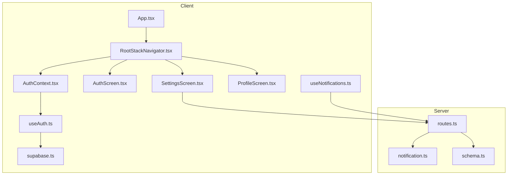
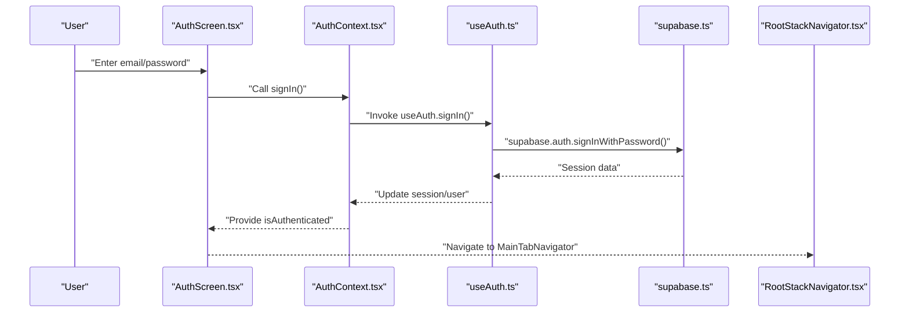
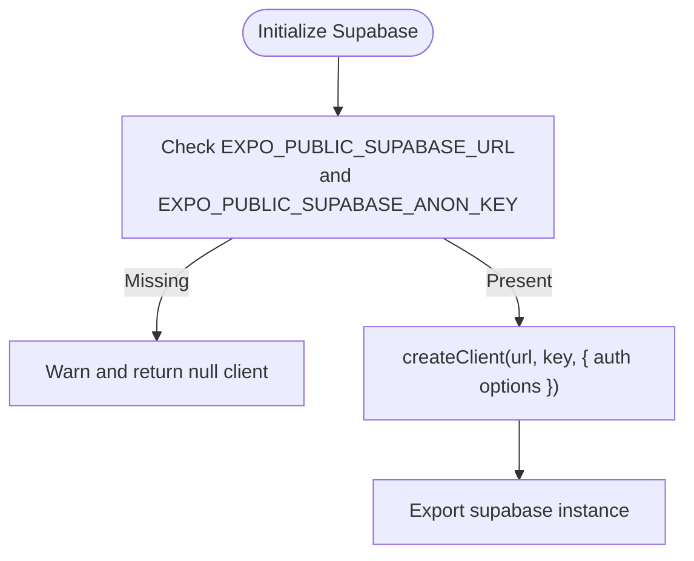
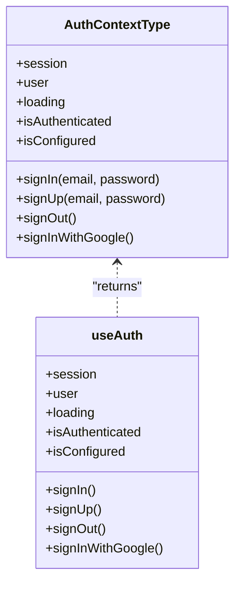
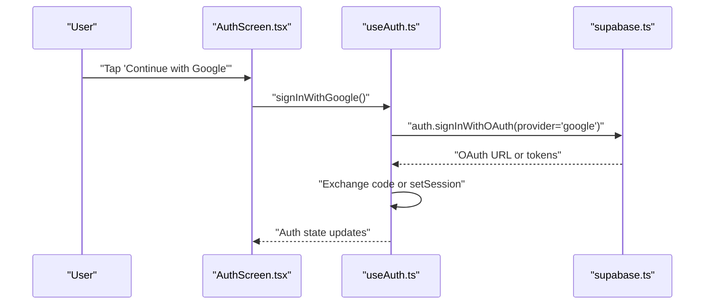
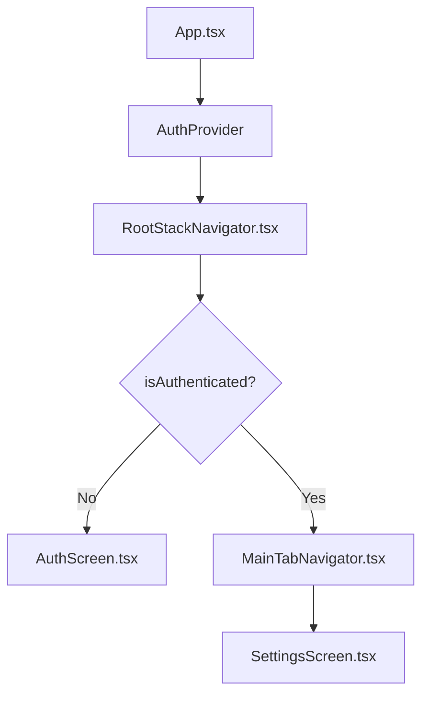
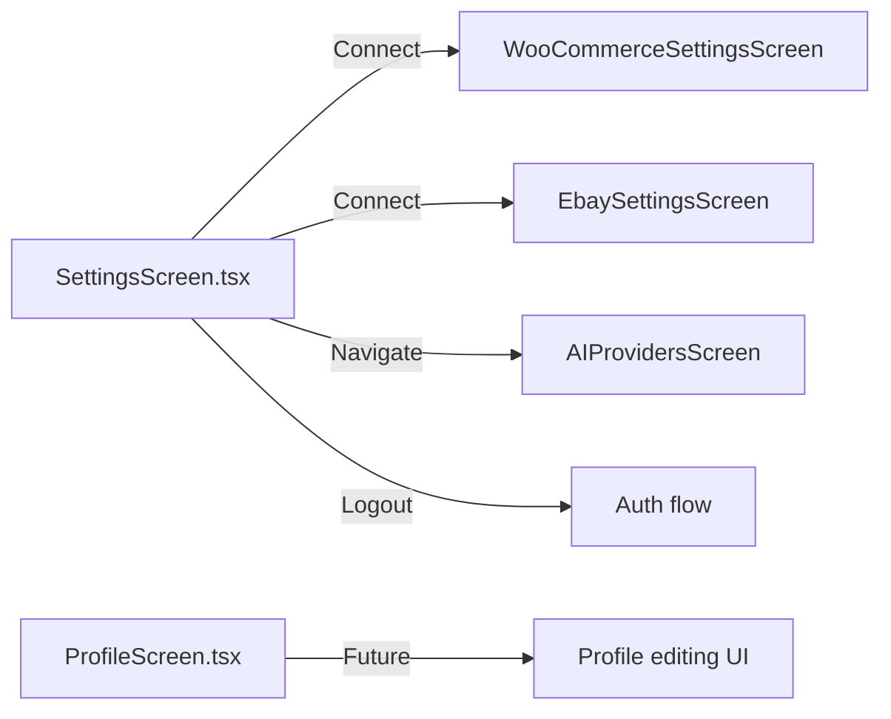
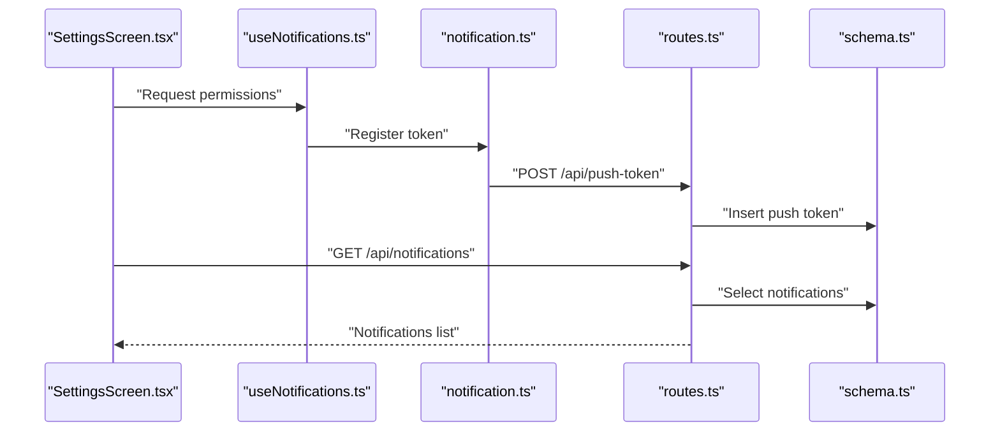
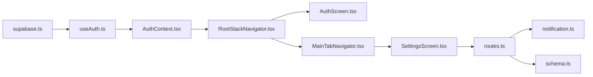

# User Management

<cite>
**Referenced Files in This Document**
- [supabase.ts](file://client/lib/supabase.ts)
- [AuthContext.tsx](file://client/contexts/AuthContext.tsx)
- [useAuth.ts](file://client/hooks/useAuth.ts)
- [AuthScreen.tsx](file://client/screens/AuthScreen.tsx)
- [RootStackNavigator.tsx](file://client/navigation/RootStackNavigator.tsx)
- [App.tsx](file://client/App.tsx)
- [MainTabNavigator.tsx](file://client/navigation/MainTabNavigator.tsx)
- [SettingsScreen.tsx](file://client/screens/SettingsScreen.tsx)
- [ProfileScreen.tsx](file://client/screens/ProfileScreen.tsx)
- [ProfileStackNavigator.tsx](file://client/navigation/ProfileStackNavigator.tsx)
- [useNotifications.ts](file://client/hooks/useNotifications.ts)
- [routes.ts](file://server/routes.ts)
- [notification.ts](file://server/services/notification.ts)
- [schema.ts](file://shared/schema.ts)
</cite>

## Table of Contents
1. [Introduction](#introduction)
2. [Project Structure](#project-structure)
3. [Core Components](#core-components)
4. [Architecture Overview](#architecture-overview)
5. [Detailed Component Analysis](#detailed-component-analysis)
6. [Dependency Analysis](#dependency-analysis)
7. [Performance Considerations](#performance-considerations)
8. [Troubleshooting Guide](#troubleshooting-guide)
9. [Conclusion](#conclusion)
10. [Appendices](#appendices)

## Introduction
This document explains Hidden-Gem’s user management system with a focus on authentication, session management, and profile-related workflows. It covers:
- Supabase integration for authentication and session persistence
- Authentication flows (login, signup, OAuth with Google)
- Protected routing and authentication state management
- User profile and settings surfaces
- Marketplace API key management and notification preferences
- Security considerations and best practices

## Project Structure
The user management system spans the client-side React Native application and the backend server:
- Client-side authentication and UI are implemented under client/
- Supabase client initialization and configuration live in client/lib/supabase.ts
- Authentication state is exposed via a React Context and hook
- Navigation controls whether users see AuthScreen or the main app
- Backend exposes endpoints for notifications and marketplace integrations

**Diagram sources**
- [App.tsx](file://client/App.tsx#L31-L59)
- [RootStackNavigator.tsx](file://client/navigation/RootStackNavigator.tsx#L34-L132)
- [AuthContext.tsx](file://client/contexts/AuthContext.tsx#L19-L30)
- [useAuth.ts](file://client/hooks/useAuth.ts#L12-L150)
- [AuthScreen.tsx](file://client/screens/AuthScreen.tsx#L13-L239)
- [SettingsScreen.tsx](file://client/screens/SettingsScreen.tsx#L76-L189)
- [ProfileScreen.tsx](file://client/screens/ProfileScreen.tsx#L9-L26)
- [useNotifications.ts](file://client/hooks/useNotifications.ts#L51-L136)
- [supabase.ts](file://client/lib/supabase.ts#L20-L38)
- [routes.ts](file://server/routes.ts#L70-L142)
- [notification.ts](file://server/services/notification.ts#L31-L129)
- [schema.ts](file://shared/schema.ts#L14-L27)

**Section sources**
- [App.tsx](file://client/App.tsx#L31-L59)
- [RootStackNavigator.tsx](file://client/navigation/RootStackNavigator.tsx#L34-L132)
- [supabase.ts](file://client/lib/supabase.ts#L20-L38)

## Core Components
- Supabase client initialization and session persistence
- Authentication Context and Hook
- Auth Screen and Google OAuth flow
- Protected routing and main app shell
- Settings and profile surfaces
- Notifications and marketplace integrations

**Section sources**
- [supabase.ts](file://client/lib/supabase.ts#L20-L38)
- [AuthContext.tsx](file://client/contexts/AuthContext.tsx#L5-L15)
- [useAuth.ts](file://client/hooks/useAuth.ts#L12-L150)
- [AuthScreen.tsx](file://client/screens/AuthScreen.tsx#L13-L239)
- [RootStackNavigator.tsx](file://client/navigation/RootStackNavigator.tsx#L34-L132)
- [SettingsScreen.tsx](file://client/screens/SettingsScreen.tsx#L76-L189)
- [ProfileScreen.tsx](file://client/screens/ProfileScreen.tsx#L9-L26)
- [useNotifications.ts](file://client/hooks/useNotifications.ts#L51-L136)

## Architecture Overview
The authentication architecture centers on Supabase for identity and session management, with React Context exposing state to the UI. Navigation decides between AuthScreen and the main app. Notifications integrate with Expo and the backend.

**Diagram sources**
- [AuthScreen.tsx](file://client/screens/AuthScreen.tsx#L25-L58)
- [AuthContext.tsx](file://client/contexts/AuthContext.tsx#L19-L30)
- [useAuth.ts](file://client/hooks/useAuth.ts#L40-L50)
- [supabase.ts](file://client/lib/supabase.ts#L26-L33)
- [RootStackNavigator.tsx](file://client/navigation/RootStackNavigator.tsx#L51-L63)

## Detailed Component Analysis

### Supabase Client and Session Persistence
- Initializes Supabase with environment variables for URL and anon key
- Configures auth storage, auto-refresh, session persistence, and URL detection based on platform
- Exposes a singleton client and a helper to compute redirect URLs

**Diagram sources**
- [supabase.ts](file://client/lib/supabase.ts#L6-L38)

**Section sources**
- [supabase.ts](file://client/lib/supabase.ts#L6-L38)

### Authentication Context and Hook
- Provides session, user, loading state, and auth actions (signIn, signUp, signOut, signInWithGoogle)
- Subscribes to Supabase auth state changes and persists sessions automatically
- Handles OAuth redirects and token exchange for native platforms

**Diagram sources**
- [AuthContext.tsx](file://client/contexts/AuthContext.tsx#L5-L15)
- [useAuth.ts](file://client/hooks/useAuth.ts#L12-L150)

**Section sources**
- [AuthContext.tsx](file://client/contexts/AuthContext.tsx#L5-L15)
- [useAuth.ts](file://client/hooks/useAuth.ts#L12-L150)

### Auth Screen and OAuth with Google
- Presents email/password login/signup and Google OAuth
- Displays success/error messaging and haptic feedback
- Delegates Google OAuth to useAuth.signInWithGoogle()

**Diagram sources**
- [AuthScreen.tsx](file://client/screens/AuthScreen.tsx#L60-L79)
- [useAuth.ts](file://client/hooks/useAuth.ts#L72-L137)
- [supabase.ts](file://client/lib/supabase.ts#L26-L33)

**Section sources**
- [AuthScreen.tsx](file://client/screens/AuthScreen.tsx#L25-L79)
- [useAuth.ts](file://client/hooks/useAuth.ts#L72-L137)

### Protected Routing and Main App Shell
- App wraps the UI with QueryClientProvider, AuthProvider, and NavigationContainer
- Root navigator conditionally renders AuthScreen or MainTabNavigator based on authentication state
- Main tab navigator displays user-specific header content and links to Settings

**Diagram sources**
- [App.tsx](file://client/App.tsx#L31-L59)
- [RootStackNavigator.tsx](file://client/navigation/RootStackNavigator.tsx#L34-L132)
- [MainTabNavigator.tsx](file://client/navigation/MainTabNavigator.tsx#L64-L144)

**Section sources**
- [App.tsx](file://client/App.tsx#L31-L59)
- [RootStackNavigator.tsx](file://client/navigation/RootStackNavigator.tsx#L34-L132)
- [MainTabNavigator.tsx](file://client/navigation/MainTabNavigator.tsx#L26-L62)

### Settings and Profile Surfaces
- SettingsScreen lists AI providers, connected marketplaces, and sign out
- Integration statuses are persisted locally and surfaced in Settings
- ProfileScreen is a placeholder scaffold for future profile editing

**Diagram sources**
- [SettingsScreen.tsx](file://client/screens/SettingsScreen.tsx#L76-L189)
- [ProfileScreen.tsx](file://client/screens/ProfileScreen.tsx#L9-L26)

**Section sources**
- [SettingsScreen.tsx](file://client/screens/SettingsScreen.tsx#L76-L189)
- [ProfileScreen.tsx](file://client/screens/ProfileScreen.tsx#L9-L26)

### Notifications and Marketplace Integrations
- useNotifications handles Expo push token registration/unregistration and permissions
- Server routes expose endpoints to manage push tokens and notifications
- Server notification service integrates with Expo push API and stores notification records
- Shared schema defines push tokens, notifications, and price tracking tables

**Diagram sources**
- [SettingsScreen.tsx](file://client/screens/SettingsScreen.tsx#L76-L189)
- [useNotifications.ts](file://client/hooks/useNotifications.ts#L51-L136)
- [notification.ts](file://server/services/notification.ts#L31-L129)
- [routes.ts](file://server/routes.ts#L70-L100)
- [schema.ts](file://shared/schema.ts#L258-L293)

**Section sources**
- [useNotifications.ts](file://client/hooks/useNotifications.ts#L51-L136)
- [routes.ts](file://server/routes.ts#L70-L142)
- [notification.ts](file://server/services/notification.ts#L31-L159)
- [schema.ts](file://shared/schema.ts#L258-L293)

## Dependency Analysis
- Client depends on Supabase for auth and on React Navigation for routing
- Auth state is centralized in a Context/Hook pair
- SettingsScreen interacts with server routes for notifications and marketplace status
- Server routes depend on shared schema and notification service

**Diagram sources**
- [supabase.ts](file://client/lib/supabase.ts#L20-L38)
- [useAuth.ts](file://client/hooks/useAuth.ts#L12-L150)
- [AuthContext.tsx](file://client/contexts/AuthContext.tsx#L19-L30)
- [RootStackNavigator.tsx](file://client/navigation/RootStackNavigator.tsx#L34-L132)
- [AuthScreen.tsx](file://client/screens/AuthScreen.tsx#L13-L239)
- [MainTabNavigator.tsx](file://client/navigation/MainTabNavigator.tsx#L64-L144)
- [SettingsScreen.tsx](file://client/screens/SettingsScreen.tsx#L76-L189)
- [routes.ts](file://server/routes.ts#L70-L142)
- [notification.ts](file://server/services/notification.ts#L31-L129)
- [schema.ts](file://shared/schema.ts#L258-L293)

**Section sources**
- [RootStackNavigator.tsx](file://client/navigation/RootStackNavigator.tsx#L34-L132)
- [routes.ts](file://server/routes.ts#L70-L142)

## Performance Considerations
- Supabase auto-refresh and persistent sessions reduce redundant network calls
- Avoid unnecessary re-renders by memoizing callbacks in useAuth
- Defer heavy UI work until after authentication state resolves
- Use local storage sparingly for optional settings (e.g., notification preferences) to minimize IO overhead

## Troubleshooting Guide
Common issues and resolutions:
- Supabase credentials missing
  - Symptom: Warning during initialization and inability to authenticate
  - Resolution: Set EXPO_PUBLIC_SUPABASE_URL and EXPO_PUBLIC_SUPABASE_ANON_KEY
- OAuth failures on native
  - Symptom: Redirect loop or blank page after Google sign-in
  - Resolution: Ensure skipBrowserRedirect is enabled and exchange code/token properly
- Sign out does not navigate away from protected views
  - Symptom: Stays on main tabs after sign out
  - Resolution: Call signOut and rely on onAuthStateChange to update state; ensure RootNavigator reacts to isAuthenticated
- Notifications not received
  - Symptom: No push notifications despite permissions granted
  - Resolution: Verify push token registration and server route handling; confirm Expo push API availability

**Section sources**
- [supabase.ts](file://client/lib/supabase.ts#L20-L38)
- [useAuth.ts](file://client/hooks/useAuth.ts#L72-L137)
- [RootStackNavigator.tsx](file://client/navigation/RootStackNavigator.tsx#L34-L132)
- [useNotifications.ts](file://client/hooks/useNotifications.ts#L51-L136)
- [routes.ts](file://server/routes.ts#L70-L100)

## Conclusion
Hidden-Gem’s user management leverages Supabase for robust authentication and session persistence, with a clean React Context/Hook pattern exposing auth state across the app. Protected routing ensures users only see authenticated views when logged in. The Settings and Notifications subsystems integrate seamlessly with backend services, while marketplace settings remain configurable through dedicated screens. Security is addressed through platform-aware session handling and optional local encryption for sensitive keys.

## Appendices

### Authentication Flow Examples
- Login/Signup flow
  - AuthScreen collects credentials and calls useAuth.signIn()/useAuth.signUp()
  - Supabase manages session and emits auth state changes
  - RootNavigator switches to MainTabNavigator upon successful auth
- Google OAuth flow
  - AuthScreen triggers useAuth.signInWithGoogle()
  - Supabase initiates OAuth, client exchanges code or sets session, then updates state

**Section sources**
- [AuthScreen.tsx](file://client/screens/AuthScreen.tsx#L25-L79)
- [useAuth.ts](file://client/hooks/useAuth.ts#L40-L137)
- [RootStackNavigator.tsx](file://client/navigation/RootStackNavigator.tsx#L51-L63)

### Profile Management Workflows
- Current state
  - ProfileScreen is a minimal scaffold; future iterations will support editing and preferences
- Recommended approach
  - Add a ProfileEditScreen with controlled inputs bound to user settings
  - Persist changes via Supabase or server endpoints as appropriate
  - Surface preferences in SettingsScreen alongside marketplace integrations

**Section sources**
- [ProfileScreen.tsx](file://client/screens/ProfileScreen.tsx#L9-L26)
- [SettingsScreen.tsx](file://client/screens/SettingsScreen.tsx#L76-L189)

### Security Best Practices
- Password policies
  - Enforce strong passwords at the server level and communicate policy via error messages
- Account verification
  - Rely on Supabase email confirmation; display clear instructions to users
- Session timeout handling
  - Supabase autoRefreshToken and persistSession reduce friction; monitor onAuthStateChange for unexpected logout
- Token handling
  - Store API keys locally with platform encryption; avoid logging tokens
  - Prefer short-lived tokens and refresh strategies where applicable

[No sources needed since this section provides general guidance]